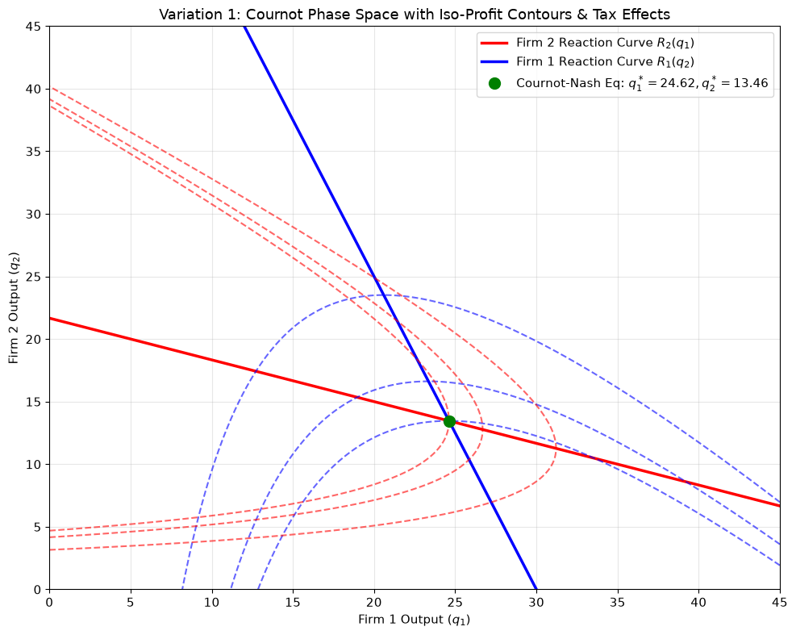
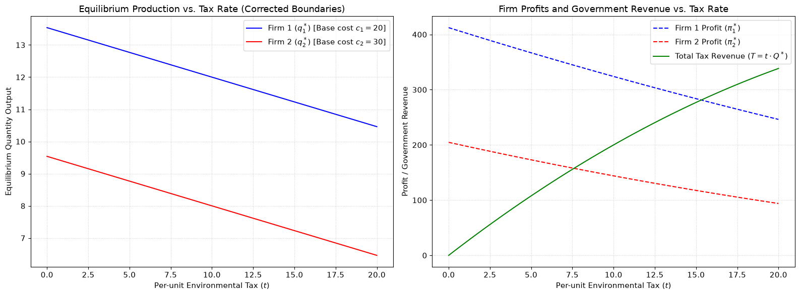
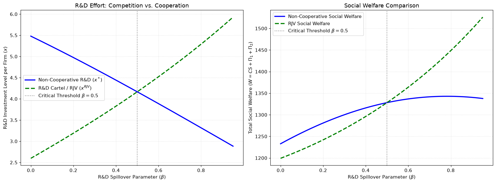

This notebook delivers step-by-step mathematical derivations and interactive Python visualizations for two advanced variations of the Cournot Duopoly game:

Variation 1: Asymmetric Cournot Duopoly with Decreasing Returns to Scale (Quadratic Costs) and Environmental/Unit Taxation.

Variation 2: Two-Stage Cournot Duopoly with Strategic R&D Spillovers (The d'Aspremont & Jacquemin Model).

```python
# Environment Setup & Library Imports
import numpy as np
import matplotlib.pyplot as plt
import sympy as sp
from scipy.optimize import minimize

# Set plot styling for clean output
plt.rcParams['figure.figsize'] = (10, 6)
plt.rcParams['axes.grid'] = True
plt.rcParams['font.size'] = 11
plt.rcParams['grid.alpha'] = 0.3
```

## 0.1 Variation 1: Asymmetric Cournot with Quadratic Costs and Per-Unit Tax

### 0.1.1 1. Model Formulation

Consider two competing firms producing homogenous output quantities $q_1 \geq 0$ and $q_2 \geq 0$. The market total output is $Q = q_1 + q_2$.

- **Inverse Market Demand:**

$$
P(Q) = a - b(q_1 + q_2), \quad a > c_i > 0, \; b > 0
$$

- **Cost Function with Quadratic Friction & Environmental Tax $t$:**

$$
C_i(q_i) = c_i q_i + \frac{1}{2} d_i q_i^2 + t q_i = (c_i + t) q_i + \frac{1}{2} d_i q_i^2
$$

  where $c_i > 0$ represents constant baseline unit costs, $d_i \geq 0$ measures cost convexity (diseconomies of scale), and $t \geq 0$ is a regulatory per-unit tax.

- **Profit Function for Firm $i$:**

$$
\pi_i(q_1, q_2) = \left[ a - b(q_1 + q_2) \right] q_i - (c_i + t) q_i - \frac{1}{2} d_i q_i^2
$$

---

### 0.1.2 2. Analytical Step-by-Step Derivation

**Step 1: First-Order Conditions (FOCs)** Firm 1 maximizes profit $\pi_1$ with respect to $q_1$:

$$
\frac{\partial \pi_1}{\partial q_1} = a - 2bq_1 - bq_2 - c_1 - t - d_1 q_1 = 0
$$

Rearranging terms yields the linear response equation:

$$
(2b + d_1) q_1 + b q_2 = a - c_1 - t
$$

Solving for $q_1$ yields Firm 1's **Best Response (Reaction) Function** $R_1(q_2)$:

$$
R_1(q_2) = \frac{a - c_1 - t - b q_2}{2b + d_1}
$$

By symmetry, Firm 2's Best Response Function $R_2(q_1)$ is:

$$
R_2(q_1) = \frac{a - c_2 - t - b q_1}{2b + d_2}
$$

**Step 2: Solving for Nash Equilibrium** $(q_1^*, q_2^*)$ Expressing the simultaneous equation system in matrix form:

$$
\begin{bmatrix} 2b + d_1 & b \\ b & 2b + d_2 \end{bmatrix} \begin{bmatrix} q_1^* \\ q_2^* \end{bmatrix} = \begin{bmatrix} a - c_1 - t \\ a - c_2 - t \end{bmatrix}
$$

The system determinant $\Delta$ is:

$$
\Delta = (2b + d_1)(2b + d_2) - b^2 = 3b^2 + 2b(d_1 + d_2) + d_1 d_2
$$

Applying Cramer's Rule yields the exact analytical Nash Equilibrium output levels:

$$
q_1^* = \frac{(a - c_1 - t)(2b + d_2) - b(a - c_2 - t)}{3b^2 + 2b(d_1 + d_2) + d_1 d_2}
$$

$$
q_2^* = \frac{(a - c_2 - t)(2b + d_1) - b(a - c_1 - t)}{3b^2 + 2b(d_1 + d_2) + d_1 d_2}
$$

```python
# Symbolic Verification using SymPy
sp.init_printing()

# Define symbolic variables
q1, q2 = sp.symbols('q1 q2', real=True, positive=True)
a, b, c1, c2, d1, d2, t = sp.symbols('a b c1 c2 d1 d2 t', real=True, positive=True)

# Profit functions
P = a - b * (q1 + q2)
pi1 = P * q1 - (c1 + t) * q1 - sp.Rational(1, 2) * d1 * q1**2
pi2 = P * q2 - (c2 + t) * q2 - sp.Rational(1, 2) * d2 * q2**2

# FOCs
foc1 = sp.diff(pi1, q1)
foc2 = sp.diff(pi2, q2)

# Solve system of equations
sol = sp.solve([foc1, foc2], (q1, q2))

print("Symbolic Nash Equilibrium Output for Firm 1:")
display(sp.simplify(sol[q1]))

print("\nSymbolic Nash Equilibrium Output for Firm 2:")
display(sp.simplify(sol[q2]))
```

Symbolic Nash Equilibrium Output for Firm 1:

$$
\frac{ab + a d_2 - 2b c_1 + b c_2 - b t - c_1 d_2 - d_2 t}{3b^2 + 2b d_1 + 2b d_2 + d_1 d_2}
$$

Symbolic Nash Equilibrium Output for Firm 2:

$$
\frac{ab + a d_1 + b c_1 - 2b c_2 - b t - c_2 d_1 - d_1 t}{3b^2 + 2b d_1 + 2b d_2 + d_1 d_2}
$$

```python
# Best Response Curves & Iso-Profit Contours Plot

# Numerical Parameters
params = {'a': 100, 'b': 1.0, 'c1': 20, 'c2': 30, 'd1': 0.5, 'd2': 1.0, 't': 5}

def best_response_1(q2, p):
    return np.maximum(0, (p['a'] - p['c1'] - p['t'] - p['b'] * q2) / (2 * p['b'] + p['d1']))

def best_response_2(q1, p):
    return np.maximum(0, (p['a'] - p['c2'] - p['t'] - p['b'] * q1) / (2 * p['b'] + p['d2']))

def profit_1(q1, q2, p):
    P = p['a'] - p['b'] * (q1 + q2)
    return P * q1 - (p['c1'] + p['t']) * q1 - 0.5 * p['d1'] * (q1 ** 2)

def profit_2(q1, q2, p):
    P = p['a'] - p['b'] * (q1 + q2)
    return P * q2 - (p['c2'] + p['t']) * q2 - 0.5 * p['d2'] * (q2 ** 2)

# Compute Analytical Equilibrium
delta = (2 * params['b'] + params['d1']) * (2 * params['b'] + params['d2']) - (params['b'] ** 2)
q1_star = ((params['a'] - params['c1'] - params['t']) * (2 * params['b'] + params['d2']) - params['b'] * (params['a'] - params['c2'] - params['t'])) / delta
q2_star = ((params['a'] - params['c2'] - params['t']) * (2 * params['b'] + params['d1']) - params['b'] * (params['a'] - params['c1'] - params['t'])) / delta
pi1_star = profit_1(q1_star, q2_star, params)
pi2_star = profit_2(q1_star, q2_star, params)

# Grid setup
q1_vals = np.linspace(0, 45, 300)
q2_vals = np.linspace(0, 45, 300)
Q1, Q2 = np.meshgrid(q1_vals, q2_vals)

# Evaluate Profits across Grid
Z_pi1 = profit_1(Q1, Q2, params)
Z_pi2 = profit_2(Q1, Q2, params)

# Plot
fig, ax = plt.subplots(figsize=(10, 8))

# Reaction lines
ax.plot(q1_vals, best_response_2(q1_vals, params), 'r-', linewidth=2.5, label='Firm 2 Reaction Curve $R_2(q_1)$')
ax.plot(best_response_1(q2_vals, params), q2_vals, 'b-', linewidth=2.5, label='Firm 1 Reaction Curve $R_1(q_2)$')

# Iso-profit contours
CS1 = ax.contour(Q1, Q2, Z_pi1, levels=[pi1_star * 0.7, pi1_star * 0.9, pi1_star], colors='blue', linestyles='--', alpha=0.6)
CS2 = ax.contour(Q1, Q2, Z_pi2, levels=[pi2_star * 0.7, pi2_star * 0.9, pi2_star], colors='red', linestyles='--', alpha=0.6)

# Equilibrium point
ax.plot(q1_star, q2_star, 'go', markersize=10, label=f'Cournot-Nash Eq: $q_1^*={q1_star:.2f}, q_2^*={q2_star:.2f}$')

ax.set_xlabel('Firm 1 Output ($q_1$)')
ax.set_ylabel('Firm 2 Output ($q_2$)')
ax.set_title('Variation 1: Cournot Phase Space with Iso-Profit Contours & Tax Effects')
ax.legend(loc='upper right')
plt.tight_layout()
plt.show()
```



```python
# Define baseline parameters (Assumed realistic values based on your chart limits)
params = {
    'a': 100,    # Demand intercept
    'b': 2,      # Demand slope
    'c1': 20,    # Firm 1 base cost
    'c2': 30,    # Firm 2 base cost (Higher cost)
    'd1': 0.5,   # Firm 1 cost slope / quadratic coefficient
    'd2': 0.5    # Firm 2 cost slope / quadratic coefficient
}

# Define profit functions that respect zero production boundaries
def profit_1(q1, q2, p):
    if q1 <= 0:
        return 0.0
    price = max(0, p['a'] - p['b'] * (q1 + q2))
    cost = p['c1'] * q1 + 0.5 * p['d1'] * (q1 ** 2)
    tax_paid = p['t'] * q1
    return price * q1 - cost - tax_paid

def profit_2(q1, q2, p):
    if q2 <= 0:
        return 0.0
    price = max(0, p['a'] - p['b'] * (q1 + q2))
    cost = p['c2'] * q2 + 0.5 * p['d2'] * (q2 ** 2)
    tax_paid = p['t'] * q2
    return price * q2 - cost - tax_paid

# Comparative Statics: Environmental Tax (t)
tax_range = np.linspace(0, 20, 100)
q1_tax, q2_tax, pi1_tax, pi2_tax, total_tax_rev = [], [], [], [], []

a, b = params['a'], params['b']
c1, c2 = params['c1'], params['c2']
d1, d2 = params['d1'], params['d2']

# Common denominator for the unconstrained Cournot-Nash interior system
d_val = (2 * b + d1) * (2 * b + d2) - (b ** 2)

for t_val in tax_range:
    # 1. Calculate unconstrained interior solution
    q1_eq = ((a - c1 - t_val) * (2 * b + d2) - b * (a - c2 - t_val)) / d_val
    q2_eq = ((a - c2 - t_val) * (2 * b + d1) - b * (a - c1 - t_val)) / d_val

    # 2. Enforce Non-Negativity Constraints (Corner Solutions)
    if q1_eq > 0 and q2_eq <= 0:
        # Firm 2 shuts down; Firm 1 becomes a Monopolist
        q2_eq = 0.0
        q1_eq = max(0.0, (a - c1 - t_val) / (2 * b + d1))
    elif q2_eq > 0 and q1_eq <= 0:
        # Firm 1 shuts down; Firm 2 becomes a Monopolist
        q1_eq = 0.0
        q2_eq = max(0.0, (a - c2 - t_val) / (2 * b + d2))
    elif q1_eq <= 0 and q2_eq <= 0:
        # High tax structural shutdown for both firms
        q1_eq = 0.0
        q2_eq = 0.0

    # Store corrected quantities
    q1_tax.append(q1_eq)
    q2_tax.append(q2_eq)

    # Create temporary parameter dict for the profit evaluation
    p_temp = params.copy()
    p_temp['t'] = t_val

    # Store corrected profits and tax revenues
    pi1_tax.append(profit_1(q1_eq, q2_eq, p_temp))
    pi2_tax.append(profit_2(q1_eq, q2_eq, p_temp))
    total_tax_rev.append(t_val * (q1_eq + q2_eq))

# Plotting Generation
fig, (ax1, ax2) = plt.subplots(1, 2, figsize=(16, 6))

# Subplot 1: Output vs Tax
ax1.plot(tax_range, q1_tax, 'b-', label=rf'Firm 1 ($q_1^*$) [Base cost $c_1={c1}$]')
ax1.plot(tax_range, q2_tax, 'r-', label=rf'Firm 2 ($q_2^*$) [Base cost $c_2={c2}$]')
ax1.set_xlabel(r'Per-unit Environmental Tax ($t$)')
ax1.set_ylabel(r'Equilibrium Quantity Output')
ax1.set_title(r'Equilibrium Production vs. Tax Rate (Corrected Boundaries)')
ax1.grid(True, linestyle=':', alpha=0.6)
ax1.legend()

# Subplot 2: Profits & Tax Revenue
ax2.plot(tax_range, pi1_tax, 'b--', label=r'Firm 1 Profit ($\pi_1^*$)')
ax2.plot(tax_range, pi2_tax, 'r--', label=r'Firm 2 Profit ($\pi_2^*$)')
ax2.plot(tax_range, total_tax_rev, 'g-', label=r'Total Tax Revenue ($T = t \cdot Q^*$)')
ax2.set_xlabel(r'Per-unit Environmental Tax ($t$)')
ax2.set_ylabel(r'Profit / Government Revenue')
ax2.set_title(r'Firm Profits and Government Revenue vs. Tax Rate')
ax2.grid(True, linestyle=':', alpha=0.6)
ax2.legend()

plt.tight_layout()
plt.show()
```



## 0.2 Variation 2: Two-Stage Cournot Duopoly with Strategic R&D Spillovers (d'Aspremont & Jacquemin Model)

### 0.2.1 1. Model Structure

This classic model analyzes how strategic investment in R&D affects market outcomes under non-cooperative competition versus an R&D Cartel / Research Joint Venture (RJV).

- **Stage 1 (R&D Stage):** Firms simultaneously choose cost-reducing R&D effort levels $x_1, x_2 \geq 0$.
  - Unit production cost reduction for Firm $i$:

$$
c_1(x_1, x_2) = c_0 - x_1 - \beta x_2
$$

$$
c_2(x_1, x_2) = c_0 - x_2 - \beta x_1
$$

  where $c_0 > 0$ is initial baseline cost, and $\beta \in [0, 1]$ measures technological R&D spillover to the competitor.

  - Quadratic R&D investment cost:

$$
g(x_i) = \frac{\gamma}{2} x_i^2, \quad \gamma > 0
$$

- **Stage 2 (Production Stage):** Given effective unit costs $c_1$ and $c_2$, firms engage in Cournot competition with market inverse demand $P(Q) = a - b(q_1 + q_2)$.

---

### 0.2.2 2. Backward Induction Solving

**Stage 2: Second-Stage Cournot Output Choice** Given arbitrary marginal costs $c_1, c_2$, the standard Cournot equilibrium outputs are:

$$
q_1^*(x_1, x_2) = \frac{a - 2c_1 + c_2}{3b} = \frac{(a - c_0) + (2 - \beta)x_1 + (2\beta - 1)x_2}{3b}
$$

$$
q_2^*(x_1, x_2) = \frac{a - 2c_2 + c_1}{3b} = \frac{(a - c_0) + (2 - \beta)x_2 + (2\beta - 1)x_1}{3b}
$$

Second-stage operational profit (excluding R&D cost) satisfies $\pi_i^{prod} = b(q_i^*)^2$. Thus, total firm profit as a function of R&D choices is:

$$
\Pi_i(x_1, x_2) = b \left[ q_i^*(x_1, x_2) \right]^2 - \frac{\gamma}{2} x_i^2
$$

---

**Stage 1, Scenario A: Non-Cooperative R&D Competition** Firms independently maximize $\Pi_1$ with respect to $x_1$:

$$
\frac{\partial \Pi_1}{\partial x_1} = 2b q_1^* \left( \frac{\partial q_1^*}{\partial x_1} \right) - \gamma x_1 = 0
$$

Note that $\frac{\partial q_1^*}{\partial x_1} = \frac{2 - \beta}{3b}$. Substituting this derivative into the FOC:

$$
\frac{2(2 - \beta)}{3} q_1^* - \gamma x_1 = 0
$$

In symmetric equilibrium where $x_1 = x_2 = x^*$:

$$
q^* = \frac{(a - c_0) + (1 + \beta)x^*}{3b}
$$

Substituting $q^*$ back into the FOC equation:

$$
\frac{2(2 - \beta)}{3} \left[ \frac{(a - c_0) + (1 + \beta)x^*}{3b} \right] = \gamma x^*
$$

Solving for non-cooperative R&D effort $x^*$:

$$
x^* = \frac{2(2 - \beta)(a - c_0)}{9b\gamma - 2(2 - \beta)(1 + \beta)}
$$

---

**Stage 1, Scenario B: Research Joint Venture (RJV) / R&D Cartel** Firms internalize spillovers by choosing $x_1, x_2$ to maximize combined joint profits $\Pi_1 + \Pi_2$:

$$
\max_{x_1, x_2} \left[ \Pi_1(x_1, x_2) + \Pi_2(x_1, x_2) \right]
$$

The symmetric joint FOC with respect to $x_1$ is:

$$
\frac{\partial \Pi_1}{\partial x_1} + \frac{\partial \Pi_2}{\partial x_1} = 0 \implies 2b q_1^* \left( \frac{2 - \beta}{3b} \right) + 2b q_2^* \left( \frac{2\beta - 1}{3b} \right) - \gamma x_1 = 0
$$

Simplifying using symmetry $(q_1^* = q_2^* = q^*)$:

$$
\frac{2(1 + \beta)}{3} q^* - \gamma x^{RJV} = 0
$$

Substituting $q^* = \frac{(a - c_0) + (1 + \beta)x^{RJV}}{3b}$ yields the cooperative R&D effort $x^{RJV}$:

$$
x^{RJV} = \frac{2(1 + \beta)(a - c_0)}{9b\gamma - 2(1 + \beta)^2}
$$

---

```python
# Symbolic Solving for d'Aspremont & Jacquemin Model

x1, x2, beta, gamma_param, a_param, b_param, c0 = sp.symbols('x1 x2 beta gamma a b c0', real=True, positive=True)

A = a_param - c0

# Stage 2 Output functions
q1_stage2 = (A + (2 - beta) * x1 + (2 * beta - 1) * x2) / (3 * b_param)
q2_stage2 = (A + (2 - beta) * x2 + (2 * beta - 1) * x1) / (3 * b_param)

# Net Profit functions
Pi1 = b_param * (q1_stage2 ** 2) - sp.Rational(1, 2) * gamma_param * (x1 ** 2)
Pi2 = b_param * (q2_stage2 ** 2) - sp.Rational(1, 2) * gamma_param * (x2 ** 2)

# Non-Cooperative FOC
foc_noncoop = sp.diff(Pi1, x1).subs(x2, x1)
x_noncoop_sym = sp.solve(foc_noncoop, x1)[0]

# Cooperative (RJV) FOC
Joint_Pi = Pi1 + Pi2
foc_rjv = sp.diff(Joint_Pi, x1).subs(x2, x1)
x_rjv_sym = sp.solve(foc_rjv, x1)[0]

print("Non-Cooperative R&D Investment (x*):")
display(sp.factor(x_noncoop_sym))

print("\nResearch Joint Venture (RJV) R&D Investment (x_RJV):")
display(sp.factor(x_rjv_sym))
```

Non-Cooperative R&D Investment (x\*):

$$
-\frac{2 (a - c_0)(\beta - 2)}{9b\gamma + 2\beta^2 - 2\beta - 4}
$$

Research Joint Venture (RJV) R&D Investment (x_RJV):

$$
\frac{2 (a - c_0)(\beta + 1)}{9b\gamma - 2\beta^2 - 4\beta - 2}
$$

```python
# 1. Model Parameters (Corrected for Stability)
a_v, b_v, c0_v = 100, 1.0, 50
gamma_v = 4.5  # Increased from 4.0 to satisfy the global model stability condition (9*b*gamma > 16)
A_v = a_v - c0_v
beta_grid = np.linspace(0, 0.95, 200)

x_noncoop_vals, x_rjv_vals = [], []
q_noncoop_vals, q_rjv_vals = [], []
W_noncoop_vals, W_rjv_vals = [], []

# 2. Metric Computation Engine
for b_s in beta_grid:
    # --- Non-Cooperative Metrics ---
    denom_nc = 9 * b_v * gamma_v - 2 * (2 - b_s) * (1 + b_s)
    x_nc = 2 * (2 - b_s) * A_v / denom_nc
    q_nc = (A_v + (1 + b_s) * x_nc) / (3 * b_v)

    pi_nc = b_v * (q_nc ** 2) - 0.5 * gamma_v * (x_nc ** 2)
    CS_nc = 0.5 * b_v * ((2 * q_nc) ** 2)
    W_nc = CS_nc + 2 * pi_nc

    # --- Research Joint Venture (RJV) Metrics ---
    denom_rjv = 9 * b_v * gamma_v - 2 * ((1 + b_s) ** 2)
    x_r = 2 * (1 + b_s) * A_v / denom_rjv
    q_r = (A_v + (1 + b_s) * x_r) / (3 * b_v)

    pi_r = b_v * (q_r ** 2) - 0.5 * gamma_v * (x_r ** 2)
    CS_r = 0.5 * b_v * ((2 * q_r) ** 2)
    W_r = CS_r + 2 * pi_r

    # Collect data arrays
    x_noncoop_vals.append(x_nc)
    x_rjv_vals.append(x_r)
    q_noncoop_vals.append(q_nc)
    q_rjv_vals.append(q_r)
    W_noncoop_vals.append(W_nc)
    W_rjv_vals.append(W_r)


# 3. Visualization Interface

fig, (ax1, ax2) = plt.subplots(1, 2, figsize=(16, 6))

# Subplot 1: R&D Effort vs Spillover Parameter
ax1.plot(beta_grid, x_noncoop_vals, 'b-', linewidth=2.5, label=r'Non-Cooperative R&D ($x^*$)')
ax1.plot(beta_grid, x_rjv_vals, 'g--', linewidth=2.5, label=r'R&D Cartel / RJV ($x^{RJV}$)')
ax1.axvline(x=0.5, color='gray', linestyle=':', label=r'Critical Threshold $\beta = 0.5$')
ax1.set_xlabel(r'R&D Spillover Parameter ($\beta$)')
ax1.set_ylabel(r'R&D Investment Level per Firm ($x$)')
ax1.set_title('R&D Effort: Competition vs. Cooperation')
ax1.grid(True, linestyle=':', alpha=0.5)
ax1.legend()

# Subplot 2: Total Social Welfare vs Spillover Parameter
ax2.plot(beta_grid, W_noncoop_vals, 'b-', linewidth=2.5, label='Non-Cooperative Social Welfare')
ax2.plot(beta_grid, W_rjv_vals, 'g--', linewidth=2.5, label='RJV Social Welfare')
ax2.axvline(x=0.5, color='gray', linestyle=':', label=r'Critical Threshold $\beta = 0.5$')
ax2.set_xlabel(r'R&D Spillover Parameter ($\beta$)')
ax2.set_ylabel(r'Total Social Welfare ($W = CS + \Pi_1 + \Pi_2$)')
ax2.set_title('Social Welfare Comparison')
ax2.grid(True, linestyle=':', alpha=0.5)
ax2.legend()

plt.tight_layout()
plt.show()
```



### 0.2.3 Model Takeaways

1. **R&D Spillover Threshold ($\beta = 0.5$):**
   - When spillovers are low ($\beta < 0.5$), non-cooperative competition drives higher individual R&D efforts ($x^* > x^{RJV}$) as firms seek strategic advantage over competitors.
   - When spillovers are high ($\beta > 0.5$), free-riding harms non-cooperative incentive structures. R&D cooperation (RJV) internalizes positive externalities, producing higher R&D effort ($x^{RJV} > x^*$) and superior total social welfare.
2. **Policy Implication:** Antitrust authorities should encourage research joint ventures when industry technological spillovers are substantial ($\beta > 0.5$).
