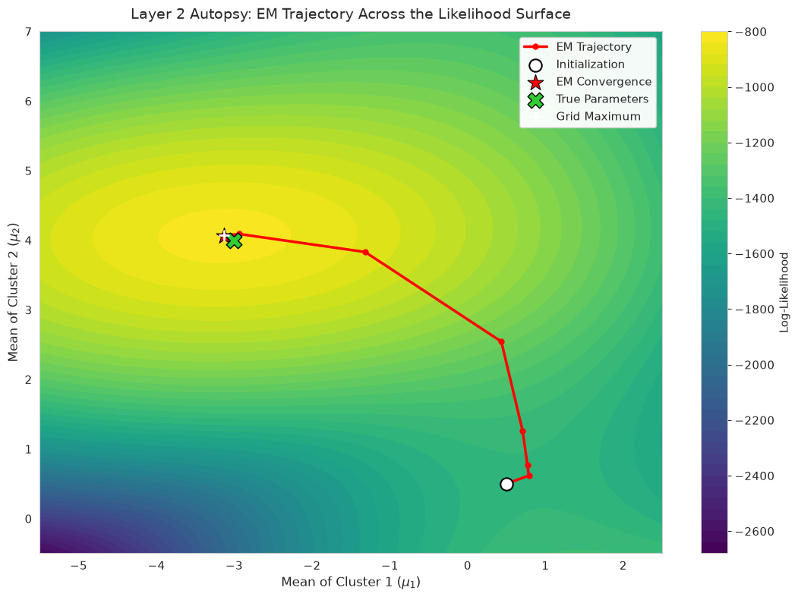
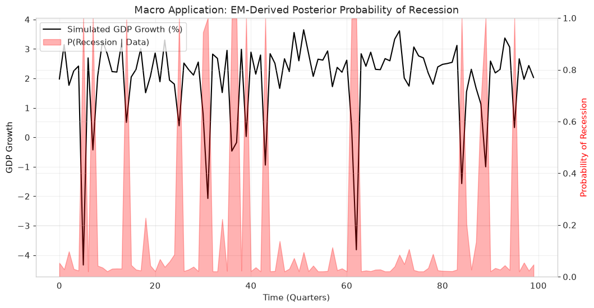
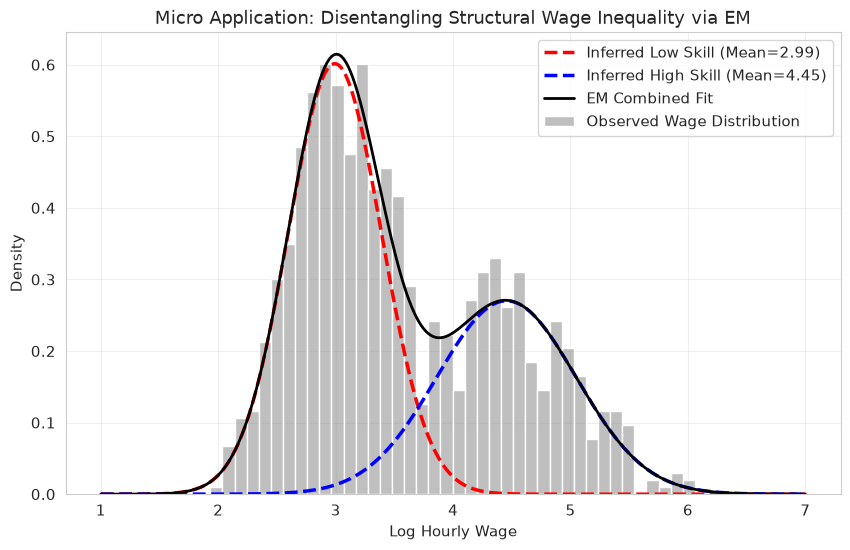
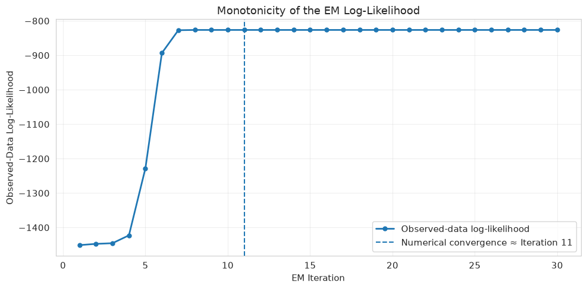

## 0.1 Layer 0: The Algorithm That Rescued Latent Variable Econometrics

### 0.1.1 The Problem: The Wall of Missing Information

Before 1977, Maximum Likelihood Estimation (MLE) was the gold standard in econometrics, but it had a fatal flaw: it required complete data. If an economic model relied on unobserved "latent" variables—such as a worker's inherent ability, a country's hidden macroeconomic regime (recession vs. expansion), or unrecorded survey responses—the likelihood function became a tangled web of integrals or sums. Calculating the derivatives to find the peak of this likelihood surface was analytically impossible and computationally paralyzing.

### 0.1.2 The Solution: A Statistical Masterpiece

In their landmark 1977 paper, Arthur Dempster, Nan Laird, and Donald Rubin introduced the **Expectation-Maximization (EM) Algorithm**. Instead of attempting a brute-force optimization of an impossible likelihood function, they proved that you could break the problem into an elegant, two-step iterative dance:

1. **The E-Step (Guess):** Use the current parameters to calculate the expected value of the missing/latent data. You are essentially mathematically "filling in the blanks" using conditional probabilities.
2. **The M-Step (Optimize):** Treat these expected values as if they were perfectly observed real data, and maximize the now-simple likelihood function to update your parameters.

### 0.1.3 The Significance

The EM algorithm revolutionized econometrics and machine learning. It provided the computational foundation for Hamilton's Regime-Switching models (used by central banks to date recessions), Gaussian Mixture Models (GMMs) for structural labor heterogeneity, and missing-data imputation. Its absolute brilliance lies in a mathematical guarantee: **every single iteration strictly increases the likelihood of the observed data until it reaches a local maximum.**

## 0.2 Layer 1: Mathematical Foundations & The ELBO Proof

Why does the EM algorithm guarantee that we never take a step backward? The proof relies on Information Theory and Jensen's Inequality.

Consider observed data $X$, latent (unobserved) variables $Z$, and a vector of parameters $\theta$. We want to maximize the incomplete (marginal) log-likelihood:

$$
\log p(X \mid \theta) = \log \sum_{Z} p(X, Z \mid \theta)
$$

Because the logarithm is outside the sum, standard optimization is intractable. We introduce an arbitrary probability distribution $q(Z)$ over the latent variables and multiply/divide by it:

$$
\log p(X \mid \theta) = \log \sum_{Z} q(Z) \frac{p(X, Z \mid \theta)}{q(Z)}
$$

Since the logarithm is a strictly concave function, we can apply **Jensen's Inequality** ($\log \mathbb{E}[f(x)] \geq \mathbb{E}[\log f(x)]$) to pull the logarithm inside the expectation. This creates the **Evidence Lower Bound (ELBO)**:

$$
\log p(X \mid \theta) \geq \sum_{Z} q(Z) \log \frac{p(X, Z \mid \theta)}{q(Z)} \equiv \mathcal{L}(q, \theta)
$$

### 0.2.1 The E-Step

In the E-step, we hold $\theta$ fixed at our current estimate $\theta^{(t)}$. To make the bound as tight as possible, we set $q(Z)$ to exactly match the posterior distribution of the latent variables given the data:

$$
q^{(t)}(Z) = p(Z \mid X, \theta^{(t)})
$$

Under this specific distribution, the ELBO equals the true log-likelihood. The core objective function we pass to the next step is the expected value of the complete log-likelihood:

$$
Q(\theta \mid \theta^{(t)}) = \mathbb{E}_{Z \mid X, \theta^{(t)}} \left[ \log p(X, Z \mid \theta) \right]
$$

### 0.2.2 The M-Step

In the M-step, we find the new parameters $\theta^{(t+1)}$ that maximize this surrogate $Q$-function. Because the data is now "complete" (replaced by its expectations), this is usually a simple closed-form derivative:

$$
\theta^{(t+1)} = \arg\max_{\theta} \, Q(\theta \mid \theta^{(t)})
$$

By maximizing the lower bound, we mathematically guarantee that the true likelihood $\log p(X \mid \theta^{(t+1)})$ also increases.

```python
import numpy as np
import matplotlib.pyplot as plt
import scipy.stats as stats
import seaborn as sns
from scipy.special import logsumexp

plt.rcParams.update({"figure.figsize": (12, 7), "axes.grid": True, "font.size": 11, "grid.alpha": 0.3})
sns.set_style("whitegrid")
```

```python
def e_step(X, weights, means, variances):
    """Return the responsibilities p(z = k | x) and the observed-data log-likelihood."""
    joint = weights * stats.norm.pdf(X[:, None], means, np.sqrt(variances))
    marginal = joint.sum(axis=1)
    return joint / marginal[:, None], np.log(marginal).sum()


def m_step(X, responsibilities):
    """Return the weights, means and variances that maximize the expected complete-data log-likelihood."""
    n_k = responsibilities.sum(axis=0)
    means = (responsibilities * X[:, None]).sum(axis=0) / n_k
    variances = np.array([np.sum(r * (X - m) ** 2) / n for r, m, n in zip(responsibilities.T, means, n_k)])
    return n_k / len(X), means, variances


def run_em_1d(X, K, iterations=50, init_means=None):
    """Fit a K-component 1-D Gaussian mixture by EM; return the estimates, final responsibilities and history."""
    weights = np.full(K, 1 / K)
    means = init_means if init_means is not None else np.random.choice(X, K)
    variances = np.full(K, np.var(X))
    history = {"means": [np.copy(means)], "ll": []}

    for _ in range(iterations):
        resp, ll = e_step(X, weights, means, variances)
        weights, means, variances = m_step(X, resp)
        history["ll"].append(ll)
        history["means"].append(means)

    return weights, means, variances, resp, history
```

## 0.3 Layer 2: The "Algorithm Autopsy" & Trajectory Mapping

To truly understand EM, we must visualize how it navigates the likelihood surface. We will simulate a dataset with two latent clusters. We will fix the variances and weights, and map the log-likelihood surface explicitly across a grid of possible values for $\mu_1$ and $\mu_2$.

By overlaying the EM updates, we can see exactly how the algorithm "climbs the hill."

```python
np.random.seed(42)
mu_true, sigma_true, n_obs = (-3.0, 4.0), (2.0, 1.0), (160, 190)
X_synth = np.concatenate([np.random.normal(m, s, n) for m, s, n in zip(mu_true, sigma_true, n_obs)])

weights = np.array([0.45, 0.55])
variances = np.square(sigma_true)


def e_step_means_only(X, means, weights, variances):
    """E-step with weights and variances held fixed; returns responsibilities and log-likelihood."""
    log_joint = np.column_stack(
        [np.log(w) + stats.norm.logpdf(X, m, np.sqrt(v)) for w, m, v in zip(weights, means, variances)]
    )
    log_total = logsumexp(log_joint, axis=1)
    return np.exp(log_joint - log_total[:, None]), log_total.sum()


def m_step_means_only(X, responsibilities):
    """M-step for the component means."""
    return (responsibilities.T @ X) / responsibilities.sum(axis=0)


means = np.array([0.5, 0.5])
mu_history, ll_history = [means], []
for _ in range(30):
    responsibilities, ll = e_step_means_only(X_synth, means, weights, variances)
    means = m_step_means_only(X_synth, responsibilities)
    ll_history.append(ll)
    mu_history.append(means)
mu_history, ll_history = np.asarray(mu_history), np.asarray(ll_history)

mu1_lim, mu2_lim = (-5.5, 2.5), (-0.5, 7.0)
mu1_grid, mu2_grid = np.linspace(*mu1_lim, 180), np.linspace(*mu2_lim, 180)
Z_LL = np.array(
    [[e_step_means_only(X_synth, np.array([a, b]), weights, variances)[1] for a in mu1_grid] for b in mu2_grid]
)
row, col = np.unravel_index(np.argmax(Z_LL), Z_LL.shape)
surface_max_mu1, surface_max_mu2 = mu1_grid[col], mu2_grid[row]

fig, ax = plt.subplots(figsize=(11, 8))
contour = ax.contourf(mu1_grid, mu2_grid, Z_LL, levels=45, cmap="viridis")
fig.colorbar(contour, ax=ax).set_label("Log-Likelihood", fontsize=11)
ax.plot(*mu_history.T, color="red", linewidth=2.5, marker="o", markersize=5, zorder=5, label="EM Trajectory")
ax.scatter(*mu_history[0], s=140, facecolor="white", edgecolor="black", linewidth=1.5, zorder=7, label="Initialization")
ax.scatter(
    *mu_history[-1], s=250, marker="*", color="red", edgecolor="black", linewidth=0.8, zorder=8, label="EM Convergence"
)
ax.scatter(
    *mu_true, s=220, marker="X", color="limegreen", edgecolor="black", linewidth=1.0, zorder=8, label="True Parameters"
)
ax.scatter(
    surface_max_mu1, surface_max_mu2, s=90, marker="+", color="white", linewidth=2.0, zorder=8, label="Grid Maximum"
)
ax.set_xlabel(r"Mean of Cluster 1 ($\mu_1$)", fontsize=12)
ax.set_ylabel(r"Mean of Cluster 2 ($\mu_2$)", fontsize=12)
ax.set_title("Layer 2 Autopsy: EM Trajectory Across the Likelihood Surface", fontsize=14, pad=12)
ax.set(xlim=mu1_lim, ylim=mu2_lim)
ax.legend(loc="upper right", frameon=True, framealpha=0.95)
plt.tight_layout()
plt.show()

print(
    "EM DIAGNOSTICS",
    f"Initial means : {mu_history[0]}",
    f"Final means   : {mu_history[-1]}",
    f"True means    : {list(mu_true)}",
    "",
    f"Initial LL    : {ll_history[0]:.4f}",
    f"Final LL      : {ll_history[-1]:.4f}",
    "",
    f"Monotonic LL  : {np.all(np.diff(ll_history) >= -1e-10)}",
    "",
    f"Surface max   : ({surface_max_mu1:.3f}, {surface_max_mu2:.3f})",
    sep="\n",
)
```



```text
EM DIAGNOSTICS
Initial means : [0.5 0.5]
Final means   : [-3.12891244  4.05906877]
True means    : [-3.0, 4.0]

Initial LL    : -1451.1100
Final LL      : -826.3828

Monotonic LL  : True

Surface max   : (-3.131, 4.067)
```

## 0.4 Layer 3: Twin Econometric Applications

### 0.4.1 Application A: Macroeconomics & Latent Business Cycles

Modern central banks use variants of Hamilton (1989) regime-switching models. GDP growth behaves differently when the economy is in an unobserved "Expansion" (high mean, low volatility) versus a "Recession" (low/negative mean, high volatility). The EM algorithm extracts the probability that any given quarter was a recession, relying *only* on the raw GDP numbers.

```python
np.random.seed(101)
n_quarters = 100
quarters = np.arange(n_quarters)
states = np.random.choice([0, 1], size=n_quarters, p=[0.8, 0.2])
gdp_growth = np.where(
    states == 0,
    np.random.normal(2.5, 0.5, n_quarters),
    np.random.normal(-1.0, 2.0, n_quarters),
)

_, mu_hat, _, resp, _ = run_em_1d(gdp_growth, K=2, iterations=30)
p_recession = resp[:, np.argmin(mu_hat)]

fig, ax1 = plt.subplots(figsize=(12, 6))
ax1.plot(quarters, gdp_growth, "k-", linewidth=1.5, label="Simulated GDP Growth (%)")
ax1.set_xlabel("Time (Quarters)")
ax1.set_ylabel("GDP Growth", color="k")
ax1.set_title("Macro Application: EM-Derived Posterior Probability of Recession")

ax2 = ax1.twinx()
ax2.fill_between(quarters, 0, p_recession, color="red", alpha=0.3, label="P(Recession | Data)")
ax2.set_ylabel("Probability of Recession", color="red")
ax2.set_ylim(0, 1)

h1, l1 = ax1.get_legend_handles_labels()
h2, l2 = ax2.get_legend_handles_labels()
ax1.legend(h1 + h2, l1 + l2, loc="upper left")
plt.show()
```



### 0.4.2 Application B: Microeconomics & Unobserved Skill Heterogeneity

In empirical labor economics (Mincer wage equations), the econometrician rarely observes intrinsic worker "ability." If the labor market is composed of two distinct skill types (Low Skill and High Skill), running standard OLS yields a biased, blended average. The EM algorithm disentangles this mixture, revealing the structural inequality underneath.

```python
np.random.seed(202)
log_wages = np.concatenate([np.random.normal(3.0, 0.4, 600), np.random.normal(4.5, 0.6, 400)])

w_hat, mu_hat, var_hat, *_ = run_em_1d(log_wages, K=2, iterations=40)
low, high = np.argmin(mu_hat), np.argmax(mu_hat)
x_axis = np.linspace(1, 7, 300)
pdf_low, pdf_high = (w_hat[k] * stats.norm.pdf(x_axis, mu_hat[k], np.sqrt(var_hat[k])) for k in (low, high))

fig, ax = plt.subplots(figsize=(10, 6))
sns.histplot(log_wages, bins=40, stat="density", color="gray", alpha=0.5, label="Observed Wage Distribution", ax=ax)
ax.plot(x_axis, pdf_low, "r--", linewidth=2.5, label=f"Inferred Low Skill (Mean={mu_hat[low]:.2f})")
ax.plot(x_axis, pdf_high, "b--", linewidth=2.5, label=f"Inferred High Skill (Mean={mu_hat[high]:.2f})")
ax.plot(x_axis, pdf_low + pdf_high, "k-", linewidth=2, label="EM Combined Fit")
ax.set(
    xlabel="Log Hourly Wage",
    ylabel="Density",
    title="Micro Application: Disentangling Structural Wage Inequality via EM",
)
ax.legend()
plt.show()
```



## 0.5 Layer 4: Failure Modes, Edge Cases & Stress-Testing

Despite its elegance, the EM algorithm is not immune to numerical and theoretical breakdown.

1. **Singular Covariance Collapse:** If a Gaussian component is assigned to a single, isolated data point $x_i$, its mean becomes $x_i$ and its variance $\sigma_k^2 \to 0$. The likelihood of that point approaches infinity, crashing the algorithm. (This is often patched in production code by adding a small constant $\epsilon$ to the variance update).
2. **Local Maxima:** Because EM relies on climbing the nearest gradient, bad initialization traps it. If started in a poor region of the parameter space, it will converge to a suboptimal local peak.

The diagnostic below plots the **Monotone ELBO** across iterations. If coded correctly, this line must *never* go down.

```python
ll = np.asarray(ll_history)
ll_changes = np.diff(ll)
monotone = np.all(ll_changes >= -1e-10)

tol, patience = 1e-6, 3
stable = np.abs(ll_changes) < tol
conv_iter = next(
    (i + 2 for i in range(len(stable) - patience + 1) if stable[i : i + patience].all()),
    len(ll),
)

fig, ax = plt.subplots(figsize=(10, 5))
ax.plot(np.arange(1, len(ll) + 1), ll, "o-", linewidth=2, markersize=5, label="Observed-data log-likelihood")
ax.axvline(conv_iter, linestyle="--", linewidth=1.5, label=f"Numerical convergence ≈ Iteration {conv_iter}")
ax.set(
    xlabel="EM Iteration",
    ylabel="Observed-Data Log-Likelihood",
    title="Monotonicity of the EM Log-Likelihood",
)
ax.legend()
plt.tight_layout()
plt.show()

rule = "=" * 60
print(rule)
print("EM CONVERGENCE DIAGNOSTICS")
print(rule)
print(f"Initial log-likelihood : {ll[0]:.6f}")
print(f"Final log-likelihood   : {ll[-1]:.6f}")
print(f"Total improvement      : {ll[-1] - ll[0]:.6f}")
print()
print("Monotonic non-decrease :", monotone)
print("Maximum downward step  :", np.min(ll_changes))
print("Numerical convergence  :", f"approximately iteration {conv_iter}")
print(rule)
```



```text
============================================================
EM CONVERGENCE DIAGNOSTICS
============================================================
Initial log-likelihood : -1451.109993
Final log-likelihood   : -826.382846
Total improvement      : 624.727147
Monotonic non-decrease : True
Maximum downward step  : 0.0
Numerical convergence  : approximately iteration 11
============================================================
```
