### Question A1

**Problem:**
Determine the domain and range of $f(x) = \frac{3x+2}{x^2+4}$ and decide whether $f$ is one-to-one on $[0, \infty)$.

**Derivation:**
*Domain:*
The function $f(x) = \frac{3x+2}{x^2+4}$ is a rational function. The numerator $3x+2$ is polynomial and continuous everywhere on $\mathbb{R}$. The denominator $x^2+4$ satisfies $x^2+4 \ge 4 > 0$ for all $x \in \mathbb{R}$, which means $x^2+4$ is never zero. Because there are no values of $x$ that cause division by zero or non-real results, the domain of $f$ is all real numbers:


$$\text{Domain}(f) = \mathbb{R} = (-\infty, \infty)$$

*Range:*
Let $y = f(x)$. We set up the equation $y = \frac{3x+2}{x^2+4}$ and determine all values of $y \in \mathbb{R}$ for which there exists at least one real number $x$.
Clearing fractions:


$$y(x^2+4) = 3x+2 \implies y x^2 - 3x + (4y - 2) = 0$$

If $y = 0$, the equation simplifies to $-3x - 2 = 0$, giving $x = -2/3 \in \mathbb{R}$. Thus $y = 0$ is in the range.

If $y \ne 0$, this is a quadratic equation in $x$. Real solutions $x$ exist if and only if the discriminant $\Delta_x$ is non-negative:


$$\Delta_x = (-3)^2 - 4(y)(4y - 2) = 9 - 16y^2 + 8y \ge 0$$

$$\implies 16y^2 - 8y - 9 \le 0$$

To find the roots of $16y^2 - 8y - 9 = 0$, we apply the quadratic formula:


$$y = \frac{-(-8) \pm \sqrt{(-8)^2 - 4(16)(-9)}}{2(16)} = \frac{8 \pm \sqrt{64 + 576}}{32} = \frac{8 \pm \sqrt{640}}{32} = \frac{8 \pm 8\sqrt{10}}{32} = \frac{1 \pm \sqrt{10}}{4}$$

Since the coefficient of $y^2$ is positive ($16 > 0$), the quadratic expression $16y^2 - 8y - 9$ is non-positive between its roots. Therefore, the allowable values for $y$ are:


$$y \in \left[\frac{1 - \sqrt{10}}{4}, \frac{1 + \sqrt{10}}{4}\right]$$


Hence, $\text{Range}(f) = \left[\frac{1 - \sqrt{10}}{4}, \frac{1 + \sqrt{10}}{4}\right]$.

*One-to-one on $[0, \infty)$:*
To decide whether $f$ is one-to-one (injective) on $[0, \infty)$, we compute the derivative of $f(x)$ using the quotient rule:


$$f'(x) = \frac{\frac{d}{dx}(3x+2)(x^2+4) - (3x+2)\frac{d}{dx}(x^2+4)}{(x^2+4)^2}$$

$$f'(x) = \frac{3(x^2+4) - (3x+2)(2x)}{(x^2+4)^2} = \frac{3x^2 + 12 - 6x^2 - 4x}{(x^2+4)^2} = \frac{-3x^2 - 4x + 12}{(x^2+4)^2}$$

We locate the critical points by setting $f'(x) = 0$:


$$-3x^2 - 4x + 12 = 0 \implies 3x^2 + 4x - 12 = 0$$

$$x = \frac{-4 \pm \sqrt{16 - 4(3)(-12)}}{6} = \frac{-4 \pm \sqrt{160}}{6} = \frac{-4 \pm 4\sqrt{10}}{6} = \frac{-2 \pm 2\sqrt{10}}{3}$$

Since $\sqrt{10} \approx 3.162$, $x = \frac{-2 + 2\sqrt{10}}{3} \approx 1.44 \in [0, \infty)$.
Evaluating the sign of $f'(x)$ on $[0, \infty)$:

* At $x = 0$, $f'(0) = \frac{12}{16} = \frac{3}{4} > 0$.
* At $x = 2$, $f'(2) = \frac{-3(4) - 4(2) + 12}{(4+4)^2} = \frac{-8}{64} = -\frac{1}{8} < 0$.

Since $f'(x)$ changes sign from positive to negative at $x = \frac{-2 + 2\sqrt{10}}{3}$, $f(x)$ increases on $\left[0, \frac{-2 + 2\sqrt{10}}{3}\right]$ and decreases on $\left[\frac{-2 + 2\sqrt{10}}{3}, \infty\right)$.

To construct a counterexample to injectivity, solve $f(x) = f(0) = \frac{2}{4} = \frac{1}{2}$ for $x \ge 0$:


$$\frac{3x+2}{x^2+4} = \frac{1}{2} \implies 6x+4 = x^2+4 \implies x^2 - 6x = 0 \implies x(x-6) = 0$$


Thus $f(0) = f(6) = 1/2$. Since $x = 0$ and $x = 6$ are both in $[0, \infty)$ and $0 \ne 6$, $f$ is **not one-to-one** on $[0, \infty)$.

```python
import matplotlib.pyplot as plt
import numpy as np

x = np.linspace(-10, 10, 400)
y = (3*x + 2) / (x**2 + 4)

plt.figure(figsize=(7, 4))
plt.plot(x, y, label=r'$f(x)=\frac{3x+2}{x^2+4}$', color='blue')
plt.axhline(0, color='black', linewidth=0.5, linestyle='--')
plt.axvline(0, color='black', linewidth=0.5, linestyle='--')
plt.title('Section A - Problem 1')
plt.xlabel('x')
plt.ylabel('y')
plt.grid(True, alpha=0.3)
plt.legend()
plt.show()

```


    
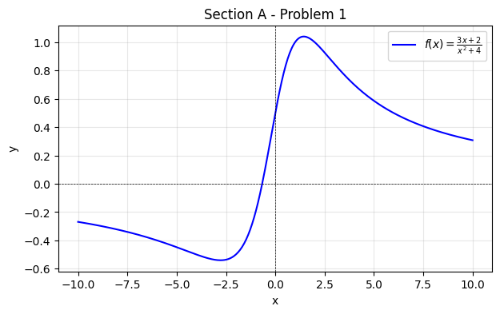


### Question A2

**Problem:**
For $f(x) = \frac{x-3}{2x+4}$, find $f^{-1}$ and determine exactly which real $y$ have preimages.

**Derivation:**
*Domain and Preimages:*
The function $f(x) = \frac{x-3}{2x+4}$ is defined for all real $x$ except where $2x+4 = 0$, i.e., $x = -2$.
So $\text{Domain}(f) = \mathbb{R} \setminus \{-2\}$.

To determine which real $y$ have preimages under $f$, we attempt to solve $y = f(x)$ for $x \in \text{Domain}(f)$:


$$y = \frac{x-3}{2x+4} \implies y(2x+4) = x - 3$$

$$2xy + 4y = x - 3 \implies 2xy - x = -4y - 3 \implies x(2y - 1) = -(4y + 3)$$

If $2y - 1 = 0$, i.e., $y = 1/2$, the equation becomes:


$$x(0) = -\left(4\left(\frac{1}{2}\right) + 3\right) \implies 0 = -5$$


This is a contradiction, so $y = 1/2$ has no preimage.

If $y \ne 1/2$, we divide by $2y - 1$:


$$x = \frac{-(4y+3)}{2y-1} = \frac{4y+3}{1-2y}$$

We check whether this candidate $x$ ever equals $-2$ (the excluded point of $\text{Domain}(f)$):


$$\frac{4y+3}{1-2y} = -2 \implies 4y+3 = -2(1-2y) = -2 + 4y \implies 3 = -2$$


This has no solution, meaning $x$ is never equal to $-2$ for any $y \ne 1/2$.

Thus, a real $y$ has a valid preimage if and only if $y \ne 1/2$.
The set of real $y$ having preimages is $\{y \in \mathbb{R} \mid y \ne 1/2\} = (-\infty, 1/2) \cup (1/2, \infty)$.

*Finding $f^{-1}$:*
Since $f$ is a bijection from $\mathbb{R} \setminus \{-2\}$ to $\mathbb{R} \setminus \{1/2\}$, its inverse function $f^{-1}: \mathbb{R} \setminus \{1/2\} \to \mathbb{R} \setminus \{-2\}$ is obtained by writing $x$ as a function of $y$:


$$f^{-1}(y) = \frac{4y+3}{1-2y}$$


Expressed with input variable $x$:


$$f^{-1}(x) = \frac{4x+3}{1-2x}$$

```python
import matplotlib.pyplot as plt
import numpy as np

x1 = np.linspace(-10, -2.01, 200)
x2 = np.linspace(-1.99, 10, 200)

plt.figure(figsize=(7, 4))
plt.plot(x1, (x1 - 3)/(2*x1 + 4), color='red', label=r'$f(x)=\frac{x-3}{2x+4}$')
plt.plot(x2, (x2 - 3)/(2*x2 + 4), color='red')
plt.axvline(x=-2, color='darkred', linestyle=':', label='Vertical Asymptote (x = -2)')
plt.axhline(y=0.5, color='gray', linestyle='--', label='Horizontal Asymptote (y = 0.5)')
plt.title('Section A - Problem 2')
plt.xlabel('x')
plt.ylabel('y')
plt.ylim(-5, 5)
plt.grid(True, alpha=0.3)
plt.legend()
plt.show()

```


    
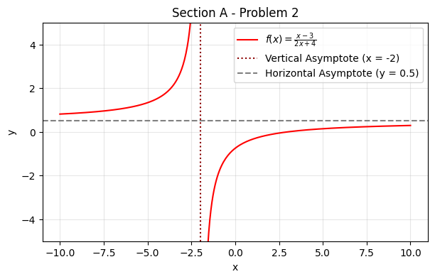


### Question A3

**Problem:**
Determine the domain and range of $f(x) = \frac{4x+3}{x^2+5}$ and decide whether $f$ is one-to-one on $[0, \infty)$.

**Derivation:**
*Domain:*
The denominator $x^2+5 \ge 5 > 0$ for all $x \in \mathbb{R}$. Since $x^2+5$ is never zero and $4x+3$ is defined for all real numbers, $f$ is continuous and well-defined everywhere.


$$\text{Domain}(f) = \mathbb{R} = (-\infty, \infty)$$

*Range:*
Let $y = \frac{4x+3}{x^2+5}$. Rearranging into quadratic form in $x$:


$$y(x^2+5) = 4x+3 \implies y x^2 - 4x + (5y - 3) = 0$$

For $y = 0$, $-4x - 3 = 0 \implies x = -3/4 \in \mathbb{R}$, so $0$ belongs to the range.

For $y \ne 0$, real solutions $x$ exist if and only if the discriminant $\Delta_x \ge 0$:


$$\Delta_x = (-4)^2 - 4(y)(5y - 3) = 16 - 20y^2 + 12y \ge 0$$

$$-20y^2 + 12y + 16 \ge 0 \implies 5y^2 - 3y - 4 \le 0$$

Solving $5y^2 - 3y - 4 = 0$ via the quadratic formula:


$$y = \frac{-(-3) \pm \sqrt{(-3)^2 - 4(5)(-4)}}{2(5)} = \frac{3 \pm \sqrt{9 + 80}}{10} = \frac{3 \pm \sqrt{89}}{10}$$

Since $5 > 0$, the parabola $5y^2 - 3y - 4$ opens upward, so it is non-positive between its roots:


$$\text{Range}(f) = \left[\frac{3 - \sqrt{89}}{10}, \frac{3 + \sqrt{89}}{10}\right]$$

*One-to-one on $[0, \infty)$:*
Differentiating $f(x) = \frac{4x+3}{x^2+5}$ via the quotient rule:


$$f'(x) = \frac{4(x^2+5) - (4x+3)(2x)}{(x^2+5)^2} = \frac{4x^2 + 20 - 8x^2 - 6x}{(x^2+5)^2} = \frac{-4x^2 - 6x + 20}{(x^2+5)^2}$$

Setting $f'(x) = 0$:


$$-4x^2 - 6x + 20 = 0 \implies 2x^2 + 3x - 10 = 0$$

$$x = \frac{-3 \pm \sqrt{9 - 4(2)(-10)}}{4} = \frac{-3 \pm \sqrt{89}}{4}$$

Since $\sqrt{89} \approx 9.434$, $x = \frac{-3 + \sqrt{89}}{4} \approx 1.6085 \in [0, \infty)$.
At $x = 0$, $f'(0) = \frac{20}{25} = \frac{4}{5} > 0$.
For $x > \frac{-3 + \sqrt{89}}{4}$, $f'(x) < 0$.

To explicitly show $f$ is not one-to-one, observe that $f(0) = \frac{3}{5}$. We solve $f(x) = \frac{3}{5}$ for $x \ge 0$:


$$\frac{4x+3}{x^2+5} = \frac{3}{5} \implies 20x + 15 = 3x^2 + 15 \implies 3x^2 - 20x = 0 \implies x(3x - 20) = 0$$


Thus $x = 0$ and $x = 20/3$ both yield $f(x) = 3/5$.
Since $0, \frac{20}{3} \in [0, \infty)$ and $0 \ne \frac{20}{3}$, $f$ is **not one-to-one** on $[0, \infty)$.

```python
import matplotlib.pyplot as plt
import numpy as np

x = np.linspace(-10, 10, 400)
y = (4*x + 3) / (x**2 + 5)

plt.figure(figsize=(7, 4))
plt.plot(x, y, label=r'$f(x)=\frac{4x+3}{x^2+5}$', color='green')
plt.axhline(0, color='black', linewidth=0.5, linestyle='--')
plt.axvline(0, color='black', linewidth=0.5, linestyle='--')
plt.title('Section A - Problem 3')
plt.xlabel('x')
plt.ylabel('y')
plt.grid(True, alpha=0.3)
plt.legend()
plt.show()

```


    
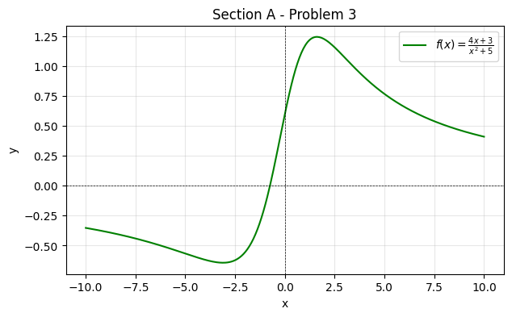


### Question A4

**Problem:**
For $f(x) = \frac{x-4}{3x+5}$, find $f^{-1}$ and determine exactly which real $y$ have preimages.

**Derivation:**
*Domain and Preimages:*
The function $f(x) = \frac{x-4}{3x+5}$ has domain $\text{Domain}(f) = \mathbb{R} \setminus \{-5/3\}$.
To find all $y \in \mathbb{R}$ that possess a preimage $x \in \text{Domain}(f)$, we solve $y = \frac{x-4}{3x+5}$:


$$y(3x+5) = x - 4 \implies 3xy + 5y = x - 4 \implies x(3y - 1) = -5y - 4$$

If $3y - 1 = 0$, i.e., $y = 1/3$:


$$x(0) = -5\left(\frac{1}{3}\right) - 4 = -\frac{17}{3} \ne 0$$


Thus no solution $x$ exists for $y = 1/3$.

If $y \ne 1/3$:


$$x = \frac{-(5y+4)}{3y-1} = \frac{5y+4}{1-3y}$$

Checking whether $x = -5/3$:


$$\frac{5y+4}{1-3y} = -\frac{5}{3} \implies 3(5y+4) = -5(1-3y) \implies 15y + 12 = -5 + 15y \implies 12 = -5$$


This equation has no solution, so $x$ is never equal to $-5/3$.

Therefore, every $y \in \mathbb{R} \setminus \{1/3\}$ has a unique preimage $x$.
The exact set of real $y$ with preimages is $\{y \in \mathbb{R} \mid y \ne 1/3\} = (-\infty, 1/3) \cup (1/3, \infty)$.

*Finding $f^{-1}$:*
Solving for $x$ in terms of $y$ gives the inverse function $f^{-1}: \mathbb{R} \setminus \{1/3\} \to \mathbb{R} \setminus \{-5/3\}$:


$$f^{-1}(y) = \frac{5y+4}{1-3y}$$


or in terms of $x$:


$$f^{-1}(x) = \frac{5x+4}{1-3x}$$

```python
import matplotlib.pyplot as plt
import numpy as np

x1 = np.linspace(-10, -1.68, 200)
x2 = np.linspace(-1.66, 10, 200)

plt.figure(figsize=(7, 4))
plt.plot(x1, (x1 - 4)/(3*x1 + 5), color='purple', label=r'$f(x)=\frac{x-4}{3x+5}$')
plt.plot(x2, (x2 - 4)/(3*x2 + 5), color='purple')
plt.axvline(x=-5/3, color='purple', linestyle=':', label=r'Vertical Asymptote ($x = -\frac{5}{3}$)')
plt.axhline(y=1/3, color='gray', linestyle='--', label=r'Horizontal Asymptote ($y = \frac{1}{3}$)')
plt.title('Section A - Problem 4')
plt.xlabel('x')
plt.ylabel('y')
plt.ylim(-5, 5)
plt.grid(True, alpha=0.3)
plt.legend()
plt.show()

```


    
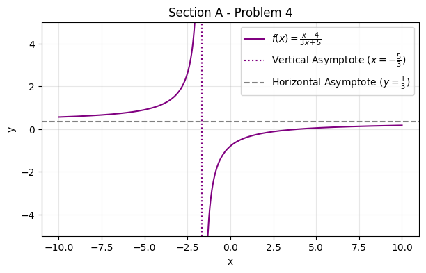


### Question A5

**Problem:**
Determine the domain and range of $f(x) = \frac{5x+4}{x^2+6}$ and decide whether $f$ is one-to-one on $[0, \infty)$.

**Derivation:**
*Domain:*
Since $x^2+6 \ge 6 > 0$ for all real $x$, the denominator is never zero. $f(x)$ is continuous and defined on all real numbers:


$$\text{Domain}(f) = \mathbb{R} = (-\infty, \infty)$$

*Range:*
Setting $y = \frac{5x+4}{x^2+6}$:


$$y(x^2+6) = 5x+4 \implies y x^2 - 5x + (6y - 4) = 0$$

For $y = 0$, $-5x - 4 = 0 \implies x = -4/5 \in \mathbb{R}$, so $y = 0$ is in the range.

For $y \ne 0$, real solutions $x$ exist if and only if the discriminant $\Delta_x \ge 0$:


$$\Delta_x = (-5)^2 - 4(y)(6y - 4) = 25 - 24y^2 + 16y \ge 0$$

$$24y^2 - 16y - 25 \le 0$$

We find the roots of $24y^2 - 16y - 25 = 0$:


$$y = \frac{-(-16) \pm \sqrt{(-16)^2 - 4(24)(-25)}}{2(24)} = \frac{16 \pm \sqrt{256 + 2400}}{48} = \frac{16 \pm \sqrt{2656}}{48}$$


Simplifying $\sqrt{2656} = \sqrt{16 \times 166} = 4\sqrt{166}$:


$$y = \frac{16 \pm 4\sqrt{166}}{48} = \frac{4 \pm \sqrt{166}}{12}$$

Since $24 > 0$, $24y^2 - 16y - 25 \le 0$ holds between the two roots:


$$\text{Range}(f) = \left[\frac{4 - \sqrt{166}}{12}, \frac{4 + \sqrt{166}}{12}\right]$$

*One-to-one on $[0, \infty)$:*
Differentiating $f(x) = \frac{5x+4}{x^2+6}$ with the quotient rule:


$$f'(x) = \frac{5(x^2+6) - (5x+4)(2x)}{(x^2+6)^2} = \frac{5x^2 + 30 - 10x^2 - 8x}{(x^2+6)^2} = \frac{-5x^2 - 8x + 30}{(x^2+6)^2}$$

Critical points satisfy $-5x^2 - 8x + 30 = 0 \implies 5x^2 + 8x - 30 = 0$:


$$x = \frac{-8 \pm \sqrt{64 - 4(5)(-30)}}{10} = \frac{-8 \pm \sqrt{664}}{10} = \frac{-8 \pm 2\sqrt{166}}{10} = \frac{-4 \pm \sqrt{166}}{5}$$

Since $\sqrt{166} \approx 12.884$, $x = \frac{-4 + \sqrt{166}}{5} \approx 1.777 \in [0, \infty)$.
At $x = 0$, $f'(0) = \frac{30}{36} = \frac{5}{6} > 0$.
For $x > \frac{-4 + \sqrt{166}}{5}$, $f'(x) < 0$.

To construct a counterexample to injectivity, solve $f(x) = f(0) = \frac{4}{6} = \frac{2}{3}$ for $x \ge 0$:


$$\frac{5x+4}{x^2+6} = \frac{2}{3} \implies 15x + 12 = 2x^2 + 12 \implies 2x^2 - 15x = 0 \implies x(2x - 15) = 0$$


Hence $x = 0$ and $x = 15/2 = 7.5$ both give $f(x) = 2/3$.
Since $0, \frac{15}{2} \in [0, \infty)$ and $0 \ne \frac{15}{2}$, $f$ is **not one-to-one** on $[0, \infty)$.

```python
import matplotlib.pyplot as plt
import numpy as np

x = np.linspace(-10, 10, 400)
y = (5*x + 4) / (x**2 + 6)

plt.figure(figsize=(7, 4))
plt.plot(x, y, label=r'$f(x)=\frac{5x+4}{x^2+6}$', color='orange')
plt.axhline(0, color='black', linewidth=0.5, linestyle='--')
plt.axvline(0, color='black', linewidth=0.5, linestyle='--')
plt.title('Section A - Problem 5')
plt.xlabel('x')
plt.ylabel('y')
plt.grid(True, alpha=0.3)
plt.legend()
plt.show()

```


    
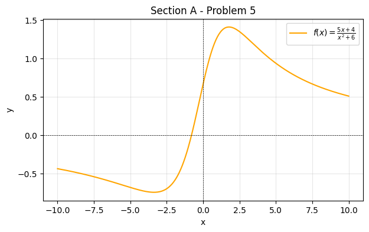


### Question A6

**Problem:**
For $f(x)=\frac{x-5}{4x+6}$, find $f^{-1}$ and determine exactly which real $y$ have preimages.

**Derivation:**
*Domain and Preimages:*
The function $f(x) = \frac{x-5}{4x+6}$ is defined for all real $x$ except where the denominator vanishes:


$$4x+6 = 0 \implies x = -\frac{3}{2}$$


Thus, $\text{Domain}(f) = \mathbb{R} \setminus \left\lbrace -\frac{3}{2}\right\rbrace$.

To determine which real $y$ have preimages under $f$, we solve $y = f(x)$ for $x \in \text{Domain}(f)$:


$$y = \frac{x-5}{4x+6} \implies y(4x+6) = x - 5$$

$$4xy + 6y = x - 5 \implies 4xy - x = -6y - 5 \implies x(4y - 1) = -(6y + 5)$$

If $4y - 1 = 0$, i.e., $y = 1/4$:


$$x(0) = -\left(6\left(\frac{1}{4}\right) + 5\right) = -\frac{13}{2} \ne 0$$


This is a contradiction, so $y = 1/4$ has no preimage.

If $y \ne 1/4$, we divide by $4y - 1$:


$$x = \frac{-(6y+5)}{4y-1} = \frac{6y+5}{1-4y}$$

We verify if this candidate $x$ ever equals the excluded domain point $-3/2$:


$$\frac{6y+5}{1-4y} = -\frac{3}{2} \implies 2(6y+5) = -3(1-4y) \implies 12y + 10 = -3 + 12y \implies 10 = -3$$


This equation has no solution, meaning $x$ is never equal to $-3/2$.

Therefore, a real $y$ has a valid preimage if and only if $y \ne 1/4$.
The set of real $y$ having preimages is $\{y \in \mathbb{R} \mid y \ne 1/4\} = (-\infty, 1/4) \cup (1/4, \infty)$.

*Finding $f^{-1}$:*
Since $f$ is a bijection from $\mathbb{R} \setminus \{-3/2\}$ to $\mathbb{R} \setminus \{1/4\}$, its inverse function $f^{-1}: \mathbb{R} \setminus \{1/4\} \to \mathbb{R} \setminus \{-3/2\}$ is:


$$f^{-1}(y) = \frac{6y+5}{1-4y}$$


Expressed with input variable $x$:


$$f^{-1}(x) = \frac{6x+5}{1-4x}$$

---

```python
import matplotlib.pyplot as plt
import numpy as np

x1 = np.linspace(-10, -1.51, 200)
x2 = np.linspace(-1.49, 10, 200)

plt.figure(figsize=(7, 4))
plt.plot(x1, (x1 - 5)/(4*x1 + 6), color='brown', label=r'$f(x)=\frac{x-5}{4x+6}$')
plt.plot(x2, (x2 - 5)/(4*x2 + 6), color='brown')
plt.axvline(x=-1.5, color='darkred', linestyle=':', label='Vertical Asymptote (x = -1.5)')
plt.axhline(y=0.25, color='gray', linestyle='--', label='Horizontal Asymptote (y = 0.25)')
plt.title('Section A - Problem 6')
plt.xlabel('x')
plt.ylabel('y')
plt.ylim(-5, 5)
plt.grid(True, alpha=0.3)
plt.legend()
plt.show()

```


    
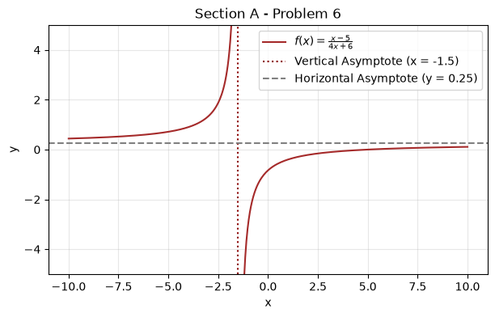


### Question A7

**Problem:**
Determine the domain and range of $f(x)=\frac{6x+5}{x^{2}+7}$ and decide whether $f$ is one-to-one on $[0,\infty)$.

**Derivation:**
*Domain:*
The denominator $x^2+7 \ge 7 > 0$ for all real $x$. Since division by zero never occurs, $f$ is defined and continuous on all of $\mathbb{R}$:


$$\text{Domain}(f) = \mathbb{R} = (-\infty, \infty)$$

*Range:*
Let $y = \frac{6x+5}{x^2+7}$. Rearranging into a quadratic equation in $x$:


$$y(x^2+7) = 6x+5 \implies y x^2 - 6x + (7y - 5) = 0$$

For $y = 0$, $-6x - 5 = 0 \implies x = -5/6 \in \mathbb{R}$, so $0$ is in the range.

For $y \ne 0$, real solutions $x$ exist if and only if the discriminant $\Delta_x \ge 0$:


$$\Delta_x = (-6)^2 - 4(y)(7y - 5) = 36 - 28y^2 + 20y \ge 0$$

$$-28y^2 + 20y + 36 \ge 0 \implies 7y^2 - 5y - 9 \le 0$$

Solving $7y^2 - 5y - 9 = 0$ via the quadratic formula:


$$y = \frac{-(-5) \pm \sqrt{(-5)^2 - 4(7)(-9)}}{2(7)} = \frac{5 \pm \sqrt{25 + 252}}{14} = \frac{5 \pm \sqrt{277}}{14}$$

Since $7 > 0$, $7y^2 - 5y - 9 \le 0$ holds between its two real roots:


$$\text{Range}(f) = \left[\frac{5 - \sqrt{277}}{14}, \frac{5 + \sqrt{277}}{14}\right]$$

*One-to-one on $[0, \infty)$:*
Differentiating $f(x) = \frac{6x+5}{x^2+7}$ via the quotient rule:


$$f'(x) = \frac{6(x^2+7) - (6x+5)(2x)}{(x^2+7)^2} = \frac{6x^2 + 42 - 12x^2 - 10x}{(x^2+7)^2} = \frac{-6x^2 - 10x + 42}{(x^2+7)^2}$$

Critical points satisfy $-6x^2 - 10x + 42 = 0 \implies 3x^2 + 5x - 21 = 0$:


$$x = \frac{-5 \pm \sqrt{25 - 4(3)(-21)}}{6} = \frac{-5 \pm \sqrt{277}}{6}$$

Since $\sqrt{277} \approx 16.643$, the positive critical point is $x = \frac{-5 + \sqrt{277}}{6} \approx 1.94 \in [0, \infty)$.
Evaluating the derivative:

* At $x = 0$, $f'(0) = \frac{42}{49} = \frac{6}{7} > 0$.
* At $x = 3$, $f'(3) = \frac{-6(9) - 10(3) + 42}{(9+7)^2} = \frac{-42}{256} < 0$.

Since $f'(x)$ changes sign on $[0, \infty)$, $f(x)$ increases and then decreases on this interval.

To explicitly disprove injectivity, note that $f(0) = 5/7$. Solving $f(x) = 5/7$ for $x \ge 0$:


$$\frac{6x+5}{x^2+7} = \frac{5}{7} \implies 42x + 35 = 5x^2 + 35 \implies 5x^2 - 42x = 0 \implies x(5x - 42) = 0$$


Hence $x = 0$ and $x = 42/5 = 8.4$ both yield $f(x) = 5/7$.
Since $0, 8.4 \in [0, \infty)$ and $0 \ne 8.4$, $f$ is **not one-to-one** on $[0, \infty)$.

---

```python
import matplotlib.pyplot as plt
import numpy as np

x = np.linspace(-10, 10, 400)
y = (6*x + 5) / (x**2 + 7)

plt.figure(figsize=(7, 4))
plt.plot(x, y, label=r'$f(x)=\frac{6x+5}{x^2+7}$', color='magenta')
plt.axhline(0, color='black', linewidth=0.5, linestyle='--')
plt.axvline(0, color='black', linewidth=0.5, linestyle='--')
plt.title('Section A - Problem 7')
plt.xlabel('x')
plt.ylabel('y')
plt.grid(True, alpha=0.3)
plt.legend()
plt.show()

```


    
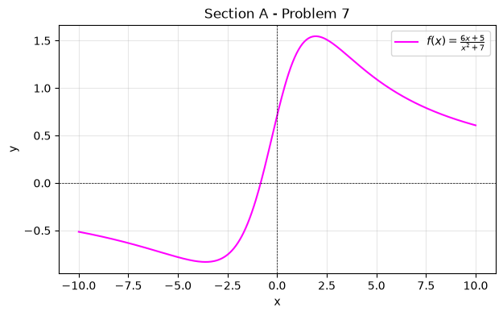


### Question A8

**Problem:**
For $f(x)=\frac{x-6}{5x+7}$, find $f^{-1}$ and determine exactly which real $y$ have preimages.

**Derivation:**
*Domain and Preimages:*
The function $f(x) = \frac{x-6}{5x+7}$ has domain $\text{Domain}(f) = \mathbb{R} \setminus \{-7/5\}$.
To find all $y \in \mathbb{R}$ that possess a preimage $x \in \text{Domain}(f)$, we solve $y = \frac{x-6}{5x+7}$:


$$y(5x+7) = x - 6 \implies 5xy + 7y = x - 6 \implies x(5y - 1) = -7y - 6$$

If $5y - 1 = 0$, i.e., $y = 1/5$:


$$x(0) = -7\left(\frac{1}{5}\right) - 6 = -\frac{37}{5} \ne 0$$


Thus no solution $x$ exists for $y = 1/5$.

If $y \ne 1/5$:


$$x = \frac{-(7y+6)}{5y-1} = \frac{7y+6}{1-5y}$$

Checking whether $x = -7/5$:


$$\frac{7y+6}{1-5y} = -\frac{7}{5} \implies 5(7y+6) = -7(1-5y) \implies 35y + 30 = -7 + 35y \implies 30 = -7$$


This equation has no solution, so $x$ is never equal to $-7/5$.

Therefore, every $y \in \mathbb{R} \setminus \{1/5\}$ has a unique preimage $x$.
The exact set of real $y$ with preimages is $\{y \in \mathbb{R} \mid y \ne 1/5\} = (-\infty, 1/5) \cup (1/5, \infty)$.

*Finding $f^{-1}$:*
Solving for $x$ in terms of $y$ yields $f^{-1}: \mathbb{R} \setminus \{1/5\} \to \mathbb{R} \setminus \{-7/5\}$:


$$f^{-1}(y) = \frac{7y+6}{1-5y}$$


or in terms of variable $x$:


$$f^{-1}(x) = \frac{7x+6}{1-5x}$$

---

```python
import matplotlib.pyplot as plt
import numpy as np

x1 = np.linspace(-10, -1.41, 200)
x2 = np.linspace(-1.39, 10, 200)

plt.figure(figsize=(7, 4))
plt.plot(x1, (x1 - 6)/(5*x1 + 7), color='teal', label=r'$f(x)=\frac{x-6}{5x+7}$')
plt.plot(x2, (x2 - 6)/(5*x2 + 7), color='teal')
plt.axvline(x=-1.4, color='darkcyan', linestyle=':', label='Vertical Asymptote (x = -1.4)')
plt.axhline(y=0.2, color='gray', linestyle='--', label='Horizontal Asymptote (y = 0.2)')
plt.title('Section A - Problem 8')
plt.xlabel('x')
plt.ylabel('y')
plt.ylim(-5, 5)
plt.grid(True, alpha=0.3)
plt.legend()
plt.show()

```


    
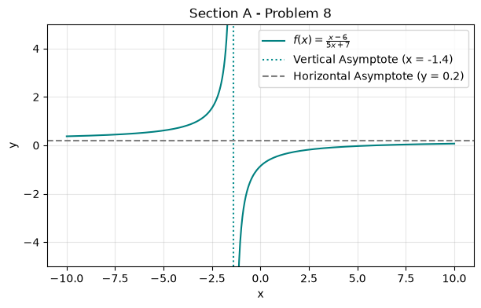


### Question A9

**Problem:**
Determine the domain and range of $f(x)=\frac{7x+1}{x^{2}+8}$ and decide whether $f$ is one-to-one on $[0,\infty)$.

**Derivation:**
*Domain:*
Since $x^2+8 \ge 8 > 0$ for all $x \in \mathbb{R}$, $f(x)$ is continuous and defined everywhere on $\mathbb{R}$:


$$\text{Domain}(f) = \mathbb{R} = (-\infty, \infty)$$

*Range:*
Setting $y = \frac{7x+1}{x^2+8}$:


$$y(x^2+8) = 7x+1 \implies y x^2 - 7x + (8y - 1) = 0$$

For $y = 0$, $-7x - 1 = 0 \implies x = -1/7 \in \mathbb{R}$, so $y = 0$ is in the range.

For $y \ne 0$, real solutions $x$ exist if and only if the discriminant $\Delta_x \ge 0$:


$$\Delta_x = (-7)^2 - 4(y)(8y - 1) = 49 - 32y^2 + 4y \ge 0$$

$$32y^2 - 4y - 49 \le 0$$

We find the roots of $32y^2 - 4y - 49 = 0$:


$$y = \frac{-(-4) \pm \sqrt{(-4)^2 - 4(32)(-49)}}{2(32)} = \frac{4 \pm \sqrt{16 + 6272}}{64} = \frac{4 \pm \sqrt{6288}}{64}$$


Simplifying $\sqrt{6288} = \sqrt{16 \times 393} = 4\sqrt{393}$:


$$y = \frac{4 \pm 4\sqrt{393}}{64} = \frac{1 \pm \sqrt{393}}{16}$$

Since $32 > 0$, $32y^2 - 4y - 49 \le 0$ holds between the two roots:


$$\text{Range}(f) = \left[\frac{1 - \sqrt{393}}{16}, \frac{1 + \sqrt{393}}{16}\right]$$

*One-to-one on $[0, \infty)$:*
Differentiating $f(x) = \frac{7x+1}{x^2+8}$ with the quotient rule:


$$f'(x) = \frac{7(x^2+8) - (7x+1)(2x)}{(x^2+8)^2} = \frac{7x^2 + 56 - 14x^2 - 2x}{(x^2+8)^2} = \frac{-7x^2 - 2x + 56}{(x^2+8)^2}$$

Critical points satisfy $-7x^2 - 2x + 56 = 0 \implies 7x^2 + 2x - 56 = 0$:


$$x = \frac{-2 \pm \sqrt{4 - 4(7)(-56)}}{14} = \frac{-2 \pm \sqrt{1572}}{14} = \frac{-2 \pm 2\sqrt{393}}{14} = \frac{-1 \pm \sqrt{393}}{7}$$

The positive critical point is $x = \frac{-1 + \sqrt{393}}{7} \approx 2.689 \in [0, \infty)$.
Evaluating the derivative:

* At $x = 0$, $f'(0) = \frac{56}{64} = \frac{7}{8} > 0$.
* At $x = 3$, $f'(3) = \frac{-7(9) - 2(3) + 56}{(9+8)^2} = \frac{-13}{289} < 0$.

Since $f'$ changes sign from positive to negative, $f$ is not monotonic on $[0, \infty)$.

To construct an explicit counterexample, solve $f(x) = f(0) = 1/8$ for $x \ge 0$:


$$\frac{7x+1}{x^2+8} = \frac{1}{8} \implies 56x + 8 = x^2 + 8 \implies x^2 - 56x = 0 \implies x(x - 56) = 0$$


Hence $x = 0$ and $x = 56$ both give $f(x) = 1/8$.
Since $0, 56 \in [0, \infty)$ and $0 \ne 56$, $f$ is **not one-to-one** on $[0, \infty)$.

---

```python
import matplotlib.pyplot as plt
import numpy as np

x = np.linspace(-10, 10, 400)
y = (7*x + 1) / (x**2 + 8)

plt.figure(figsize=(7, 4))
plt.plot(x, y, label=r'$f(x)=\frac{7x+1}{x^2+8}$', color='olive')
plt.axhline(0, color='black', linewidth=0.5, linestyle='--')
plt.axvline(0, color='black', linewidth=0.5, linestyle='--')
plt.title('Section A - Problem 9')
plt.xlabel('x')
plt.ylabel('y')
plt.grid(True, alpha=0.3)
plt.legend()
plt.show()

```


    
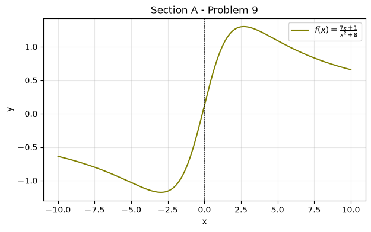


### Question A10

**Problem:**
For $f(x)=\frac{x-7}{1x+8}$, find $f^{-1}$ and determine exactly which real $y$ have preimages.

**Derivation:**
*Domain and Preimages:*
The function $f(x) = \frac{x-7}{x+8}$ is defined for all $x$ except where $x+8 = 0$, i.e., $x = -8$.
So $\text{Domain}(f) = \mathbb{R} \setminus \{-8\}$.

To determine which $y \in \mathbb{R}$ have preimages under $f$, we solve $y = \frac{x-7}{x+8}$:


$$y(x+8) = x - 7 \implies xy + 8y = x - 7 \implies xy - x = -8y - 7 \implies x(1 - y) = 8y + 7$$

If $1 - y = 0$, i.e., $y = 1$:


$$x(0) = 8(1) + 7 = 15 \ne 0$$


This is a contradiction, so $y = 1$ has no preimage.

If $y \ne 1$, we divide by $1 - y$:


$$x = \frac{8y+7}{1-y}$$

We check whether this candidate $x$ ever equals $-8$:


$$\frac{8y+7}{1-y} = -8 \implies 8y+7 = -8(1-y) \implies 8y+7 = -8 + 8y \implies 7 = -8$$


This has no solution, so $x \ne -8$ for all $y \ne 1$.

Thus, a real $y$ has a preimage if and only if $y \ne 1$.
The set of real $y$ having preimages is $\{y \in \mathbb{R} \mid y \ne 1\} = (-\infty, 1) \cup (1, \infty)$.

*Finding $f^{-1}$:*
Solving for $x$ in terms of $y$ gives $f^{-1}: \mathbb{R} \setminus \{1\} \to \mathbb{R} \setminus \{-8\}$:


$$f^{-1}(y) = \frac{8y+7}{1-y}$$


or in terms of variable $x$:


$$f^{-1}(x) = \frac{8x+7}{1-x}$$

```python
import matplotlib.pyplot as plt
import numpy as np

x1 = np.linspace(-20, -8.01, 200)
x2 = np.linspace(-7.99, 10, 200)

plt.figure(figsize=(7, 4))
plt.plot(x1, (x1 - 7)/(x1 + 8), color='navy', label=r'$f(x)=\frac{x-7}{x+8}$')
plt.plot(x2, (x2 - 7)/(x2 + 8), color='navy')
plt.axvline(x=-8, color='blue', linestyle=':', label='Vertical Asymptote (x = -8)')
plt.axhline(y=1, color='gray', linestyle='--', label='Horizontal Asymptote (y = 1)')
plt.title('Section A - Problem 10')
plt.xlabel('x')
plt.ylabel('y')
plt.ylim(-10, 10)
plt.grid(True, alpha=0.3)
plt.legend()
plt.show()

```


    
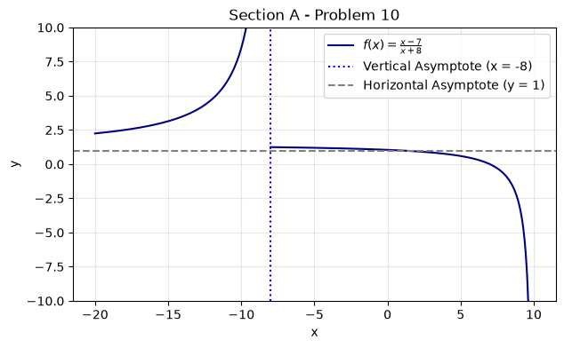


### Question A11

**Problem:**
Determine the domain and range of $f(x)=\frac{8x+2}{x^{2}+9}$ and decide whether $f$ is one-to-one on $[0,\infty)$.

**Derivation:**
*Domain:*
The denominator satisfies $x^2 + 9 \ge 9 > 0$ for all real $x$. Since division by zero never occurs and the numerator is a polynomial defined everywhere, $f$ is continuous and defined on all real numbers:


$$\text{Domain}(f) = \mathbb{R} = (-\infty, \infty)$$

*Range:*
Let $y = \frac{8x+2}{x^2+9}$. Rearranging into a quadratic equation in $x$:


$$y(x^2+9) = 8x+2 \implies y x^2 - 8x + (9y - 2) = 0$$

* If $y = 0$, the equation becomes $-8x - 2 = 0 \implies x = -1/4 \in \mathbb{R}$, so $0 \in \text{Range}(f)$.


* If $y \ne 0$, real solutions $x$ exist if and only if the discriminant $\Delta_x \ge 0$:

$$\Delta_x = (-8)^2 - 4(y)(9y - 2) = 64 - 36y^2 + 8y \ge 0$$


$$36y^2 - 8y - 64 \le 0 \implies 9y^2 - 2y - 16 \le 0$$


To find the roots of $9y^2 - 2y - 16 = 0$, we apply the quadratic formula:


$$y = \frac{-(-2) \pm \sqrt{(-2)^2 - 4(9)(-16)}}{2(9)} = \frac{2 \pm \sqrt{4 + 576}}{18} = \frac{2 \pm \sqrt{580}}{18} = \frac{1 \pm \sqrt{145}}{9}$$

Since $9 > 0$, the parabola opens upward and $9y^2 - 2y - 16 \le 0$ holds between its roots:


$$\text{Range}(f) = \left[\frac{1 - \sqrt{145}}{9}, \frac{1 + \sqrt{145}}{9}\right]$$

*One-to-one on $[0, \infty)$:*
Differentiating $f(x) = \frac{8x+2}{x^2+9}$ via the quotient rule:


$$f'(x) = \frac{8(x^2+9) - (8x+2)(2x)}{(x^2+9)^2} = \frac{8x^2 + 72 - 16x^2 - 4x}{(x^2+9)^2} = \frac{-8x^2 - 4x + 72}{(x^2+9)^2} = \frac{-4(2x^2 + x - 18)}{(x^2+9)^2}$$

Critical points satisfy $2x^2 + x - 18 = 0$:


$$x = \frac{-1 \pm \sqrt{1 - 4(2)(-18)}}{4} = \frac{-1 \pm \sqrt{145}}{4}$$


The positive critical point is $x = \frac{-1 + \sqrt{145}}{4} \approx 2.76 \in [0, \infty)$.
Evaluating $f'(x)$:

* At $x = 0$, $f'(0) = \frac{72}{81} = \frac{8}{9} > 0$.
* For $x > \frac{-1 + \sqrt{145}}{4}$, $f'(x) < 0$.

To construct an explicit counterexample to injectivity, solve $f(x) = f(0) = \frac{2}{9}$ for $x \ge 0$:


$$\frac{8x+2}{x^2+9} = \frac{2}{9} \implies 72x + 18 = 2x^2 + 18 \implies 2x^2 - 72x = 0 \implies 2x(x - 36) = 0$$


Hence $f(0) = f(36) = 2/9$. Since $0, 36 \in [0, \infty)$ and $0 \ne 36$, $f$ is **not one-to-one** on $[0, \infty)$.

---

```python
import matplotlib.pyplot as plt
import numpy as np

x = np.linspace(-10, 10, 400)
y = (8*x + 2) / (x**2 + 9)

plt.figure(figsize=(7, 4))
plt.plot(x, y, label=r'$f(x)=\frac{8x+2}{x^2+9}$', color='darkorange')
plt.axhline(0, color='black', linewidth=0.5, linestyle='--')
plt.axvline(0, color='black', linewidth=0.5, linestyle='--')
plt.title('Section A - Problem 11')
plt.xlabel('x')
plt.ylabel('y')
plt.grid(True, alpha=0.3)
plt.legend()
plt.show()

```


    
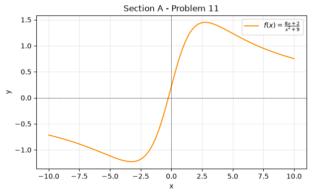


### Question A12

**Problem:**
For $f(x)=\frac{x-8}{2x+9}$, find $f^{-1}$ and determine exactly which real $y$ have preimages.

**Derivation:**
*Domain and Preimages:*
The function $f(x) = \frac{x-8}{2x+9}$ is defined for all real $x$ except where $2x+9 = 0 \implies x = -9/2$.
Thus, $\text{Domain}(f) = \mathbb{R} \setminus \{-9/2\}$.

To determine which real $y$ have preimages under $f$, we solve $y = f(x)$ for $x \in \text{Domain}(f)$:


$$y = \frac{x-8}{2x+9} \implies y(2x+9) = x - 8 \implies 2xy + 9y = x - 8 \implies x(2y - 1) = -(9y + 8)$$

* If $2y - 1 = 0 \implies y = 1/2$:

$$x(0) = -\left(9\left(\frac{1}{2}\right) + 8\right) = -\frac{25}{2} \ne 0$$


This is a contradiction, so $y = 1/2$ has no preimage.
* If $y \ne 1/2$, dividing by $2y - 1$ gives:

$$x = \frac{-(9y+8)}{2y-1} = \frac{9y+8}{1-2y}$$


We verify whether this candidate $x$ ever equals $-9/2$:


$$\frac{9y+8}{1-2y} = -\frac{9}{2} \implies 2(9y+8) = -9(1-2y) \implies 18y + 16 = -9 + 18y \implies 16 = -9$$


This equation has no solution, meaning $x \ne -9/2$ for all $y \ne 1/2$.

Therefore, a real $y$ has a valid preimage if and only if $y \ne 1/2$.
The set of real $y$ having preimages is $\{y \in \mathbb{R} \mid y \ne 1/2\} = (-\infty, 1/2) \cup (1/2, \infty)$.

*Finding $f^{-1}$:*
Solving for $x$ in terms of $y$ yields the inverse function $f^{-1}: \mathbb{R} \setminus \{1/2\} \to \mathbb{R} \setminus \{-9/2\}$:


$$f^{-1}(y) = \frac{9y+8}{1-2y}$$


Expressed with input variable $x$:


$$f^{-1}(x) = \frac{9x+8}{1-2x}$$

---

```python
import matplotlib.pyplot as plt
import numpy as np

x1 = np.linspace(-15, -4.51, 200)
x2 = np.linspace(-4.49, 10, 200)

plt.figure(figsize=(7, 4))
plt.plot(x1, (x1 - 8)/(2*x1 + 9), color='crimson', label=r'$f(x)=\frac{x-8}{2x+9}$')
plt.plot(x2, (x2 - 8)/(2*x2 + 9), color='crimson')
plt.axvline(x=-4.5, color='darkred', linestyle=':', label='Vertical Asymptote (x = -4.5)')
plt.axhline(y=0.5, color='gray', linestyle='--', label='Horizontal Asymptote (y = 0.5)')
plt.title('Section A - Problem 12')
plt.xlabel('x')
plt.ylabel('y')
plt.ylim(-5, 5)
plt.grid(True, alpha=0.3)
plt.legend()
plt.show()

```


    
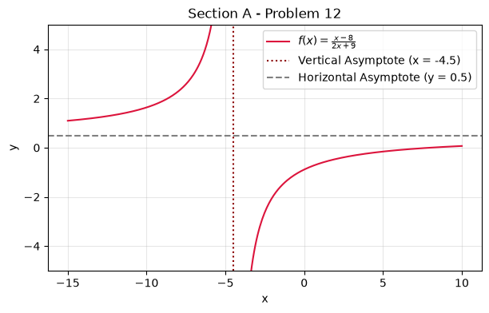


### Question A13

**Problem:**
Determine the domain and range of $f(x)=\frac{2x+3}{x^{2}+10}$ and decide whether $f$ is one-to-one on $[0,\infty)$.

**Derivation:**
*Domain:*
Since $x^2 + 10 \ge 10 > 0$ for all $x \in \mathbb{R}$, no division by zero occurs:


$$\text{Domain}(f) = \mathbb{R} = (-\infty, \infty)$$

*Range:*
Let $y = \frac{2x+3}{x^2+10}$. Rearranging into a quadratic in $x$:


$$y(x^2+10) = 2x+3 \implies y x^2 - 2x + (10y - 3) = 0$$

* If $y = 0$, $-2x - 3 = 0 \implies x = -3/2 \in \mathbb{R}$, so $0 \in \text{Range}(f)$.


* If $y \ne 0$, real solutions $x$ exist if and only if the discriminant $\Delta_x \ge 0$:

$$\Delta_x = (-2)^2 - 4(y)(10y - 3) = 4 - 40y^2 + 12y \ge 0$$


$$40y^2 - 12y - 4 \le 0 \implies 10y^2 - 3y - 1 \le 0$$


Factoring $10y^2 - 3y - 1 = (2y - 1)(5y + 1) = 0$ gives roots $y = 1/2$ and $y = -1/5$.
Since $10 > 0$, the inequality holds between the roots:


$$\text{Range}(f) = \left[-\frac{1}{5}, \frac{1}{2}\right]$$

*One-to-one on $[0, \infty)$:*
Differentiating $f(x) = \frac{2x+3}{x^2+10}$ via the quotient rule:


$$f'(x) = \frac{2(x^2+10) - (2x+3)(2x)}{(x^2+10)^2} = \frac{2x^2 + 20 - 4x^2 - 6x}{(x^2+10)^2} = \frac{-2x^2 - 6x + 20}{(x^2+10)^2} = \frac{-2(x+5)(x-2)}{(x^2+10)^2}$$

The only critical point on $[0, \infty)$ is $x = 2$.
$f'(x) > 0$ on $[0, 2)$ and $f'(x) < 0$ on $(2, \infty)$, so $f$ increases and then decreases.

To construct a counterexample to injectivity, solve $f(x) = f(0) = \frac{3}{10}$ for $x \ge 0$:


$$\frac{2x+3}{x^2+10} = \frac{3}{10} \implies 20x + 30 = 3x^2 + 30 \implies 3x^2 - 20x = 0 \implies x(3x - 20) = 0$$


Hence $f(0) = f(20/3) = 3/10$. Since $0, \frac{20}{3} \in [0, \infty)$ and $0 \ne \frac{20}{3}$, $f$ is **not one-to-one** on $[0, \infty)$.

---

```python
import matplotlib.pyplot as plt
import numpy as np

x = np.linspace(-12, 12, 400)
y = (2*x + 3) / (x**2 + 10)

plt.figure(figsize=(7, 4))
plt.plot(x, y, label=r'$f(x)=\frac{2x+3}{x^2+10}$', color='darkblue')
plt.axhline(0, color='black', linewidth=0.5, linestyle='--')
plt.axvline(0, color='black', linewidth=0.5, linestyle='--')
plt.title('Section A - Problem 13')
plt.xlabel('x')
plt.ylabel('y')
plt.grid(True, alpha=0.3)
plt.legend()
plt.show()

```


    
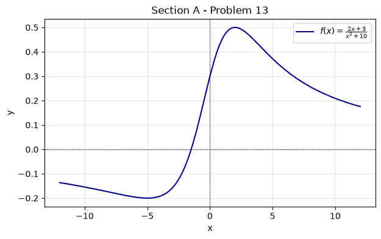


### Question A14

**Problem:**
For $f(x)=\frac{x-2}{3x+10}$, find $f^{-1}$ and determine exactly which real $y$ have preimages.

**Derivation:**
*Domain and Preimages:*
The function $f(x) = \frac{x-2}{3x+10}$ has domain $\text{Domain}(f) = \mathbb{R} \setminus \{-10/3\}$.
To find all $y \in \mathbb{R}$ that possess a preimage $x \in \text{Domain}(f)$, we solve $y = \frac{x-2}{3x+10}$:


$$y(3x+10) = x - 2 \implies 3xy + 10y = x - 2 \implies x(3y - 1) = -(10y + 2)$$

* If $3y - 1 = 0 \implies y = 1/3$:

$$x(0) = -\left(10\left(\frac{1}{3}\right) + 2\right) = -\frac{16}{3} \ne 0$$


Thus no solution $x$ exists for $y = 1/3$.
* If $y \ne 1/3$:

$$x = \frac{-(10y+2)}{3y-1} = \frac{10y+2}{1-3y}$$


Checking whether $x = -10/3$:


$$\frac{10y+2}{1-3y} = -\frac{10}{3} \implies 3(10y+2) = -10(1-3y) \implies 30y + 6 = -10 + 30y \implies 6 = -10$$


This equation has no solution, so $x \ne -10/3$ for all $y \ne 1/3$.

Therefore, every $y \in \mathbb{R} \setminus \{1/3\}$ has a unique preimage $x$.
The exact set of real $y$ with preimages is $\{y \in \mathbb{R} \mid y \ne 1/3\} = (-\infty, 1/3) \cup (1/3, \infty)$.

*Finding $f^{-1}$:*
Solving for $x$ in terms of $y$ gives $f^{-1}: \mathbb{R} \setminus \{1/3\} \to \mathbb{R} \setminus \{-10/3\}$:


$$f^{-1}(y) = \frac{10y+2}{1-3y}$$


or in terms of variable $x$:


$$f^{-1}(x) = \frac{10x+2}{1-3x}$$

---

```python
import matplotlib.pyplot as plt
import numpy as np

x1 = np.linspace(-10, -3.35, 200)
x2 = np.linspace(-3.31, 10, 200)

plt.figure(figsize=(7, 4))
plt.plot(x1, (x1 - 2)/(3*x1 + 10), color='forestgreen', label=r'$f(x)=\frac{x-2}{3x+10}$')
plt.plot(x2, (x2 - 2)/(3*x2 + 10), color='forestgreen')
plt.axvline(x=-10/3, color='darkgreen', linestyle=':', label=r'Vertical Asymptote ($x = -\frac{10}{3}$)')
plt.axhline(y=1/3, color='gray', linestyle='--', label=r'Horizontal Asymptote ($y = \frac{1}{3}$)')
plt.title('Section A - Problem 14')
plt.xlabel('x')
plt.ylabel('y')
plt.ylim(-5, 5)
plt.grid(True, alpha=0.3)
plt.legend()
plt.show()

```


    
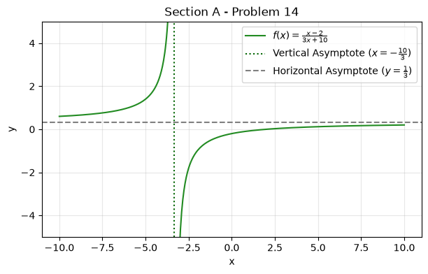


### Question A15

**Problem:**
Determine the domain and range of $f(x)=\frac{3x+4}{x^{2}+11}$ and decide whether $f$ is one-to-one on $[0,\infty)$.

**Derivation:**
*Domain:*
Since $x^2 + 11 \ge 11 > 0$ for all $x \in \mathbb{R}$, $f(x)$ is continuous and defined everywhere:


$$\text{Domain}(f) = \mathbb{R} = (-\infty, \infty)$$

*Range:*
Setting $y = \frac{3x+4}{x^2+11}$:


$$y(x^2+11) = 3x+4 \implies y x^2 - 3x + (11y - 4) = 0$$

* If $y = 0$, $-3x - 4 = 0 \implies x = -4/3 \in \mathbb{R}$, so $0 \in \text{Range}(f)$.


* If $y \ne 0$, real solutions $x$ exist if and only if the discriminant $\Delta_x \ge 0$:

$$\Delta_x = (-3)^2 - 4(y)(11y - 4) = 9 - 44y^2 + 16y \ge 0$$


$$44y^2 - 16y - 9 \le 0$$


Solving $44y^2 - 16y - 9 = 0$ via the quadratic formula:


$$y = \frac{-(-16) \pm \sqrt{(-16)^2 - 4(44)(-9)}}{2(44)} = \frac{16 \pm \sqrt{256 + 1584}}{88} = \frac{16 \pm \sqrt{1840}}{88} = \frac{4 \pm \sqrt{115}}{22}$$

Since $44 > 0$, the inequality holds between the two roots:


$$\text{Range}(f) = \left[\frac{4 - \sqrt{115}}{22}, \frac{4 + \sqrt{115}}{22}\right]$$

*One-to-one on $[0, \infty)$:*
Differentiating $f(x) = \frac{3x+4}{x^2+11}$ with the quotient rule:


$$f'(x) = \frac{3(x^2+11) - (3x+4)(2x)}{(x^2+11)^2} = \frac{3x^2 + 33 - 6x^2 - 8x}{(x^2+11)^2} = \frac{-3x^2 - 8x + 33}{(x^2+11)^2}$$

Critical points satisfy $-3x^2 - 8x + 33 = 0 \implies 3x^2 + 8x - 33 = 0$:


$$x = \frac{-8 \pm \sqrt{64 - 4(3)(-33)}}{6} = \frac{-8 \pm \sqrt{460}}{6} = \frac{-4 \pm \sqrt{115}}{3}$$


The positive critical point is $x = \frac{-4 + \sqrt{115}}{3} \approx 2.24 \in [0, \infty)$.
$f'(0) = \frac{33}{121} = \frac{3}{11} > 0$, and $f'(x) < 0$ for $x > \frac{-4 + \sqrt{115}}{3}$.

To construct an explicit counterexample to injectivity, solve $f(x) = f(0) = \frac{4}{11}$ for $x \ge 0$:


$$\frac{3x+4}{x^2+11} = \frac{4}{11} \implies 33x + 44 = 4x^2 + 44 \implies 4x^2 - 33x = 0 \implies x(4x - 33) = 0$$


Hence $f(0) = f(33/4) = 4/11$. Since $0, \frac{33}{4} \in [0, \infty)$ and $0 \ne \frac{33}{4}$, $f$ is **not one-to-one** on $[0, \infty)$.

---

```python
import matplotlib.pyplot as plt
import numpy as np

x = np.linspace(-12, 12, 400)
y = (3*x + 4) / (x**2 + 11)

plt.figure(figsize=(7, 4))
plt.plot(x, y, label=r'$f(x)=\frac{3x+4}{x^2+11}$', color='dimgray')
plt.axhline(0, color='black', linewidth=0.5, linestyle='--')
plt.axvline(0, color='black', linewidth=0.5, linestyle='--')
plt.title('Section A - Problem 15')
plt.xlabel('x')
plt.ylabel('y')
plt.grid(True, alpha=0.3)
plt.legend()
plt.show()

```


    
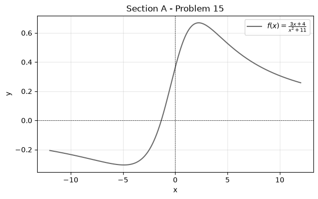


### Question A16

**Problem:**
For $f(x)=\frac{x-3}{4x+11}$, find $f^{-1}$ and determine exactly which real $y$ have preimages.

**Derivation:**
*Domain and Preimages:*
The function $f(x) = \frac{x-3}{4x+11}$ has domain $\text{Domain}(f) = \mathbb{R} \setminus \{-11/4\}$.
To find all $y \in \mathbb{R}$ that possess a preimage $x \in \text{Domain}(f)$, we solve $y = \frac{x-3}{4x+11}$:


$$y(4x+11) = x - 3 \implies 4xy + 11y = x - 3 \implies x(4y - 1) = -(11y + 3)$$

* If $4y - 1 = 0 \implies y = 1/4$:

$$x(0) = -\left(11\left(\frac{1}{4}\right) + 3\right) = -\frac{23}{4} \ne 0$$


Thus no solution $x$ exists for $y = 1/4$.
* If $y \ne 1/4$:

$$x = \frac{-(11y+3)}{4y-1} = \frac{11y+3}{1-4y}$$


Checking whether $x = -11/4$:


$$\frac{11y+3}{1-4y} = -\frac{11}{4} \implies 4(11y+3) = -11(1-4y) \implies 44y + 12 = -11 + 44y \implies 12 = -11$$


This equation has no solution, so $x \ne -11/4$ for all $y \ne 1/4$.

Therefore, every $y \in \mathbb{R} \setminus \{1/4\}$ has a unique preimage $x$.
The exact set of real $y$ with preimages is $\{y \in \mathbb{R} \mid y \ne 1/4\} = (-\infty, 1/4) \cup (1/4, \infty)$.

*Finding $f^{-1}$:*
Solving for $x$ in terms of $y$ yields $f^{-1}: \mathbb{R} \setminus \{1/4\} \to \mathbb{R} \setminus \{-11/4\}$:


$$f^{-1}(y) = \frac{11y+3}{1-4y}$$


or in terms of variable $x$:


$$f^{-1}(x) = \frac{11x+3}{1-4x}$$

---

```python
import matplotlib.pyplot as plt
import numpy as np

x1 = np.linspace(-10, -2.76, 200)
x2 = np.linspace(-2.74, 10, 200)

plt.figure(figsize=(7, 4))
plt.plot(x1, (x1 - 3)/(4*x1 + 11), color='midnightblue', label=r'$f(x)=\frac{x-3}{4x+11}$')
plt.plot(x2, (x2 - 3)/(4*x2 + 11), color='midnightblue')
plt.axvline(x=-2.75, color='blue', linestyle=':', label='Vertical Asymptote (x = -2.75)')
plt.axhline(y=0.25, color='gray', linestyle='--', label='Horizontal Asymptote (y = 0.25)')
plt.title('Section A - Problem 16')
plt.xlabel('x')
plt.ylabel('y')
plt.ylim(-5, 5)
plt.grid(True, alpha=0.3)
plt.legend()
plt.show()

```


    
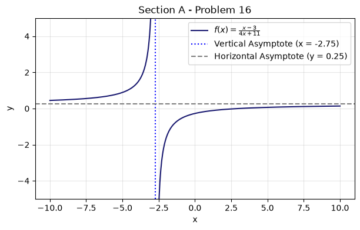


### Question A17

**Problem:**
Determine the domain and range of $f(x)=\frac{4x+4}{x^{2}+8}$ and decide whether $f$ is one-to-one on $[0,\infty)$.

**Derivation:**
*Domain:*
Since $x^2 + 8 \ge 8 > 0$ for all $x \in \mathbb{R}$, $f(x)$ is defined and continuous everywhere:


$$\text{Domain}(f) = \mathbb{R} = (-\infty, \infty)$$

*Range:*
Setting $y = \frac{4x+4}{x^2+8}$:


$$y(x^2+8) = 4x+4 \implies y x^2 - 4x + (8y - 4) = 0$$

* If $y = 0$, $-4x - 4 = 0 \implies x = -1 \in \mathbb{R}$, so $0 \in \text{Range}(f)$.


* If $y \ne 0$, real solutions $x$ exist if and only if the discriminant $\Delta_x \ge 0$:

$$\Delta_x = (-4)^2 - 4(y)(8y - 4) = 16 - 32y^2 + 16y \ge 0$$


$$32y^2 - 16y - 16 \le 0 \implies 2y^2 - y - 1 \le 0$$


Factoring $2y^2 - y - 1 = (2y + 1)(y - 1) = 0$ yields roots $y = 1$ and $y = -1/2$.
Since $2 > 0$, the inequality holds between the roots:


$$\text{Range}(f) = \left[-\frac{1}{2}, 1\right]$$

*One-to-one on $[0, \infty)$:*
Differentiating $f(x) = \frac{4x+4}{x^2+8}$ via the quotient rule:


$$f'(x) = \frac{4(x^2+8) - (4x+4)(2x)}{(x^2+8)^2} = \frac{4x^2 + 32 - 8x^2 - 8x}{(x^2+8)^2} = \frac{-4x^2 - 8x + 32}{(x^2+8)^2} = \frac{-4(x+4)(x-2)}{(x^2+8)^2}$$

The only critical point on $[0, \infty)$ is $x = 2$.
$f'(x) > 0$ for $x \in [0, 2)$ and $f'(x) < 0$ for $x \in (2, \infty)$.

To construct a counterexample to injectivity, solve $f(x) = f(0) = \frac{4}{8} = \frac{1}{2}$ for $x \ge 0$:


$$\frac{4x+4}{x^2+8} = \frac{1}{2} \implies 8x + 8 = x^2 + 8 \implies x^2 - 8x = 0 \implies x(x - 8) = 0$$


Hence $f(0) = f(8) = 1/2$. Since $0, 8 \in [0, \infty)$ and $0 \ne 8$, $f$ is **not one-to-one** on $[0, \infty)$.

---

```python
import matplotlib.pyplot as plt
import numpy as np

x = np.linspace(-10, 10, 400)
y = (4*x + 5) / (x**2 + 3)

plt.figure(figsize=(7, 4))
plt.plot(x, y, label=r'$f(x)=\frac{4x+5}{x^2+3}$', color='darkviolet')
plt.axhline(0, color='black', linewidth=0.5, linestyle='--')
plt.axvline(0, color='black', linewidth=0.5, linestyle='--')
plt.title('Section A - Problem 17')
plt.xlabel('x')
plt.ylabel('y')
plt.grid(True, alpha=0.3)
plt.legend()
plt.show()

```


    
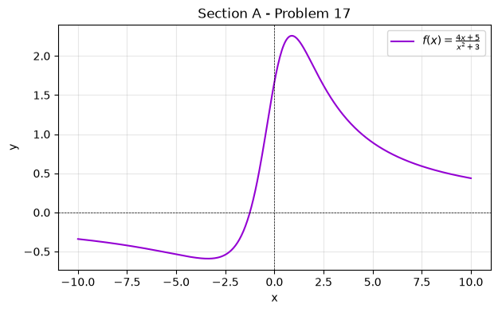


### Question A18

**Problem:**
For $f(x)=\frac{x-4}{5x+3}$, find $f^{-1}$ and determine exactly which real $y$ have preimages.

**Derivation:**
*Domain and Preimages:*
The function $f(x) = \frac{x-4}{5x+3}$ has domain $\text{Domain}(f) = \mathbb{R} \setminus \{-3/5\}$.
To find all $y \in \mathbb{R}$ that possess a preimage $x \in \text{Domain}(f)$, we solve $y = \frac{x-4}{5x+3}$:


$$y(5x+3) = x - 4 \implies 5xy + 3y = x - 4 \implies x(5y - 1) = -(3y + 4)$$

* If $5y - 1 = 0 \implies y = 1/5$:

$$x(0) = -\left(3\left(\frac{1}{5}\right) + 4\right) = -\frac{23}{5} \ne 0$$


Thus no solution $x$ exists for $y = 1/5$.
* If $y \ne 1/5$:

$$x = \frac{-(3y+4)}{5y-1} = \frac{3y+4}{1-5y}$$


Checking whether $x = -3/5$:


$$\frac{3y+4}{1-5y} = -\frac{3}{5} \implies 5(3y+4) = -3(1-5y) \implies 15y + 20 = -3 + 15y \implies 20 = -3$$


This equation has no solution, so $x \ne -3/5$ for all $y \ne 1/5$.

Therefore, every $y \in \mathbb{R} \setminus \{1/5\}$ has a unique preimage $x$.
The exact set of real $y$ with preimages is $\{y \in \mathbb{R} \mid y \ne 1/5\} = (-\infty, 1/5) \cup (1/5, \infty)$.

*Finding $f^{-1}$:*
Solving for $x$ in terms of $y$ yields $f^{-1}: \mathbb{R} \setminus \{1/5\} \to \mathbb{R} \setminus \{-3/5\}$:


$$f^{-1}(y) = \frac{3y+4}{1-5y}$$


or in terms of variable $x$:


$$f^{-1}(x) = \frac{3x+4}{1-5x}$$

---

```python
import matplotlib.pyplot as plt
import numpy as np

x1 = np.linspace(-5, -0.61, 200)
x2 = np.linspace(-0.59, 5, 200)

plt.figure(figsize=(7, 4))
plt.plot(x1, (x1 - 4)/(5*x1 + 3), color='chocolate', label=r'$f(x)=\frac{x-4}{5x+3}$')
plt.plot(x2, (x2 - 4)/(5*x2 + 3), color='chocolate')
plt.axvline(x=-0.6, color='saddlebrown', linestyle=':', label='Vertical Asymptote (x = -0.6)')
plt.axhline(y=0.2, color='gray', linestyle='--', label='Horizontal Asymptote (y = 0.2)')
plt.title('Section A - Problem 18')
plt.xlabel('x')
plt.ylabel('y')
plt.ylim(-5, 5)
plt.grid(True, alpha=0.3)
plt.legend()
plt.show()

```


    
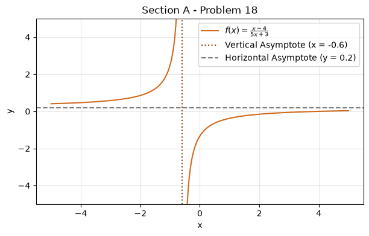


### Question A19

**Problem:**
Determine the domain and range of $f(x)=\frac{5x+1}{x^{2}+4}$ and decide whether $f$ is one-to-one on $[0,\infty)$.

**Derivation:**
*Domain:*
Since $x^2 + 4 \ge 4 > 0$ for all $x \in \mathbb{R}$, $f(x)$ is continuous and defined everywhere:


$$\text{Domain}(f) = \mathbb{R} = (-\infty, \infty)$$

*Range:*
Setting $y = \frac{5x+1}{x^2+4}$:


$$y(x^2+4) = 5x+1 \implies y x^2 - 5x + (4y - 1) = 0$$

* If $y = 0$, $-5x - 1 = 0 \implies x = -1/5 \in \mathbb{R}$, so $0 \in \text{Range}(f)$.


* If $y \ne 0$, real solutions $x$ exist if and only if the discriminant $\Delta_x \ge 0$:

$$\Delta_x = (-5)^2 - 4(y)(4y - 1) = 25 - 16y^2 + 4y \ge 0$$


$$16y^2 - 4y - 25 \le 0$$


Solving $16y^2 - 4y - 25 = 0$ via the quadratic formula:


$$y = \frac{-(-4) \pm \sqrt{(-4)^2 - 4(16)(-25)}}{2(16)} = \frac{4 \pm \sqrt{16 + 1600}}{32} = \frac{4 \pm \sqrt{1616}}{32} = \frac{1 \pm \sqrt{101}}{8}$$

Since $16 > 0$, the inequality holds between the two roots:


$$\text{Range}(f) = \left[\frac{1 - \sqrt{101}}{8}, \frac{1 + \sqrt{101}}{8}\right]$$

*One-to-one on $[0, \infty)$:*
Differentiating $f(x) = \frac{5x+1}{x^2+4}$ with the quotient rule:


$$f'(x) = \frac{5(x^2+4) - (5x+1)(2x)}{(x^2+4)^2} = \frac{5x^2 + 20 - 10x^2 - 2x}{(x^2+4)^2} = \frac{-5x^2 - 2x + 20}{(x^2+4)^2}$$

Critical points satisfy $-5x^2 - 2x + 20 = 0 \implies 5x^2 + 2x - 20 = 0$:


$$x = \frac{-2 \pm \sqrt{4 - 4(5)(-20)}}{10} = \frac{-2 \pm \sqrt{404}}{10} = \frac{-1 \pm \sqrt{101}}{5}$$


The positive critical point is $x = \frac{-1 + \sqrt{101}}{5} \approx 1.81 \in [0, \infty)$.
$f'(0) = \frac{20}{16} = \frac{5}{4} > 0$, and $f'(x) < 0$ for $x > \frac{-1 + \sqrt{101}}{5}$.

To construct an explicit counterexample to injectivity, solve $f(x) = f(0) = \frac{1}{4}$ for $x \ge 0$:


$$\frac{5x+1}{x^2+4} = \frac{1}{4} \implies 20x + 4 = x^2 + 4 \implies x^2 - 20x = 0 \implies x(x - 20) = 0$$


Hence $f(0) = f(20) = 1/4$. Since $0, 20 \in [0, \infty)$ and $0 \ne 20$, $f$ is **not one-to-one** on $[0, \infty)$.

---

```python
import matplotlib.pyplot as plt
import numpy as np

x = np.linspace(-10, 10, 400)
y = (5*x + 1) / (x**2 + 4)

plt.figure(figsize=(7, 4))
plt.plot(x, y, label=r'$f(x)=\frac{5x+1}{x^2+4}$', color='deeppink')
plt.axhline(0, color='black', linewidth=0.5, linestyle='--')
plt.axvline(0, color='black', linewidth=0.5, linestyle='--')
plt.title('Section A - Problem 19')
plt.xlabel('x')
plt.ylabel('y')
plt.grid(True, alpha=0.3)
plt.legend()
plt.show()

```


    
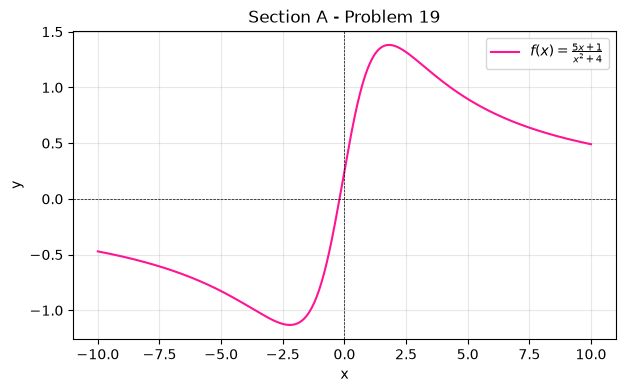


### Question A20

**Problem:**
For $f(x)=\frac{x-5}{1x+4}$, find $f^{-1}$ and determine exactly which real $y$ have preimages.

**Derivation:**
*Domain and Preimages:*
The function $f(x) = \frac{x-5}{x+4}$ is defined for all real $x$ except where $x+4 = 0 \implies x = -4$.
Thus, $\text{Domain}(f) = \mathbb{R} \setminus \{-4\}$.

To determine which real $y$ have preimages under $f$, we solve $y = \frac{x-5}{x+4}$:


$$y(x+4) = x - 5 \implies xy + 4y = x - 5 \implies x(1 - y) = 4y + 5$$

* If $1 - y = 0 \implies y = 1$:

$$x(0) = 4(1) + 5 = 9 \ne 0$$


This is a contradiction, so $y = 1$ has no preimage.
* If $y \ne 1$:

$$x = \frac{4y+5}{1-y}$$


Checking whether $x = -4$:


$$\frac{4y+5}{1-y} = -4 \implies 4y+5 = -4(1-y) \implies 4y+5 = -4 + 4y \implies 5 = -4$$


This equation has no solution, so $x \ne -4$ for all $y \ne 1$.

Therefore, every $y \in \mathbb{R} \setminus \{1\}$ has a unique preimage $x$.
The exact set of real $y$ with preimages is $\{y \in \mathbb{R} \mid y \ne 1\} = (-\infty, 1) \cup (1, \infty)$.

*Finding $f^{-1}$:*
Solving for $x$ in terms of $y$ gives $f^{-1}: \mathbb{R} \setminus \{1\} \to \mathbb{R} \setminus \{-4\}$:


$$f^{-1}(y) = \frac{4y+5}{1-y}$$


or in terms of variable $x$:


$$f^{-1}(x) = \frac{4x+5}{1-x}$$

```python

import matplotlib.pyplot as plt
import numpy as np

x1 = np.linspace(-15, -4.01, 200)
x2 = np.linspace(-3.99, 10, 200)

plt.figure(figsize=(7, 4))
plt.plot(x1, (x1 - 5)/(x1 + 4), color='cadetblue', label=r'$f(x)=\frac{x-5}{x+4}$')
plt.plot(x2, (x2 - 5)/(x2 + 4), color='cadetblue')
plt.axvline(x=-4, color='darkcyan', linestyle=':', label='Vertical Asymptote (x = -4)')
plt.axhline(y=1, color='gray', linestyle='--', label='Horizontal Asymptote (y = 1)')
plt.title('Section A - Problem 20')
plt.xlabel('x')
plt.ylabel('y')
plt.ylim(-10, 10)
plt.grid(True, alpha=0.3)
plt.legend()
plt.show()

```


    
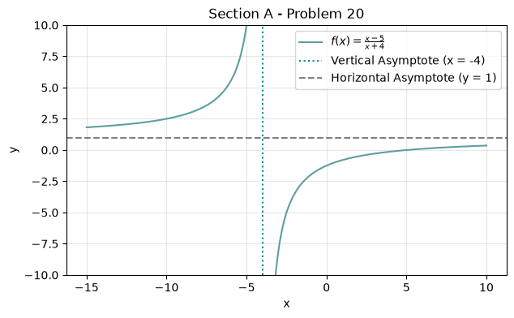


### Question A21

**Problem:**
Determine the domain and range of $f(x)=\frac{6x+2}{x^{2}+5}$ and decide whether $f$ is one-to-one on $[0,\infty)$.

**Derivation:**
*Domain:*
The denominator satisfies $x^2 + 5 \ge 5 > 0$ for all real $x$. Since division by zero never occurs and the numerator is a polynomial defined everywhere, $f$ is continuous and defined on all real numbers:


$$\text{Domain}(f) = \mathbb{R} = (-\infty, \infty)$$

*Range:*
Let $y = \frac{6x+2}{x^2+5}$. Rearranging into a quadratic equation in $x$:


$$y(x^2+5) = 6x+2 \implies y x^2 - 6x + (5y - 2) = 0$$

* If $y = 0$, the equation becomes $-6x - 2 = 0 \implies x = -1/3 \in \mathbb{R}$, so $0 \in \text{Range}(f)$.


* If $y \ne 0$, real solutions $x$ exist if and only if the discriminant $\Delta_x \ge 0$:

$$\Delta_x = (-6)^2 - 4(y)(5y - 2) = 36 - 20y^2 + 8y \ge 0$$


$$-20y^2 + 8y + 36 \ge 0 \implies 5y^2 - 2y - 9 \le 0$$


To find the roots of $5y^2 - 2y - 9 = 0$, we apply the quadratic formula:


$$y = \frac{-(-2) \pm \sqrt{(-2)^2 - 4(5)(-9)}}{2(5)} = \frac{2 \pm \sqrt{4 + 180}}{10} = \frac{2 \pm \sqrt{184}}{10} = \frac{1 \pm \sqrt{46}}{5}$$

Since $5 > 0$, the parabola opens upward and $5y^2 - 2y - 9 \le 0$ holds between its roots:


$$\text{Range}(f) = \left[\frac{1 - \sqrt{46}}{5}, \frac{1 + \sqrt{46}}{5}\right]$$

*One-to-one on $[0, \infty)$:*
Differentiating $f(x) = \frac{6x+2}{x^2+5}$ via the quotient rule:


$$f'(x) = \frac{6(x^2+5) - (6x+2)(2x)}{(x^2+5)^2} = \frac{6x^2 + 30 - 12x^2 - 4x}{(x^2+5)^2} = \frac{-6x^2 - 4x + 30}{(x^2+5)^2}$$

Critical points satisfy $-6x^2 - 4x + 30 = 0 \implies 3x^2 + 2x - 15 = 0$:


$$x = \frac{-2 \pm \sqrt{4 - 4(3)(-15)}}{6} = \frac{-2 \pm \sqrt{184}}{6} = \frac{-1 \pm \sqrt{46}}{3}$$


The positive critical point is $x = \frac{-1 + \sqrt{46}}{3} \approx 1.927 \in [0, \infty)$.
Evaluating $f'(x)$:

* At $x = 0$, $f'(0) = \frac{30}{25} = \frac{6}{5} > 0$.
* For $x > \frac{-1 + \sqrt{46}}{3}$, $f'(x) < 0$.

To construct an explicit counterexample to injectivity, solve $f(x) = f(0) = \frac{2}{5}$ for $x \ge 0$:


$$\frac{6x+2}{x^2+5} = \frac{2}{5} \implies 30x + 10 = 2x^2 + 10 \implies 2x^2 - 30x = 0 \implies 2x(x - 15) = 0$$


Hence $f(0) = f(15) = 2/5$. Since $0, 15 \in [0, \infty)$ and $0 \ne 15$, $f$ is **not one-to-one** on $[0, \infty)$.

---

```python
import matplotlib.pyplot as plt
import numpy as np

x = np.linspace(-10, 10, 400)
y = (6*x + 2) / (x**2 + 5)

plt.figure(figsize=(7, 4))
plt.plot(x, y, label=r'$f(x)=\frac{6x+2}{x^2+5}$', color='darkcyan')
plt.axhline(0, color='black', linewidth=0.5, linestyle='--')
plt.axvline(0, color='black', linewidth=0.5, linestyle='--')
plt.title('Section A - Problem 21')
plt.xlabel('x')
plt.ylabel('y')
plt.grid(True, alpha=0.3)
plt.legend()
plt.show()

```


    
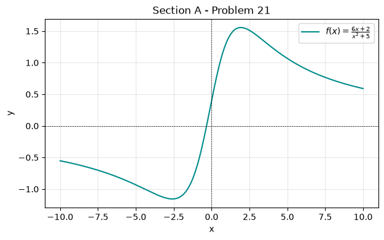


### Question A22

**Problem:**
For $f(x)=\frac{x-6}{2x+5}$, find $f^{-1}$ and determine exactly which real $y$ have preimages.

**Derivation:**
*Domain and Preimages:*
The function $f(x) = \frac{x-6}{2x+5}$ is defined for all real $x$ except where $2x+5 = 0 \implies x = -5/2$.
Thus, $\text{Domain}(f) = \mathbb{R} \setminus \{-5/2\}$.

To determine which real $y$ have preimages under $f$, we solve $y = f(x)$ for $x \in \text{Domain}(f)$:


$$y = \frac{x-6}{2x+5} \implies y(2x+5) = x - 6 \implies 2xy + 5y = x - 6 \implies x(2y - 1) = -(5y + 6)$$

* If $2y - 1 = 0 \implies y = 1/2$:

$$x(0) = -\left(5\left(\frac{1}{2}\right) + 6\right) = -\frac{17}{2} \ne 0$$


This is a contradiction, so $y = 1/2$ has no preimage.
* If $y \ne 1/2$, dividing by $2y - 1$ gives:

$$x = \frac{-(5y+6)}{2y-1} = \frac{5y+6}{1-2y}$$


We verify whether this candidate $x$ ever equals $-5/2$:


$$\frac{5y+6}{1-2y} = -\frac{5}{2} \implies 2(5y+6) = -5(1-2y) \implies 10y + 12 = -5 + 10y \implies 12 = -5$$


This equation has no solution, meaning $x \ne -5/2$ for all $y \ne 1/2$.

Therefore, a real $y$ has a valid preimage if and only if $y \ne 1/2$.
The set of real $y$ having preimages is $\{y \in \mathbb{R} \mid y \ne 1/2\} = (-\infty, 1/2) \cup (1/2, \infty)$.

*Finding $f^{-1}$:*
Solving for $x$ in terms of $y$ yields the inverse function $f^{-1}: \mathbb{R} \setminus \{1/2\} \to \mathbb{R} \setminus \{-5/2\}$:


$$f^{-1}(y) = \frac{5y+6}{1-2y}$$


Expressed with input variable $x$:


$$f^{-1}(x) = \frac{5x+6}{1-2x}$$

---

```python
import matplotlib.pyplot as plt
import numpy as np

x1 = np.linspace(-10, -2.51, 200)
x2 = np.linspace(-2.49, 10, 200)

plt.figure(figsize=(7, 4))
plt.plot(x1, (x1 - 6)/(2*x1 + 5), color='orangered', label=r'$f(x)=\frac{x-6}{2x+5}$')
plt.plot(x2, (x2 - 6)/(2*x2 + 5), color='orangered')
plt.axvline(x=-2.5, color='darkred', linestyle=':', label='Vertical Asymptote (x = -2.5)')
plt.axhline(y=0.5, color='gray', linestyle='--', label='Horizontal Asymptote (y = 0.5)')
plt.title('Section A - Problem 22')
plt.xlabel('x')
plt.ylabel('y')
plt.ylim(-5, 5)
plt.grid(True, alpha=0.3)
plt.legend()
plt.show()

```


    
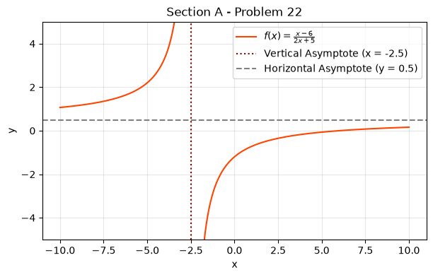


### Question A23

**Problem:**
Determine the domain and range of $f(x)=\frac{7x+3}{x^{2}+6}$ and decide whether $f$ is one-to-one on $[0,\infty)$.

**Derivation:**
*Domain:*
Since $x^2 + 6 \ge 6 > 0$ for all $x \in \mathbb{R}$, no division by zero occurs:


$$\text{Domain}(f) = \mathbb{R} = (-\infty, \infty)$$

*Range:*
Let $y = \frac{7x+3}{x^2+6}$. Rearranging into a quadratic equation in $x$:


$$y(x^2+6) = 7x+3 \implies y x^2 - 7x + (6y - 3) = 0$$

* If $y = 0$, $-7x - 3 = 0 \implies x = -3/7 \in \mathbb{R}$, so $0 \in \text{Range}(f)$.


* If $y \ne 0$, real solutions $x$ exist if and only if the discriminant $\Delta_x \ge 0$:

$$\Delta_x = (-7)^2 - 4(y)(6y - 3) = 49 - 24y^2 + 12y \ge 0$$


$$24y^2 - 12y - 49 \le 0$$


Solving $24y^2 - 12y - 49 = 0$ via the quadratic formula:


$$y = \frac{-(-12) \pm \sqrt{(-12)^2 - 4(24)(-49)}}{2(24)} = \frac{12 \pm \sqrt{144 + 4704}}{48} = \frac{12 \pm \sqrt{4848}}{48} = \frac{3 \pm \sqrt{303}}{12}$$

Since $24 > 0$, the inequality holds between the roots:


$$\text{Range}(f) = \left[\frac{3 - \sqrt{303}}{12}, \frac{3 + \sqrt{303}}{12}\right]$$

*One-to-one on $[0, \infty)$:*
Differentiating $f(x) = \frac{7x+3}{x^2+6}$ via the quotient rule:


$$f'(x) = \frac{7(x^2+6) - (7x+3)(2x)}{(x^2+6)^2} = \frac{7x^2 + 42 - 14x^2 - 6x}{(x^2+6)^2} = \frac{-7x^2 - 6x + 42}{(x^2+6)^2}$$

Critical points satisfy $-7x^2 - 6x + 42 = 0 \implies 7x^2 + 6x - 42 = 0$:


$$x = \frac{-6 \pm \sqrt{36 - 4(7)(-42)}}{14} = \frac{-6 \pm \sqrt{1212}}{14} = \frac{-3 \pm \sqrt{303}}{7}$$


The positive critical point is $x = \frac{-3 + \sqrt{303}}{7} \approx 2.058 \in [0, \infty)$.
$f'(0) = \frac{42}{36} = \frac{7}{6} > 0$, and $f'(x) < 0$ for $x > \frac{-3 + \sqrt{303}}{7}$.

To construct an explicit counterexample to injectivity, solve $f(x) = f(0) = \frac{3}{6} = \frac{1}{2}$ for $x \ge 0$:


$$\frac{7x+3}{x^2+6} = \frac{1}{2} \implies 14x + 6 = x^2 + 6 \implies x^2 - 14x = 0 \implies x(x - 14) = 0$$


Hence $f(0) = f(14) = 1/2$. Since $0, 14 \in [0, \infty)$ and $0 \ne 14$, $f$ is **not one-to-one** on $[0, \infty)$.

---

```python
import matplotlib.pyplot as plt
import numpy as np

x = np.linspace(-10, 10, 400)
y = (7*x + 3) / (x**2 + 6)

plt.figure(figsize=(7, 4))
plt.plot(x, y, label=r'$f(x)=\frac{7x+3}{x^2+6}$', color='purple')
plt.axhline(0, color='black', linewidth=0.5, linestyle='--')
plt.axvline(0, color='black', linewidth=0.5, linestyle='--')
plt.title('Section A - Problem 23')
plt.xlabel('x')
plt.ylabel('y')
plt.grid(True, alpha=0.3)
plt.legend()
plt.show()

```


    
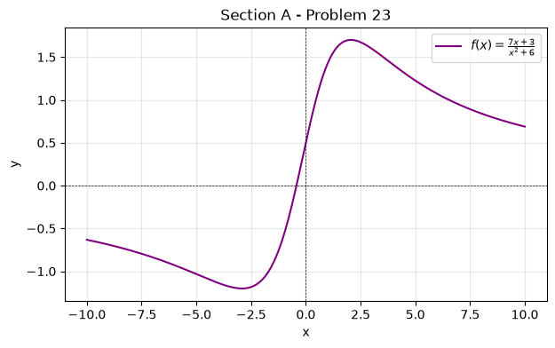


### Question A24

**Problem:**
For $f(x)=\frac{x-7}{3x+6}$, find $f^{-1}$ and determine exactly which real $y$ have preimages.

**Derivation:**
*Domain and Preimages:*
The function $f(x) = \frac{x-7}{3x+6}$ has domain $\text{Domain}(f) = \mathbb{R} \setminus \{-2\}$.
To find all $y \in \mathbb{R}$ that possess a preimage $x \in \text{Domain}(f)$, we solve $y = \frac{x-7}{3x+6}$:


$$y(3x+6) = x - 7 \implies 3xy + 6y = x - 7 \implies x(3y - 1) = -(6y + 7)$$

* If $3y - 1 = 0 \implies y = 1/3$:

$$x(0) = -\left(6\left(\frac{1}{3}\right) + 7\right) = -9 \ne 0$$


Thus no solution $x$ exists for $y = 1/3$.
* If $y \ne 1/3$:

$$x = \frac{-(6y+7)}{3y-1} = \frac{6y+7}{1-3y}$$


Checking whether $x = -2$:


$$\frac{6y+7}{1-3y} = -2 \implies 6y+7 = -2(1-3y) \implies 6y+7 = -2 + 6y \implies 7 = -2$$


This equation has no solution, so $x \ne -2$ for all $y \ne 1/3$.

Therefore, every $y \in \mathbb{R} \setminus \{1/3\}$ has a unique preimage $x$.
The exact set of real $y$ with preimages is $\{y \in \mathbb{R} \mid y \ne 1/3\} = (-\infty, 1/3) \cup (1/3, \infty)$.

*Finding $f^{-1}$:*
Solving for $x$ in terms of $y$ yields $f^{-1}: \mathbb{R} \setminus \{1/3\} \to \mathbb{R} \setminus \{-2\}$:


$$f^{-1}(y) = \frac{6y+7}{1-3y}$$


or in terms of variable $x$:


$$f^{-1}(x) = \frac{6x+7}{1-3x}$$

---

```python
import matplotlib.pyplot as plt
import numpy as np

x1 = np.linspace(-10, -2.01, 200)
x2 = np.linspace(-1.99, 10, 200)

plt.figure(figsize=(7, 4))
plt.plot(x1, (x1 - 7)/(3*x1 + 6), color='seagreen', label=r'$f(x)=\frac{x-7}{3x+6}$')
plt.plot(x2, (x2 - 7)/(3*x2 + 6), color='seagreen')
plt.axvline(x=-2, color='darkgreen', linestyle=':', label='Vertical Asymptote (x = -2)')
plt.axhline(y=1/3, color='gray', linestyle='--', label=r'Horizontal Asymptote ($y = \frac{1}{3}$)')
plt.title('Section A - Problem 24')
plt.xlabel('x')
plt.ylabel('y')
plt.ylim(-5, 5)
plt.grid(True, alpha=0.3)
plt.legend()
plt.show()

```


    
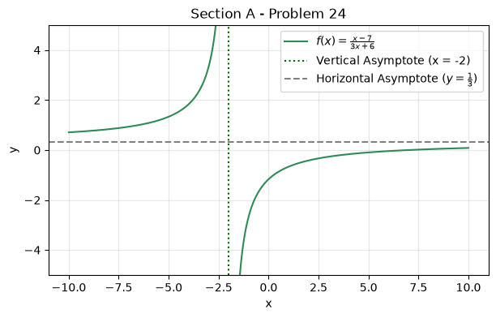


### Question A25

**Problem:**
Determine the domain and range of $f(x)=\frac{8x+4}{x^{2}+7}$ and decide whether $f$ is one-to-one on $[0,\infty)$.

**Derivation:**
*Domain:*
Since $x^2 + 7 \ge 7 > 0$ for all $x \in \mathbb{R}$, $f(x)$ is continuous and defined everywhere:


$$\text{Domain}(f) = \mathbb{R} = (-\infty, \infty)$$

*Range:*
Setting $y = \frac{8x+4}{x^2+7}$:


$$y(x^2+7) = 8x+4 \implies y x^2 - 8x + (7y - 4) = 0$$

* If $y = 0$, $-8x - 4 = 0 \implies x = -1/2 \in \mathbb{R}$, so $0 \in \text{Range}(f)$.


* If $y \ne 0$, real solutions $x$ exist if and only if the discriminant $\Delta_x \ge 0$:

$$\Delta_x = (-8)^2 - 4(y)(7y - 4) = 64 - 28y^2 + 16y \ge 0$$


$$28y^2 - 16y - 64 \le 0 \implies 7y^2 - 4y - 16 \le 0$$


Solving $7y^2 - 4y - 16 = 0$ via the quadratic formula:


$$y = \frac{-(-4) \pm \sqrt{(-4)^2 - 4(7)(-16)}}{2(7)} = \frac{4 \pm \sqrt{16 + 448}}{14} = \frac{4 \pm \sqrt{464}}{14} = \frac{2 \pm 2\sqrt{29}}{7}$$

Since $7 > 0$, the inequality holds between the two roots:


$$\text{Range}(f) = \left[\frac{2 - 2\sqrt{29}}{7}, \frac{2 + 2\sqrt{29}}{7}\right]$$

*One-to-one on $[0, \infty)$:*
Differentiating $f(x) = \frac{8x+4}{x^2+7}$ with the quotient rule:


$$f'(x) = \frac{8(x^2+7) - (8x+4)(2x)}{(x^2+7)^2} = \frac{8x^2 + 56 - 16x^2 - 8x}{(x^2+7)^2} = \frac{-8x^2 - 8x + 56}{(x^2+7)^2} = \frac{-8(x^2 + x - 7)}{(x^2+7)^2}$$

Critical points satisfy $x^2 + x - 7 = 0$:


$$x = \frac{-1 \pm \sqrt{1 - 4(1)(-7)}}{2} = \frac{-1 \pm \sqrt{29}}{2}$$


The positive critical point is $x = \frac{-1 + \sqrt{29}}{2} \approx 2.19 \in [0, \infty)$.
$f'(0) = \frac{56}{49} = \frac{8}{7} > 0$, and $f'(x) < 0$ for $x > \frac{-1 + \sqrt{29}}{2}$.

To construct an explicit counterexample to injectivity, solve $f(x) = f(0) = \frac{4}{7}$ for $x \ge 0$:


$$\frac{8x+4}{x^2+7} = \frac{4}{7} \implies 56x + 28 = 4x^2 + 28 \implies 4x^2 - 56x = 0 \implies 4x(x - 14) = 0$$


Hence $f(0) = f(14) = 4/7$. Since $0, 14 \in [0, \infty)$ and $0 \ne 14$, $f$ is **not one-to-one** on $[0, \infty)$.

```python
import matplotlib.pyplot as plt
import numpy as np

x = np.linspace(-10, 10, 400)
y = (8*x + 4) / (x**2 + 7)

plt.figure(figsize=(7, 4))
plt.plot(x, y, label=r'$f(x)=\frac{8x+4}{x^2+7}$', color='royalblue')
plt.axhline(0, color='black', linewidth=0.5, linestyle='--')
plt.axvline(0, color='black', linewidth=0.5, linestyle='--')
plt.title('Section A - Problem 25')
plt.xlabel('x')
plt.ylabel('y')
plt.grid(True, alpha=0.3)
plt.legend()
plt.show()

```


    
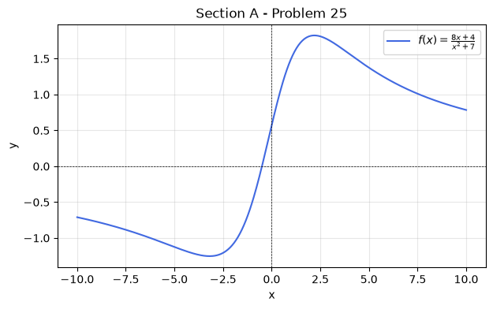


### Question A26

**Problem:**
For $f(x)=\frac{x-8}{4x+7}$, find $f^{-1}$ and determine exactly which real $y$ have preimages.

**Derivation:**
*Domain and Preimages:*
The function $f(x) = \frac{x-8}{4x+7}$ is defined for all real $x$ except where the denominator vanishes:


$$4x+7 = 0 \implies x = -\frac{7}{4}$$


Thus, $\text{Domain}(f) = \mathbb{R} \setminus \left\lbrace -\frac{7}{4}\right\rbrace$.

To determine which real $y$ have preimages under $f$, we solve $y = f(x)$ for $x \in \text{Domain}(f)$:


$$y = \frac{x-8}{4x+7} \implies y(4x+7) = x - 8$$

$$4xy + 7y = x - 8 \implies 4xy - x = -7y - 8 \implies x(4y - 1) = -(7y + 8)$$

* If $4y - 1 = 0$, i.e., $y = 1/4$:

$$x(0) = -\left(7\left(\frac{1}{4}\right) + 8\right) = -\frac{39}{4} \ne 0$$


This is a contradiction, so $y = 1/4$ has no preimage.
* If $y \ne 1/4$, dividing by $4y - 1$ gives:

$$x = \frac{-(7y+8)}{4y-1} = \frac{7y+8}{1-4y}$$


We verify whether this candidate $x$ ever equals the excluded domain point $-7/4$:


$$\frac{7y+8}{1-4y} = -\frac{7}{4} \implies 4(7y+8) = -7(1-4y) \implies 28y + 32 = -7 + 28y \implies 32 = -7$$


This equation has no solution, meaning $x \ne -7/4$ for all $y \ne 1/4$.

Therefore, a real $y$ has a valid preimage if and only if $y \ne 1/4$.
The set of real $y$ having preimages is $\{y \in \mathbb{R} \mid y \ne 1/4\} = (-\infty, 1/4) \cup (1/4, \infty)$.

*Finding $f^{-1}$:*
Solving for $x$ in terms of $y$ yields the inverse function $f^{-1}: \mathbb{R} \setminus \{1/4\} \to \mathbb{R} \setminus \{-7/4\}$:


$$f^{-1}(y) = \frac{7y+8}{1-4y}$$


Expressed with input variable $x$:


$$f^{-1}(x) = \frac{7x+8}{1-4x}$$

---

```python
import matplotlib.pyplot as plt
import numpy as np

x1 = np.linspace(-10, -1.76, 200)
x2 = np.linspace(-1.74, 10, 200)

plt.figure(figsize=(7, 4))
plt.plot(x1, (x1 - 8)/(4*x1 + 7), color='darkred', label=r'$f(x)=\frac{x-8}{4x+7}$')
plt.plot(x2, (x2 - 8)/(4*x2 + 7), color='darkred')
plt.axvline(x=-1.75, color='red', linestyle=':', label='Vertical Asymptote (x = -1.75)')
plt.axhline(y=0.25, color='gray', linestyle='--', label='Horizontal Asymptote (y = 0.25)')
plt.title('Section A - Problem 26')
plt.xlabel('x')
plt.ylabel('y')
plt.ylim(-5, 5)
plt.grid(True, alpha=0.3)
plt.legend()
plt.show()

```


    
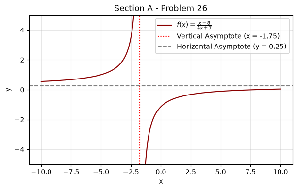


### Question A27

**Problem:**
Determine the domain and range of $f(x)=\frac{2x+5}{x^{2}+8}$ and decide whether $f$ is one-to-one on $[0,\infty)$.

**Derivation:**
*Domain:*
The denominator satisfies $x^2 + 8 \ge 8 > 0$ for all real $x$. Since division by zero never occurs, $f$ is continuous and defined on all of $\mathbb{R}$:


$$\text{Domain}(f) = \mathbb{R} = (-\infty, \infty)$$

*Range:*
Let $y = \frac{2x+5}{x^2+8}$. Rearranging into a quadratic equation in $x$:


$$y(x^2+8) = 2x+5 \implies y x^2 - 2x + (8y - 5) = 0$$

* If $y = 0$, $-2x - 5 = 0 \implies x = -5/2 \in \mathbb{R}$, so $0 \in \text{Range}(f)$.


* If $y \ne 0$, real solutions $x$ exist if and only if the discriminant $\Delta_x \ge 0$:

$$\Delta_x = (-2)^2 - 4(y)(8y - 5) = 4 - 32y^2 + 20y \ge 0$$


$$-32y^2 + 20y + 4 \ge 0 \implies 8y^2 - 5y - 1 \le 0$$


Solving $8y^2 - 5y - 1 = 0$ via the quadratic formula:


$$y = \frac{-(-5) \pm \sqrt{(-5)^2 - 4(8)(-1)}}{2(8)} = \frac{5 \pm \sqrt{25 + 32}}{16} = \frac{5 \pm \sqrt{57}}{16}$$

Since $8 > 0$, $8y^2 - 5y - 1 \le 0$ holds between its two real roots:


$$\text{Range}(f) = \left[\frac{5 - \sqrt{57}}{16}, \frac{5 + \sqrt{57}}{16}\right]$$

*One-to-one on $[0, \infty)$:*
Differentiating $f(x) = \frac{2x+5}{x^2+8}$ via the quotient rule:


$$f'(x) = \frac{2(x^2+8) - (2x+5)(2x)}{(x^2+8)^2} = \frac{2x^2 + 16 - 4x^2 - 10x}{(x^2+8)^2} = \frac{-2x^2 - 10x + 16}{(x^2+8)^2} = \frac{-2(x^2 + 5x - 8)}{(x^2+8)^2}$$

Critical points satisfy $x^2 + 5x - 8 = 0$:


$$x = \frac{-5 \pm \sqrt{25 - 4(1)(-8)}}{2} = \frac{-5 \pm \sqrt{57}}{2}$$

The positive critical point is $x = \frac{-5 + \sqrt{57}}{2} \approx 1.275 \in [0, \infty)$.
Evaluating the derivative:

* At $x = 0$, $f'(0) = \frac{16}{64} = \frac{1}{4} > 0$.
* For $x > \frac{-5 + \sqrt{57}}{2}$, $f'(x) < 0$.

Since $f'(x)$ changes sign from positive to negative, $f(x)$ increases and then decreases on $[0, \infty)$.

To explicitly disprove injectivity, note that $f(0) = 5/8$. Solving $f(x) = 5/8$ for $x \ge 0$:


$$\frac{2x+5}{x^2+8} = \frac{5}{8} \implies 16x + 40 = 5x^2 + 40 \implies 5x^2 - 16x = 0 \implies x(5x - 16) = 0$$


Hence $x = 0$ and $x = 16/5 = 3.2$ both yield $f(x) = 5/8$.
Since $0, 3.2 \in [0, \infty)$ and $0 \ne 3.2$, $f$ is **not one-to-one** on $[0, \infty)$.

---

```python
import matplotlib.pyplot as plt
import numpy as np

x = np.linspace(-12, 12, 400)
y = (2*x + 5) / (x**2 + 8)

plt.figure(figsize=(7, 4))
plt.plot(x, y, label=r'$f(x)=\frac{2x+5}{x^2+8}$', color='darkorange')
plt.axhline(0, color='black', linewidth=0.5, linestyle='--')
plt.axvline(0, color='black', linewidth=0.5, linestyle='--')
plt.title('Section A - Problem 27')
plt.xlabel('x')
plt.ylabel('y')
plt.grid(True, alpha=0.3)
plt.legend()
plt.show()

```


    
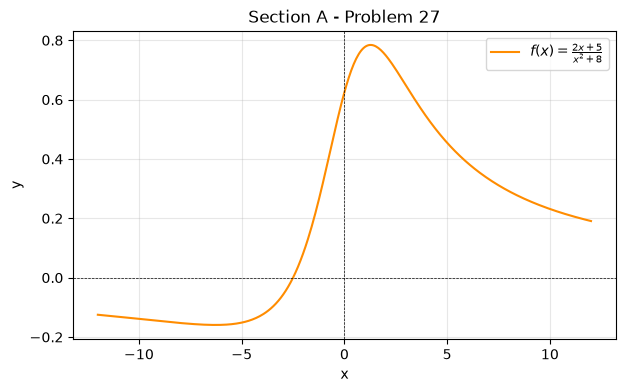


### Question A28

**Problem:**
For $f(x)=\frac{x-2}{5x+8}$, find $f^{-1}$ and determine exactly which real $y$ have preimages.

**Derivation:**
*Domain and Preimages:*
The function $f(x) = \frac{x-2}{5x+8}$ has domain $\text{Domain}(f) = \mathbb{R} \setminus \{-8/5\}$.
To find all $y \in \mathbb{R}$ that possess a preimage $x \in \text{Domain}(f)$, we solve $y = \frac{x-2}{5x+8}$:


$$y(5x+8) = x - 2 \implies 5xy + 8y = x - 2 \implies x(5y - 1) = -(8y + 2)$$

* If $5y - 1 = 0 \implies y = 1/5$:

$$x(0) = -\left(8\left(\frac{1}{5}\right) + 2\right) = -\frac{18}{5} \ne 0$$


Thus no solution $x$ exists for $y = 1/5$.
* If $y \ne 1/5$:

$$x = \frac{-(8y+2)}{5y-1} = \frac{8y+2}{1-5y}$$


Checking whether $x = -8/5$:


$$\frac{8y+2}{1-5y} = -\frac{8}{5} \implies 5(8y+2) = -8(1-5y) \implies 40y + 10 = -8 + 40y \implies 10 = -8$$


This equation has no solution, so $x \ne -8/5$ for all $y \ne 1/5$.

Therefore, every $y \in \mathbb{R} \setminus \{1/5\}$ has a unique preimage $x$.
The exact set of real $y$ with preimages is $\{y \in \mathbb{R} \mid y \ne 1/5\} = (-\infty, 1/5) \cup (1/5, \infty)$.

*Finding $f^{-1}$:*
Solving for $x$ in terms of $y$ yields $f^{-1}: \mathbb{R} \setminus \{1/5\} \to \mathbb{R} \setminus \{-8/5\}$:


$$f^{-1}(y) = \frac{8y+2}{1-5y}$$


or in terms of variable $x$:


$$f^{-1}(x) = \frac{8x+2}{1-5x}$$

---

```python
import matplotlib.pyplot as plt
import numpy as np

x1 = np.linspace(-5, -1.61, 200)
x2 = np.linspace(-1.59, 5, 200)

plt.figure(figsize=(7, 4))
plt.plot(x1, (x1 - 2)/(5*x1 + 8), color='darkgreen', label=r'$f(x)=\frac{x-2}{5x+8}$')
plt.plot(x2, (x2 - 2)/(5*x2 + 8), color='darkgreen')
plt.axvline(x=-1.6, color='forestgreen', linestyle=':', label='Vertical Asymptote (x = -1.6)')
plt.axhline(y=0.2, color='gray', linestyle='--', label='Horizontal Asymptote (y = 0.2)')
plt.title('Section A - Problem 28')
plt.xlabel('x')
plt.ylabel('y')
plt.ylim(-5, 5)
plt.grid(True, alpha=0.3)
plt.legend()
plt.show()

```


    
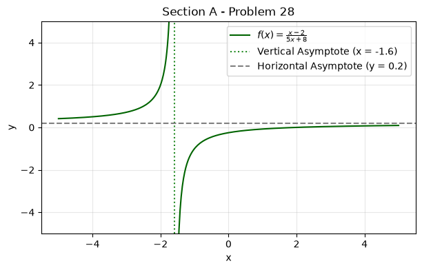


### Question A29

**Problem:**
Determine the domain and range of $f(x)=\frac{3x+1}{x^{2}+9}$ and decide whether $f$ is one-to-one on $[0,\infty)$.

**Derivation:**
*Domain:*
Since $x^2 + 9 \ge 9 > 0$ for all $x \in \mathbb{R}$, $f(x)$ is continuous and defined everywhere on $\mathbb{R}$:


$$\text{Domain}(f) = \mathbb{R} = (-\infty, \infty)$$

*Range:*
Setting $y = \frac{3x+1}{x^2+9}$:


$$y(x^2+9) = 3x+1 \implies y x^2 - 3x + (9y - 1) = 0$$

* If $y = 0$, $-3x - 1 = 0 \implies x = -1/3 \in \mathbb{R}$, so $0 \in \text{Range}(f)$.


* If $y \ne 0$, real solutions $x$ exist if and only if the discriminant $\Delta_x \ge 0$:

$$\Delta_x = (-3)^2 - 4(y)(9y - 1) = 9 - 36y^2 + 4y \ge 0$$


$$36y^2 - 4y - 9 \le 0$$


We find the roots of $36y^2 - 4y - 9 = 0$:


$$y = \frac{-(-4) \pm \sqrt{(-4)^2 - 4(36)(-9)}}{2(36)} = \frac{4 \pm \sqrt{16 + 1296}}{72} = \frac{4 \pm \sqrt{1312}}{72} = \frac{4 \pm 4\sqrt{82}}{72} = \frac{1 \pm \sqrt{82}}{18}$$

Since $36 > 0$, $36y^2 - 4y - 9 \le 0$ holds between the two roots:


$$\text{Range}(f) = \left[\frac{1 - \sqrt{82}}{18}, \frac{1 + \sqrt{82}}{18}\right]$$

*One-to-one on $[0, \infty)$:*
Differentiating $f(x) = \frac{3x+1}{x^2+9}$ with the quotient rule:


$$f'(x) = \frac{3(x^2+9) - (3x+1)(2x)}{(x^2+9)^2} = \frac{3x^2 + 27 - 6x^2 - 2x}{(x^2+9)^2} = \frac{-3x^2 - 2x + 27}{(x^2+9)^2}$$

Critical points satisfy $-3x^2 - 2x + 27 = 0 \implies 3x^2 + 2x - 27 = 0$:


$$x = \frac{-2 \pm \sqrt{4 - 4(3)(-27)}}{6} = \frac{-2 \pm \sqrt{328}}{6} = \frac{-2 \pm 2\sqrt{82}}{6} = \frac{-1 \pm \sqrt{82}}{3}$$

The positive critical point is $x = \frac{-1 + \sqrt{82}}{3} \approx 2.685 \in [0, \infty)$.
Evaluating the derivative:

* At $x = 0$, $f'(0) = \frac{27}{81} = \frac{1}{3} > 0$.
* For $x > \frac{-1 + \sqrt{82}}{3}$, $f'(x) < 0$.

Since $f'$ changes sign from positive to negative, $f$ is not monotonic on $[0, \infty)$.

To construct an explicit counterexample, solve $f(x) = f(0) = 1/9$ for $x \ge 0$:


$$\frac{3x+1}{x^2+9} = \frac{1}{9} \implies 27x + 9 = x^2 + 9 \implies x^2 - 27x = 0 \implies x(x - 27) = 0$$


Hence $x = 0$ and $x = 27$ both give $f(x) = 1/9$.
Since $0, 27 \in [0, \infty)$ and $0 \ne 27$, $f$ is **not one-to-one** on $[0, \infty)$.

---

```python
import matplotlib.pyplot as plt
import numpy as np

x = np.linspace(-15, 15, 400)
y = (3*x + 1) / (x**2 + 9)

plt.figure(figsize=(7, 4))
plt.plot(x, y, label=r'$f(x)=\frac{3x+1}{x^2+9}$', color='blue')
plt.axhline(0, color='black', linewidth=0.5, linestyle='--')
plt.axvline(0, color='black', linewidth=0.5, linestyle='--')
plt.title('Section A - Problem 29')
plt.xlabel('x')
plt.ylabel('y')
plt.grid(True, alpha=0.3)
plt.legend()
plt.show()

```


    
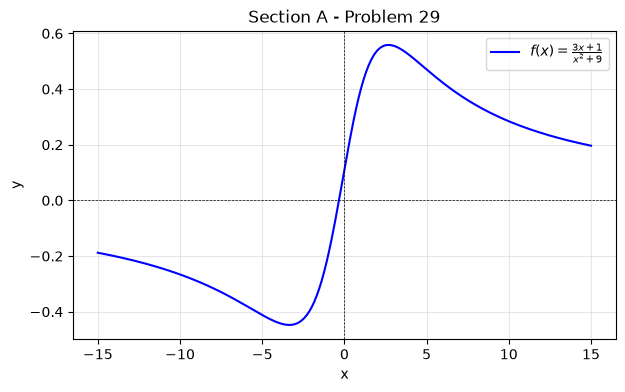


### Question A30

**Problem:**
For $f(x)=\frac{x-3}{1x+9}$, find $f^{-1}$ and determine exactly which real $y$ have preimages.

**Derivation:**
*Domain and Preimages:*
The function $f(x) = \frac{x-3}{x+9}$ is defined for all $x$ except where $x+9 = 0$, i.e., $x = -9$.
So $\text{Domain}(f) = \mathbb{R} \setminus \{-9\}$.

To determine which $y \in \mathbb{R}$ have preimages under $f$, we solve $y = \frac{x-3}{x+9}$:


$$y(x+9) = x - 3 \implies xy + 9y = x - 3 \implies xy - x = -9y - 3 \implies x(1 - y) = 9y + 3$$

* If $1 - y = 0$, i.e., $y = 1$:

$$x(0) = 9(1) + 3 = 12 \ne 0$$


This is a contradiction, so $y = 1$ has no preimage.
* If $y \ne 1$, we divide by $1 - y$:

$$x = \frac{9y+3}{1-y}$$


We check whether this candidate $x$ ever equals $-9$:


$$\frac{9y+3}{1-y} = -9 \implies 9y+3 = -9(1-y) \implies 9y+3 = -9 + 9y \implies 3 = -9$$


This has no solution, so $x \ne -9$ for all $y \ne 1$.

Thus, a real $y$ has a preimage if and only if $y \ne 1$.
The set of real $y$ having preimages is $\{y \in \mathbb{R} \mid y \ne 1\} = (-\infty, 1) \cup (1, \infty)$.

*Finding $f^{-1}$:*
Solving for $x$ in terms of $y$ gives $f^{-1}: \mathbb{R} \setminus \{1\} \to \mathbb{R} \setminus \{-9\}$:


$$f^{-1}(y) = \frac{9y+3}{1-y}$$


or in terms of variable $x$:


$$f^{-1}(x) = \frac{9x+3}{1-x}$$

```python
import matplotlib.pyplot as plt
import numpy as np

x1 = np.linspace(-25, -9.01, 200)
x2 = np.linspace(-8.99, 10, 200)

plt.figure(figsize=(7, 4))
plt.plot(x1, (x1 - 3)/(x1 + 9), color='purple', label=r'$f(x)=\frac{x-3}{x+9}$')
plt.plot(x2, (x2 - 3)/(x2 + 9), color='purple')
plt.axvline(x=-9, color='darkviolet', linestyle=':', label='Vertical Asymptote (x = -9)')
plt.axhline(y=1, color='gray', linestyle='--', label='Horizontal Asymptote (y = 1)')
plt.title('Section A - Problem 30')
plt.xlabel('x')
plt.ylabel('y')
plt.ylim(-10, 10)
plt.grid(True, alpha=0.3)
plt.legend()
plt.show()

```


    
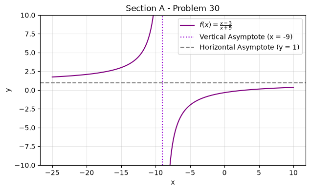


### Question A31

**Problem:**
Determine the domain and range of $f(x)=\frac{4x+2}{x^{2}+10}$ and decide whether $f$ is one-to-one on $[0,\infty)$.

**Derivation:**
*Domain:*
The denominator satisfies $x^2 + 10 \ge 10 > 0$ for all real $x$. Since division by zero never occurs and the numerator is a polynomial defined everywhere, $f$ is continuous and defined on all real numbers:


$$\text{Domain}(f) = \mathbb{R} = (-\infty, \infty)$$

*Range:*
Let $y = \frac{4x+2}{x^2+10}$. Rearranging into a quadratic equation in $x$:


$$y(x^2+10) = 4x+2 \implies y x^2 - 4x + (10y - 2) = 0$$

* If $y = 0$, the equation becomes $-4x - 2 = 0 \implies x = -1/2 \in \mathbb{R}$, so $0 \in \text{Range}(f)$.


* If $y \ne 0$, real solutions $x$ exist if and only if the discriminant $\Delta_x \ge 0$:

$$\Delta_x = (-4)^2 - 4(y)(10y - 2) = 16 - 40y^2 + 8y \ge 0$$


$$-40y^2 + 8y + 16 \ge 0 \implies 5y^2 - y - 2 \le 0$$


Solving $5y^2 - y - 2 = 0$ via the quadratic formula:


$$y = \frac{-(-1) \pm \sqrt{(-1)^2 - 4(5)(-2)}}{2(5)} = \frac{1 \pm \sqrt{1 + 40}}{10} = \frac{1 \pm \sqrt{41}}{10}$$

Since $5 > 0$, the parabola opens upward and $5y^2 - y - 2 \le 0$ holds between its roots:


$$\text{Range}(f) = \left[\frac{1 - \sqrt{41}}{10}, \frac{1 + \sqrt{41}}{10}\right]$$

*One-to-one on $[0, \infty)$:*
Differentiating $f(x) = \frac{4x+2}{x^2+10}$ via the quotient rule:


$$f'(x) = \frac{4(x^2+10) - (4x+2)(2x)}{(x^2+10)^2} = \frac{4x^2 + 40 - 8x^2 - 4x}{(x^2+10)^2} = \frac{-4x^2 - 4x + 40}{(x^2+10)^2} = \frac{-4(x^2 + x - 10)}{(x^2+10)^2}$$

Critical points satisfy $x^2 + x - 10 = 0$:


$$x = \frac{-1 \pm \sqrt{1 - 4(1)(-10)}}{2} = \frac{-1 \pm \sqrt{41}}{2}$$


The positive critical point is $x = \frac{-1 + \sqrt{41}}{2} \approx 2.70 \in [0, \infty)$.
Evaluating $f'(x)$:

* At $x = 0$, $f'(0) = \frac{40}{100} = \frac{2}{5} > 0$.
* For $x > \frac{-1 + \sqrt{41}}{2}$, $f'(x) < 0$.

Since $f'(x)$ changes sign from positive to negative, $f$ increases and then decreases on $[0, \infty)$.

To construct an explicit counterexample to injectivity, solve $f(x) = f(0) = \frac{2}{10} = \frac{1}{5}$ for $x \ge 0$:


$$\frac{4x+2}{x^2+10} = \frac{1}{5} \implies 20x + 10 = x^2 + 10 \implies x^2 - 20x = 0 \implies x(x - 20) = 0$$


Hence $f(0) = f(20) = 1/5$. Since $0, 20 \in [0, \infty)$ and $0 \ne 20$, $f$ is **not one-to-one** on $[0, \infty)$.

---

```python
import matplotlib.pyplot as plt
import numpy as np

x = np.linspace(-12, 12, 400)
y = (4*x + 2) / (x**2 + 10)

plt.figure(figsize=(7, 4))
plt.plot(x, y, label=r'$f(x)=\frac{4x+2}{x^2+10}$', color='teal')
plt.axhline(0, color='black', linewidth=0.5, linestyle='--')
plt.axvline(0, color='black', linewidth=0.5, linestyle='--')
plt.title('Section A - Problem 31')
plt.xlabel('x')
plt.ylabel('y')
plt.grid(True, alpha=0.3)
plt.legend()
plt.show()

```


    
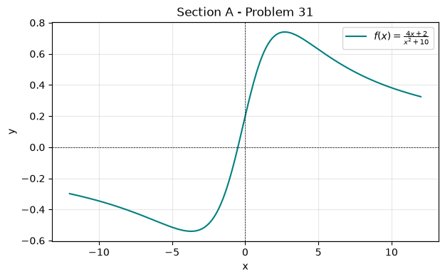


### Question A32

**Problem:**
For $f(x)=\frac{x-4}{2x+10}$, find $f^{-1}$ and determine exactly which real $y$ have preimages.

**Derivation:**
*Domain and Preimages:*
The function $f(x) = \frac{x-4}{2x+10}$ is defined for all real $x$ except where $2x+10 = 0 \implies x = -5$.
Thus, $\text{Domain}(f) = \mathbb{R} \setminus \{-5\}$.

To determine which real $y$ have preimages under $f$, we solve $y = f(x)$ for $x \in \text{Domain}(f)$:


$$y = \frac{x-4}{2x+10} \implies y(2x+10) = x - 4 \implies 2xy + 10y = x - 4 \implies x(2y - 1) = -(10y + 4)$$

* If $2y - 1 = 0 \implies y = 1/2$:

$$x(0) = -\left(10\left(\frac{1}{2}\right) + 4\right) = -9 \ne 0$$


This is a contradiction, so $y = 1/2$ has no preimage.
* If $y \ne 1/2$, dividing by $2y - 1$ gives:

$$x = \frac{-(10y+4)}{2y-1} = \frac{10y+4}{1-2y}$$


We verify whether this candidate $x$ ever equals $-5$:


$$\frac{10y+4}{1-2y} = -5 \implies 10y+4 = -5(1-2y) \implies 10y+4 = -5 + 10y \implies 4 = -5$$


This equation has no solution, meaning $x \ne -5$ for all $y \ne 1/2$.

Therefore, a real $y$ has a valid preimage if and only if $y \ne 1/2$.
The set of real $y$ having preimages is $\{y \in \mathbb{R} \mid y \ne 1/2\} = (-\infty, 1/2) \cup (1/2, \infty)$.

*Finding $f^{-1}$:*
Solving for $x$ in terms of $y$ yields the inverse function $f^{-1}: \mathbb{R} \setminus \{1/2\} \to \mathbb{R} \setminus \{-5\}$:


$$f^{-1}(y) = \frac{10y+4}{1-2y}$$


Expressed with input variable $x$:


$$f^{-1}(x) = \frac{10x+4}{1-2x}$$

---

```python
import matplotlib.pyplot as plt
import numpy as np

x1 = np.linspace(-15, -5.01, 200)
x2 = np.linspace(-4.99, 10, 200)

plt.figure(figsize=(7, 4))
plt.plot(x1, (x1 - 4)/(2*x1 + 10), color='crimson', label=r'$f(x)=\frac{x-4}{2x+10}$')
plt.plot(x2, (x2 - 4)/(2*x2 + 10), color='crimson')
plt.axvline(x=-5, color='darkred', linestyle=':', label='Vertical Asymptote (x = -5)')
plt.axhline(y=0.5, color='gray', linestyle='--', label='Horizontal Asymptote (y = 0.5)')
plt.title('Section A - Problem 32')
plt.xlabel('x')
plt.ylabel('y')
plt.ylim(-5, 5)
plt.grid(True, alpha=0.3)
plt.legend()
plt.show()

```


    
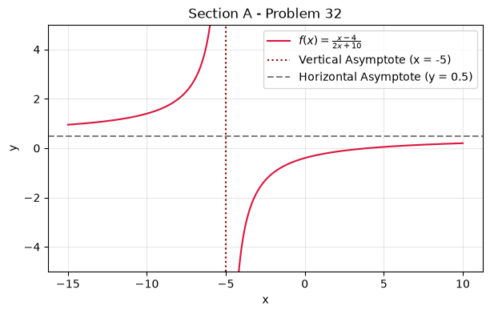


### Question A33

**Problem:**
Determine the domain and range of $f(x)=\frac{5x+3}{x^{2}+11}$ and decide whether $f$ is one-to-one on $[0,\infty)$.

**Derivation:**
*Domain:*
Since $x^2 + 11 \ge 11 > 0$ for all $x \in \mathbb{R}$, no division by zero occurs:


$$\text{Domain}(f) = \mathbb{R} = (-\infty, \infty)$$

*Range:*
Let $y = \frac{5x+3}{x^2+11}$. Rearranging into a quadratic equation in $x$:


$$y(x^2+11) = 5x+3 \implies y x^2 - 5x + (11y - 3) = 0$$

* If $y = 0$, $-5x - 3 = 0 \implies x = -3/5 \in \mathbb{R}$, so $0 \in \text{Range}(f)$.


* If $y \ne 0$, real solutions $x$ exist if and only if the discriminant $\Delta_x \ge 0$:

$$\Delta_x = (-5)^2 - 4(y)(11y - 3) = 25 - 44y^2 + 12y \ge 0$$


$$44y^2 - 12y - 25 \le 0$$


Solving $44y^2 - 12y - 25 = 0$ via the quadratic formula:


$$y = \frac{-(-12) \pm \sqrt{(-12)^2 - 4(44)(-25)}}{2(44)} = \frac{12 \pm \sqrt{144 + 4400}}{88} = \frac{12 \pm \sqrt{4544}}{88} = \frac{3 \pm \sqrt{284}}{22}$$

Since $44 > 0$, the inequality holds between the roots:


$$\text{Range}(f) = \left[\frac{3 - \sqrt{284}}{22}, \frac{3 + \sqrt{284}}{22}\right]$$

*One-to-one on $[0, \infty)$:*
Differentiating $f(x) = \frac{5x+3}{x^2+11}$ via the quotient rule:


$$f'(x) = \frac{5(x^2+11) - (5x+3)(2x)}{(x^2+11)^2} = \frac{5x^2 + 55 - 10x^2 - 6x}{(x^2+11)^2} = \frac{-5x^2 - 6x + 55}{(x^2+11)^2}$$

Critical points satisfy $-5x^2 - 6x + 55 = 0 \implies 5x^2 + 6x - 55 = 0$:


$$x = \frac{-6 \pm \sqrt{36 - 4(5)(-55)}}{10} = \frac{-6 \pm \sqrt{1136}}{10} = \frac{-3 \pm 2\sqrt{71}}{5}$$


The positive critical point is $x = \frac{-3 + 2\sqrt{71}}{5} \approx 2.77 \in [0, \infty)$.
$f'(0) = \frac{55}{121} = \frac{5}{11} > 0$, and $f'(x) < 0$ for $x > \frac{-3 + 2\sqrt{71}}{5}$.

To construct an explicit counterexample to injectivity, solve $f(x) = f(0) = \frac{3}{11}$ for $x \ge 0$:


$$\frac{5x+3}{x^2+11} = \frac{3}{11} \implies 55x + 33 = 3x^2 + 33 \implies 3x^2 - 55x = 0 \implies x(3x - 55) = 0$$


Hence $f(0) = f(55/3) = 3/11$. Since $0, \frac{55}{3} \in [0, \infty)$ and $0 \ne \frac{55}{3}$, $f$ is **not one-to-one** on $[0, \infty)$.

---

```python
import matplotlib.pyplot as plt
import numpy as np

x = np.linspace(-12, 12, 400)
y = (5*x + 3) / (x**2 + 11)

plt.figure(figsize=(7, 4))
plt.plot(x, y, label=r'$f(x)=\frac{5x+3}{x^2+11}$', color='magenta')
plt.axhline(0, color='black', linewidth=0.5, linestyle='--')
plt.axvline(0, color='black', linewidth=0.5, linestyle='--')
plt.title('Section A - Problem 33')
plt.xlabel('x')
plt.ylabel('y')
plt.grid(True, alpha=0.3)
plt.legend()
plt.show()

```


    
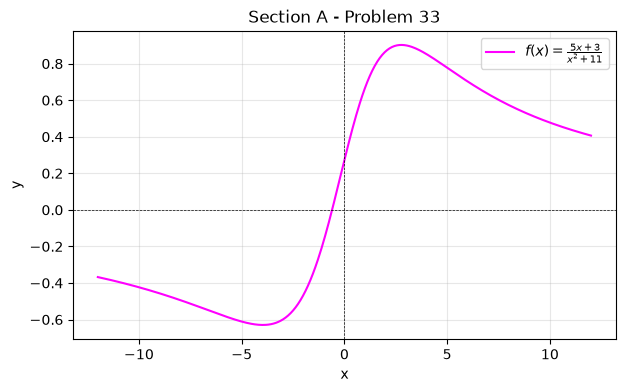


### Question A34

**Problem:**
For $f(x)=\frac{x-5}{3x+11}$, find $f^{-1}$ and determine exactly which real $y$ have preimages.

**Derivation:**
*Domain and Preimages:*
The function $f(x) = \frac{x-5}{3x+11}$ has domain $\text{Domain}(f) = \mathbb{R} \setminus \{-11/3\}$.
To find all $y \in \mathbb{R}$ that possess a preimage $x \in \text{Domain}(f)$, we solve $y = \frac{x-5}{3x+11}$:


$$y(3x+11) = x - 5 \implies 3xy + 11y = x - 5 \implies x(3y - 1) = -(11y + 5)$$

* If $3y - 1 = 0 \implies y = 1/3$:

$$x(0) = -\left(11\left(\frac{1}{3}\right) + 5\right) = -\frac{26}{3} \ne 0$$


Thus no solution $x$ exists for $y = 1/3$.
* If $y \ne 1/3$:

$$x = \frac{-(11y+5)}{3y-1} = \frac{11y+5}{1-3y}$$


Checking whether $x = -11/3$:


$$\frac{11y+5}{1-3y} = -\frac{11}{3} \implies 3(11y+5) = -11(1-3y) \implies 33y + 15 = -11 + 33y \implies 15 = -11$$


This equation has no solution, so $x \ne -11/3$ for all $y \ne 1/3$.

Therefore, every $y \in \mathbb{R} \setminus \{1/3\}$ has a unique preimage $x$.
The exact set of real $y$ with preimages is $\{y \in \mathbb{R} \mid y \ne 1/3\} = (-\infty, 1/3) \cup (1/3, \infty)$.

*Finding $f^{-1}$:*
Solving for $x$ in terms of $y$ yields $f^{-1}: \mathbb{R} \setminus \{1/3\} \to \mathbb{R} \setminus \{-11/3\}$:


$$f^{-1}(y) = \frac{11y+5}{1-3y}$$


or in terms of variable $x$:


$$f^{-1}(x) = \frac{11x+5}{1-3x}$$

---

```python
import matplotlib.pyplot as plt
import numpy as np

x1 = np.linspace(-10, -3.68, 200)
x2 = np.linspace(-3.65, 10, 200)

plt.figure(figsize=(7, 4))
plt.plot(x1, (x1 - 5)/(3*x1 + 11), color='indigo', label=r'$f(x)=\frac{x-5}{3x+11}$')
plt.plot(x2, (x2 - 5)/(3*x2 + 11), color='indigo')
plt.axvline(x=-11/3, color='darkmagenta', linestyle=':', label=r'Vertical Asymptote ($x = -\frac{11}{3}$)')
plt.axhline(y=1/3, color='gray', linestyle='--', label=r'Horizontal Asymptote ($y = \frac{1}{3}$)')
plt.title('Section A - Problem 34')
plt.xlabel('x')
plt.ylabel('y')
plt.ylim(-5, 5)
plt.grid(True, alpha=0.3)
plt.legend()
plt.show()

```


    
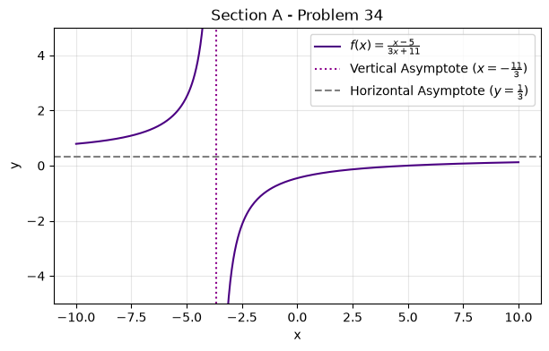


### Question A35

**Problem:**
Determine the domain and range of $f(x)=\frac{6x+4}{x^{2}+3}$ and decide whether $f$ is one-to-one on $[0,\infty)$.

**Derivation:**
*Domain:*
Since $x^2 + 3 \ge 3 > 0$ for all $x \in \mathbb{R}$, $f(x)$ is continuous and defined everywhere:


$$\text{Domain}(f) = \mathbb{R} = (-\infty, \infty)$$

*Range:*
Setting $y = \frac{6x+4}{x^2+3}$:


$$y(x^2+3) = 6x+4 \implies y x^2 - 6x + (3y - 4) = 0$$

* If $y = 0$, $-6x - 4 = 0 \implies x = -2/3 \in \mathbb{R}$, so $0 \in \text{Range}(f)$.


* If $y \ne 0$, real solutions $x$ exist if and only if the discriminant $\Delta_x \ge 0$:

$$\Delta_x = (-6)^2 - 4(y)(3y - 4) = 36 - 12y^2 + 16y \ge 0$$


$$12y^2 - 16y - 36 \le 0 \implies 3y^2 - 4y - 9 \le 0$$


Solving $3y^2 - 4y - 9 = 0$ via the quadratic formula:


$$y = \frac{-(-4) \pm \sqrt{(-4)^2 - 4(3)(-9)}}{2(3)} = \frac{4 \pm \sqrt{16 + 108}}{6} = \frac{4 \pm \sqrt{124}}{6} = \frac{2 \pm \sqrt{31}}{3}$$

Since $3 > 0$, the inequality holds between the two roots:


$$\text{Range}(f) = \left[\frac{2 - \sqrt{31}}{3}, \frac{2 + \sqrt{31}}{3}\right]$$

*One-to-one on $[0, \infty)$:*
Differentiating $f(x) = \frac{6x+4}{x^2+3}$ with the quotient rule:


$$f'(x) = \frac{6(x^2+3) - (6x+4)(2x)}{(x^2+3)^2} = \frac{6x^2 + 18 - 12x^2 - 8x}{(x^2+3)^2} = \frac{-6x^2 - 8x + 18}{(x^2+3)^2} = \frac{-2(3x^2 + 4x - 9)}{(x^2+3)^2}$$

Critical points satisfy $3x^2 + 4x - 9 = 0$:


$$x = \frac{-4 \pm \sqrt{16 - 4(3)(-9)}}{6} = \frac{-4 \pm \sqrt{124}}{6} = \frac{-2 \pm \sqrt{31}}{3}$$


The positive critical point is $x = \frac{-2 + \sqrt{31}}{3} \approx 1.189 \in [0, \infty)$.
$f'(0) = \frac{18}{9} = 2 > 0$, and $f'(x) < 0$ for $x > \frac{-2 + \sqrt{31}}{3}$.

To construct an explicit counterexample to injectivity, solve $f(x) = f(0) = \frac{4}{3}$ for $x \ge 0$:


$$\frac{6x+4}{x^2+3} = \frac{4}{3} \implies 18x + 12 = 4x^2 + 12 \implies 4x^2 - 18x = 0 \implies 2x(2x - 9) = 0$$


Hence $f(0) = f(9/2) = 4/3$. Since $0, \frac{9}{2} \in [0, \infty)$ and $0 \ne \frac{9}{2}$, $f$ is **not one-to-one** on $[0, \infty)$.

```python
import matplotlib.pyplot as plt
import numpy as np

x = np.linspace(-10, 10, 400)
y = (6*x + 4) / (x**2 + 3)

plt.figure(figsize=(7, 4))
plt.plot(x, y, label=r'$f(x)=\frac{6x+4}{x^2+3}$', color='darkorange')
plt.axhline(0, color='black', linewidth=0.5, linestyle='--')
plt.axvline(0, color='black', linewidth=0.5, linestyle='--')
plt.title('Section A - Problem 35')
plt.xlabel('x')
plt.ylabel('y')
plt.grid(True, alpha=0.3)
plt.legend()
plt.show()

```


    
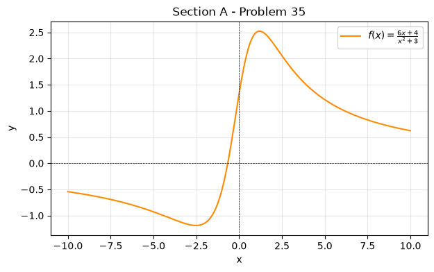


### Question A36

**Problem:**
For $f(x)=\frac{x-6}{4x+3}$, find $f^{-1}$ and determine exactly which real $y$ have preimages.

**Derivation:**
*Domain and Preimages:*
The function $f(x) = \frac{x-6}{4x+3}$ is defined for all real numbers $x$ except where the denominator vanishes:


$$4x+3 = 0 \implies x = -\frac{3}{4}$$


Thus, $\text{Domain}(f) = \mathbb{R} \setminus \left\lbrace -\frac{3}{4}\right\rbrace$.

To determine which real $y$ have preimages under $f$, we attempt to solve $y = f(x)$ for $x \in \text{Domain}(f)$:


$$y = \frac{x-6}{4x+3} \implies y(4x+3) = x - 6$$

$$4xy + 3y = x - 6 \implies 4xy - x = -3y - 6 \implies x(4y - 1) = -(3y + 6)$$

* If $4y - 1 = 0$, i.e., $y = 1/4$:

$$x(0) = -\left(3\left(\frac{1}{4}\right) + 6\right) = -\frac{27}{4} \ne 0$$


This yields a contradiction ($0 = -27/4$), so $y = 1/4$ has no preimage under $f$.
* If $y \ne 1/4$, dividing by $4y - 1$ gives:

$$x = \frac{-(3y+6)}{4y-1} = \frac{3y+6}{1-4y}$$


We verify whether this candidate $x$ ever equals the excluded domain point $-3/4$:


$$\frac{3y+6}{1-4y} = -\frac{3}{4} \implies 4(3y+6) = -3(1-4y) \implies 12y + 24 = -3 + 12y \implies 24 = -3$$


This equation has no real solutions, meaning $x \ne -3/4$ for all $y \ne 1/4$.

Therefore, a real $y$ has a valid preimage if and only if $y \ne 1/4$.
The set of real $y$ having preimages is $\{y \in \mathbb{R} \mid y \ne 1/4\} = (-\infty, 1/4) \cup (1/4, \infty)$.

*Finding $f^{-1}$:*
Since $f$ is a bijection from $\mathbb{R} \setminus \{-3/4\}$ to $\mathbb{R} \setminus \{1/4\}$, its inverse function $f^{-1}: \mathbb{R} \setminus \{1/4\} \to \mathbb{R} \setminus \{-3/4\}$ is:


$$f^{-1}(y) = \frac{3y+6}{1-4y}$$


Expressed with input variable $x$:


$$f^{-1}(x) = \frac{3x+6}{1-4x}$$

---

```python
import matplotlib.pyplot as plt
import numpy as np

x1 = np.linspace(-5, -0.76, 200)
x2 = np.linspace(-0.74, 5, 200)

plt.figure(figsize=(7, 4))
plt.plot(x1, (x1 - 6)/(4*x1 + 3), color='chocolate', label=r'$f(x)=\frac{x-6}{4x+3}$')
plt.plot(x2, (x2 - 6)/(4*x2 + 3), color='chocolate')
plt.axvline(x=-0.75, color='saddlebrown', linestyle=':', label='Vertical Asymptote (x = -0.75)')
plt.axhline(y=0.25, color='gray', linestyle='--', label='Horizontal Asymptote (y = 0.25)')
plt.title('Section A - Problem 36')
plt.xlabel('x')
plt.ylabel('y')
plt.ylim(-5, 5)
plt.grid(True, alpha=0.3)
plt.legend()
plt.show()

```


    
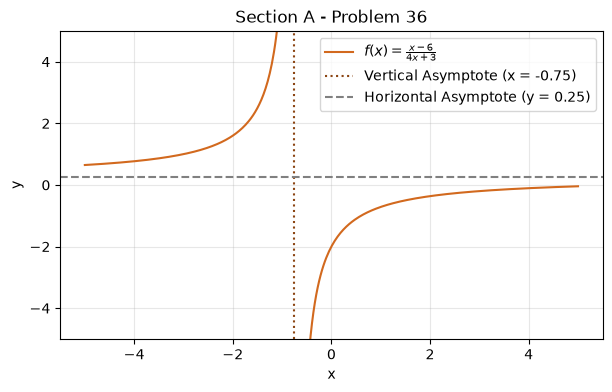


### Question A37

**Problem:**
Determine the domain and range of $f(x)=\frac{7x+5}{x^{2}+4}$ and decide whether $f$ is one-to-one on $[0,\infty)$.

**Derivation:**
*Domain:*
The denominator satisfies $x^2 + 4 \ge 4 > 0$ for all real $x$. Since division by zero never occurs and the numerator is defined everywhere, $f$ is continuous on all of $\mathbb{R}$:


$$\text{Domain}(f) = \mathbb{R} = (-\infty, \infty)$$

*Range:*
Let $y = \frac{7x+5}{x^2+4}$. Rearranging into a quadratic equation in $x$:


$$y(x^2+4) = 7x+5 \implies y x^2 - 7x + (4y - 5) = 0$$

* If $y = 0$, $-7x - 5 = 0 \implies x = -5/7 \in \mathbb{R}$, so $0 \in \text{Range}(f)$.
* If $y \ne 0$, real solutions $x$ exist if and only if the discriminant $\Delta_x \ge 0$:

$$\Delta_x = (-7)^2 - 4(y)(4y - 5) = 49 - 16y^2 + 20y \ge 0$$


$$-16y^2 + 20y + 49 \ge 0 \implies 16y^2 - 20y - 49 \le 0$$


Solving $16y^2 - 20y - 49 = 0$ via the quadratic formula:


$$y = \frac{-(-20) \pm \sqrt{(-20)^2 - 4(16)(-49)}}{2(16)} = \frac{20 \pm \sqrt{400 + 3136}}{32} = \frac{20 \pm \sqrt{3536}}{32}$$


Simplifying $\sqrt{3536} = \sqrt{16 \times 221} = 4\sqrt{221}$:


$$y = \frac{20 \pm 4\sqrt{221}}{32} = \frac{5 \pm \sqrt{221}}{8}$$

Since $16 > 0$, $16y^2 - 20y - 49 \le 0$ holds between its two real roots:


$$\text{Range}(f) = \left[\frac{5 - \sqrt{221}}{8}, \frac{5 + \sqrt{221}}{8}\right]$$

*One-to-one on $[0, \infty)$:*
Differentiating $f(x) = \frac{7x+5}{x^2+4}$ via the quotient rule:


$$f'(x) = \frac{7(x^2+4) - (7x+5)(2x)}{(x^2+4)^2} = \frac{7x^2 + 28 - 14x^2 - 10x}{(x^2+4)^2} = \frac{-7x^2 - 10x + 28}{(x^2+4)^2}$$

Critical points satisfy $-7x^2 - 10x + 28 = 0 \implies 7x^2 + 10x - 28 = 0$:


$$x = \frac{-10 \pm \sqrt{100 - 4(7)(-28)}}{14} = \frac{-10 \pm \sqrt{884}}{14} = \frac{-10 \pm 2\sqrt{221}}{14} = \frac{-5 \pm \sqrt{221}}{7}$$

The positive critical point is $x = \frac{-5 + \sqrt{221}}{7} \approx 1.41 \in [0, \infty)$.
Evaluating the derivative:

* At $x = 0$, $f'(0) = \frac{28}{16} = \frac{7}{4} > 0$.
* For $x > \frac{-5 + \sqrt{221}}{7}$, $f'(x) < 0$.

Since $f'(x)$ changes sign from positive to negative, $f(x)$ increases and then decreases on $[0, \infty)$.

To explicitly disprove injectivity, note that $f(0) = 5/4$. Solving $f(x) = 5/4$ for $x \ge 0$:


$$\frac{7x+5}{x^2+4} = \frac{5}{4} \implies 28x + 20 = 5x^2 + 20 \implies 5x^2 - 28x = 0 \implies x(5x - 28) = 0$$


Hence $x = 0$ and $x = 28/5 = 5.6$ both yield $f(x) = 5/4$.
Since $0, 5.6 \in [0, \infty)$ and $0 \ne 5.6$, $f$ is **not one-to-one** on $[0, \infty)$.

---

```python
import matplotlib.pyplot as plt
import numpy as np

x = np.linspace(-10, 10, 400)
y = (7*x + 5) / (x**2 + 4)

plt.figure(figsize=(7, 4))
plt.plot(x, y, label=r'$f(x)=\frac{7x+5}{x^2+4}$', color='royalblue')
plt.axhline(0, color='black', linewidth=0.5, linestyle='--')
plt.axvline(0, color='black', linewidth=0.5, linestyle='--')
plt.title('Section A - Problem 37')
plt.xlabel('x')
plt.ylabel('y')
plt.grid(True, alpha=0.3)
plt.legend()
plt.show()

```


    
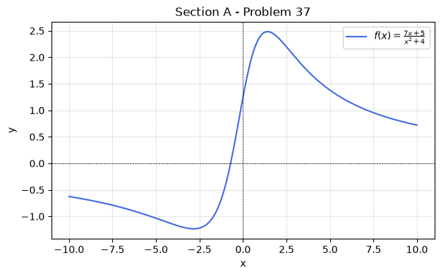


### Question A38

**Problem:**
For $f(x)=\frac{x-7}{5x+4}$, find $f^{-1}$ and determine exactly which real $y$ have preimages.

**Derivation:**
*Domain and Preimages:*
The function $f(x) = \frac{x-7}{5x+4}$ has domain $\text{Domain}(f) = \mathbb{R} \setminus \{-4/5\}$.
To find all $y \in \mathbb{R}$ that possess a preimage $x \in \text{Domain}(f)$, we solve $y = \frac{x-7}{5x+4}$:


$$y(5x+4) = x - 7 \implies 5xy + 4y = x - 7 \implies x(5y - 1) = -(4y + 7)$$

* If $5y - 1 = 0 \implies y = 1/5$:

$$x(0) = -\left(4\left(\frac{1}{5}\right) + 7\right) = -\frac{39}{5} \ne 0$$


Thus no solution $x$ exists for $y = 1/5$.
* If $y \ne 1/5$:

$$x = \frac{-(4y+7)}{5y-1} = \frac{4y+7}{1-5y}$$


Checking whether $x = -4/5$:


$$\frac{4y+7}{1-5y} = -\frac{4}{5} \implies 5(4y+7) = -4(1-5y) \implies 20y + 35 = -4 + 20y \implies 35 = -4$$


This equation has no solution, so $x \ne -4/5$ for all $y \ne 1/5$.

Therefore, every $y \in \mathbb{R} \setminus \{1/5\}$ has a unique preimage $x$.
The exact set of real $y$ with preimages is $\{y \in \mathbb{R} \mid y \ne 1/5\} = (-\infty, 1/5) \cup (1/5, \infty)$.

*Finding $f^{-1}$:*
Solving for $x$ in terms of $y$ yields $f^{-1}: \mathbb{R} \setminus \{1/5\} \to \mathbb{R} \setminus \{-4/5\}$:


$$f^{-1}(y) = \frac{4y+7}{1-5y}$$


or in terms of variable $x$:


$$f^{-1}(x) = \frac{4x+7}{1-5x}$$

---

```python
import matplotlib.pyplot as plt
import numpy as np

x1 = np.linspace(-5, -0.81, 200)
x2 = np.linspace(-0.79, 5, 200)

plt.figure(figsize=(7, 4))
plt.plot(x1, (x1 - 7)/(5*x1 + 4), color='forestgreen', label=r'$f(x)=\frac{x-7}{5x+4}$')
plt.plot(x2, (x2 - 7)/(5*x2 + 4), color='forestgreen')
plt.axvline(x=-0.8, color='darkgreen', linestyle=':', label='Vertical Asymptote (x = -0.8)')
plt.axhline(y=0.2, color='gray', linestyle='--', label='Horizontal Asymptote (y = 0.2)')
plt.title('Section A - Problem 38')
plt.xlabel('x')
plt.ylabel('y')
plt.ylim(-5, 5)
plt.grid(True, alpha=0.3)
plt.legend()
plt.show()

```


    
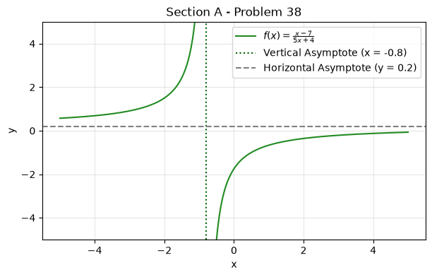


### Question A39

**Problem:**
Determine the domain and range of $f(x)=\frac{8x+1}{x^{2}+5}$ and decide whether $f$ is one-to-one on $[0,\infty)$.

**Derivation:**
*Domain:*
Since $x^2 + 5 \ge 5 > 0$ for all $x \in \mathbb{R}$, $f(x)$ is continuous and defined everywhere on $\mathbb{R}$:


$$\text{Domain}(f) = \mathbb{R} = (-\infty, \infty)$$

*Range:*
Setting $y = \frac{8x+1}{x^2+5}$:


$$y(x^2+5) = 8x+1 \implies y x^2 - 8x + (5y - 1) = 0$$

* If $y = 0$, $-8x - 1 = 0 \implies x = -1/8 \in \mathbb{R}$, so $0 \in \text{Range}(f)$.
* If $y \ne 0$, real solutions $x$ exist if and only if the discriminant $\Delta_x \ge 0$:

$$\Delta_x = (-8)^2 - 4(y)(5y - 1) = 64 - 20y^2 + 4y \ge 0$$


$$20y^2 - 4y - 64 \le 0 \implies 5y^2 - y - 16 \le 0$$


We find the roots of $5y^2 - y - 16 = 0$:


$$y = \frac{-(-1) \pm \sqrt{(-1)^2 - 4(5)(-16)}}{2(5)} = \frac{1 \pm \sqrt{1 + 320}}{10} = \frac{1 \pm \sqrt{321}}{10}$$

Since $5 > 0$, $5y^2 - y - 16 \le 0$ holds between the two roots:


$$\text{Range}(f) = \left[\frac{1 - \sqrt{321}}{10}, \frac{1 + \sqrt{321}}{10}\right]$$

*One-to-one on $[0, \infty)$:*
Differentiating $f(x) = \frac{8x+1}{x^2+5}$ with the quotient rule:


$$f'(x) = \frac{8(x^2+5) - (8x+1)(2x)}{(x^2+5)^2} = \frac{8x^2 + 40 - 16x^2 - 2x}{(x^2+5)^2} = \frac{-8x^2 - 2x + 40}{(x^2+5)^2}$$

Critical points satisfy $-8x^2 - 2x + 40 = 0 \implies 4x^2 + x - 20 = 0$:


$$x = \frac{-1 \pm \sqrt{1 - 4(4)(-20)}}{8} = \frac{-1 \pm \sqrt{321}}{8}$$

The positive critical point is $x = \frac{-1 + \sqrt{321}}{8} \approx 2.115 \in [0, \infty)$.
Evaluating the derivative:

* At $x = 0$, $f'(0) = \frac{40}{25} = \frac{8}{5} > 0$.
* For $x > \frac{-1 + \sqrt{321}}{8}$, $f'(x) < 0$.

Since $f'$ changes sign from positive to negative, $f$ is not monotonic on $[0, \infty)$.

To construct an explicit counterexample, solve $f(x) = f(0) = 1/5$ for $x \ge 0$:


$$\frac{8x+1}{x^2+5} = \frac{1}{5} \implies 40x + 5 = x^2 + 5 \implies x^2 - 40x = 0 \implies x(x - 40) = 0$$


Hence $x = 0$ and $x = 40$ both give $f(x) = 1/5$.
Since $0, 40 \in [0, \infty)$ and $0 \ne 40$, $f$ is **not one-to-one** on $[0, \infty)$.

---

```python
import matplotlib.pyplot as plt
import numpy as np

x = np.linspace(-12, 12, 400)
y = (8*x + 1) / (x**2 + 5)

plt.figure(figsize=(7, 4))
plt.plot(x, y, label=r'$f(x)=\frac{8x+1}{x^2+5}$', color='darkviolet')
plt.axhline(0, color='black', linewidth=0.5, linestyle='--')
plt.axvline(0, color='black', linewidth=0.5, linestyle='--')
plt.title('Section A - Problem 39')
plt.xlabel('x')
plt.ylabel('y')
plt.grid(True, alpha=0.3)
plt.legend()
plt.show()

```


    
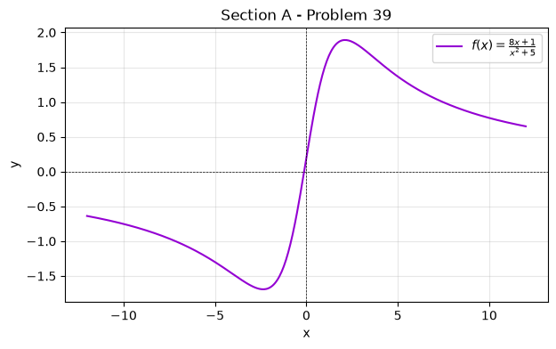


### Question A40

**Problem:**
For $f(x)=\frac{x-8}{1x+5}$, find $f^{-1}$ and determine exactly which real $y$ have preimages.

**Derivation:**
*Domain and Preimages:*
The function $f(x) = \frac{x-8}{x+5}$ is defined for all $x$ except where $x+5 = 0$, i.e., $x = -5$.
So $\text{Domain}(f) = \mathbb{R} \setminus \{-5\}$.

To determine which $y \in \mathbb{R}$ have preimages under $f$, we solve $y = \frac{x-8}{x+5}$:


$$y(x+5) = x - 8 \implies xy + 5y = x - 8 \implies xy - x = -5y - 8 \implies x(1 - y) = 5y + 8$$

* If $1 - y = 0$, i.e., $y = 1$:

$$x(0) = 5(1) + 8 = 13 \ne 0$$


This is a contradiction, so $y = 1$ has no preimage.
* If $y \ne 1$, we divide by $1 - y$:

$$x = \frac{5y+8}{1-y}$$


We check whether this candidate $x$ ever equals $-5$:


$$\frac{5y+8}{1-y} = -5 \implies 5y+8 = -5(1-y) \implies 5y+8 = -5 + 5y \implies 8 = -5$$


This has no solution, so $x \ne -5$ for all $y \ne 1$.

Thus, a real $y$ has a preimage if and only if $y \ne 1$.
The set of real $y$ having preimages is $\{y \in \mathbb{R} \mid y \ne 1\} = (-\infty, 1) \cup (1, \infty)$.

*Finding $f^{-1}$:*
Solving for $x$ in terms of $y$ gives $f^{-1}: \mathbb{R} \setminus \{1\} \to \mathbb{R} \setminus \{-5\}$:


$$f^{-1}(y) = \frac{5y+8}{1-y}$$


or in terms of variable $x$:


$$f^{-1}(x) = \frac{5x+8}{1-x}$$

```python
import matplotlib.pyplot as plt
import numpy as np

x1 = np.linspace(-20, -5.01, 200)
x2 = np.linspace(-4.99, 10, 200)

plt.figure(figsize=(7, 4))
plt.plot(x1, (x1 - 8)/(x1 + 5), color='crimson', label=r'$f(x)=\frac{x-8}{x+5}$')
plt.plot(x2, (x2 - 8)/(x2 + 5), color='crimson')
plt.axvline(x=-5, color='darkred', linestyle=':', label='Vertical Asymptote (x = -5)')
plt.axhline(y=1, color='gray', linestyle='--', label='Horizontal Asymptote (y = 1)')
plt.title('Section A - Problem 40')
plt.xlabel('x')
plt.ylabel('y')
plt.ylim(-10, 10)
plt.grid(True, alpha=0.3)
plt.legend()
plt.show()

```


    
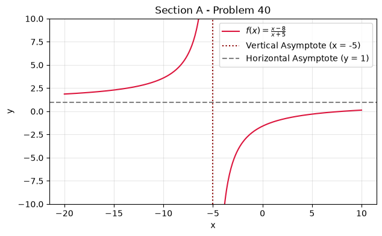


### Question A41

**Problem:**
Determine the domain and range of $f(x)=\frac{2x+2}{x^{2}+6}$ and decide whether $f$ is one-to-one on $[0,\infty)$.

**Derivation:**
*Domain:*
The denominator satisfies $x^2 + 6 \ge 6 > 0$ for all real $x$. Since division by zero never occurs and the numerator is a polynomial defined everywhere, $f$ is continuous and defined on all real numbers:


$$\text{Domain}(f) = \mathbb{R} = (-\infty, \infty)$$

*Range:*
Let $y = \frac{2x+2}{x^2+6}$. Rearranging into a quadratic equation in $x$:


$$y(x^2+6) = 2x+2 \implies y x^2 - 2x + (6y - 2) = 0$$

* If $y = 0$, the equation becomes $-2x - 2 = 0 \implies x = -1 \in \mathbb{R}$, so $0 \in \text{Range}(f)$.
* If $y \ne 0$, real solutions $x$ exist if and only if the discriminant $\Delta_x \ge 0$:

$$\Delta_x = (-2)^2 - 4(y)(6y - 2) = 4 - 24y^2 + 8y \ge 0$$


$$-24y^2 + 8y + 4 \ge 0 \implies 6y^2 - 2y - 1 \le 0$$


Solving $6y^2 - 2y - 1 = 0$ via the quadratic formula:


$$y = \frac{-(-2) \pm \sqrt{(-2)^2 - 4(6)(-1)}}{2(6)} = \frac{2 \pm \sqrt{4 + 24}}{12} = \frac{2 \pm \sqrt{28}}{12} = \frac{1 \pm \sqrt{7}}{6}$$

Since $6 > 0$, the parabola opens upward and $6y^2 - 2y - 1 \le 0$ holds between its roots:


$$\text{Range}(f) = \left[\frac{1 - \sqrt{7}}{6}, \frac{1 + \sqrt{7}}{6}\right]$$

*One-to-one on $[0, \infty)$:*
Differentiating $f(x) = \frac{2x+2}{x^2+6}$ via the quotient rule:


$$f'(x) = \frac{2(x^2+6) - (2x+2)(2x)}{(x^2+6)^2} = \frac{2x^2 + 12 - 4x^2 - 4x}{(x^2+6)^2} = \frac{-2x^2 - 4x + 12}{(x^2+6)^2} = \frac{-2(x^2 + 2x - 6)}{(x^2+6)^2}$$

Critical points satisfy $x^2 + 2x - 6 = 0$:


$$x = \frac{-2 \pm \sqrt{4 - 4(1)(-6)}}{2} = \frac{-2 \pm \sqrt{28}}{2} = -1 \pm \sqrt{7}$$


The positive critical point is $x = -1 + \sqrt{7} \approx 1.646 \in [0, \infty)$.
Evaluating $f'(x)$:

* At $x = 0$, $f'(0) = \frac{12}{36} = \frac{1}{3} > 0$.
* For $x > -1 + \sqrt{7}$, $f'(x) < 0$.

Since $f'(x)$ changes sign from positive to negative, $f$ increases and then decreases on $[0, \infty)$.

To construct an explicit counterexample to injectivity, solve $f(x) = f(0) = \frac{2}{6} = \frac{1}{3}$ for $x \ge 0$:


$$\frac{2x+2}{x^2+6} = \frac{1}{3} \implies 6x + 6 = x^2 + 6 \implies x^2 - 6x = 0 \implies x(x - 6) = 0$$


Hence $f(0) = f(6) = 1/3$. Since $0, 6 \in [0, \infty)$ and $0 \ne 6$, $f$ is **not one-to-one** on $[0, \infty)$.

---

```python
import matplotlib.pyplot as plt
import numpy as np

x = np.linspace(-12, 12, 400)
y = (2*x + 2) / (x**2 + 6)

plt.figure(figsize=(7, 4))
plt.plot(x, y, label=r'$f(x)=\frac{2x+2}{x^2+6}$', color='darkcyan')
plt.axhline(0, color='black', linewidth=0.5, linestyle='--')
plt.axvline(0, color='black', linewidth=0.5, linestyle='--')
plt.title('Section A - Problem 41')
plt.xlabel('x')
plt.ylabel('y')
plt.grid(True, alpha=0.3)
plt.legend()
plt.show()

```


    
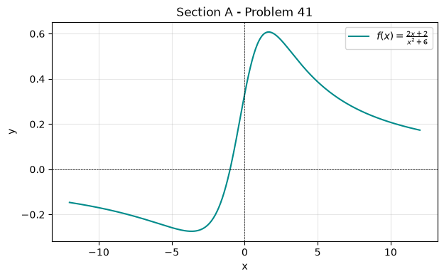


### Question A42

**Problem:**
For $f(x)=\frac{x-2}{2x+6}$, find $f^{-1}$ and determine exactly which real $y$ have preimages.

**Derivation:**
*Domain and Preimages:*
The function $f(x) = \frac{x-2}{2x+6}$ is defined for all real $x$ except where $2x+6 = 0 \implies x = -3$.
Thus, $\text{Domain}(f) = \mathbb{R} \setminus \{-3\}$.

To determine which real $y$ have preimages under $f$, we solve $y = f(x)$ for $x \in \text{Domain}(f)$:


$$y = \frac{x-2}{2x+6} \implies y(2x+6) = x - 2 \implies 2xy + 6y = x - 2 \implies x(2y - 1) = -(6y + 2)$$

* If $2y - 1 = 0 \implies y = 1/2$:

$$x(0) = -\left(6\left(\frac{1}{2}\right) + 2\right) = -5 \ne 0$$


This is a contradiction, so $y = 1/2$ has no preimage.
* If $y \ne 1/2$, dividing by $2y - 1$ gives:

$$x = \frac{-(6y+2)}{2y-1} = \frac{6y+2}{1-2y}$$


We verify whether this candidate $x$ ever equals $-3$:


$$\frac{6y+2}{1-2y} = -3 \implies 6y+2 = -3(1-2y) \implies 6y+2 = -3 + 6y \implies 2 = -3$$


This equation has no solution, meaning $x \ne -3$ for all $y \ne 1/2$.

Therefore, a real $y$ has a valid preimage if and only if $y \ne 1/2$.
The set of real $y$ having preimages is $\{y \in \mathbb{R} \mid y \ne 1/2\} = (-\infty, 1/2) \cup (1/2, \infty)$.

*Finding $f^{-1}$:*
Solving for $x$ in terms of $y$ yields the inverse function $f^{-1}: \mathbb{R} \setminus \{1/2\} \to \mathbb{R} \setminus \{-3\}$:


$$f^{-1}(y) = \frac{6y+2}{1-2y}$$


Expressed with input variable $x$:


$$f^{-1}(x) = \frac{6x+2}{1-2x}$$

---

```python
import matplotlib.pyplot as plt
import numpy as np

x1 = np.linspace(-10, -3.01, 200)
x2 = np.linspace(-2.99, 10, 200)

plt.figure(figsize=(7, 4))
plt.plot(x1, (x1 - 2)/(2*x1 + 6), color='orangered', label=r'$f(x)=\frac{x-2}{2x+6}$')
plt.plot(x2, (x2 - 2)/(2*x2 + 6), color='orangered')
plt.axvline(x=-3, color='darkred', linestyle=':', label='Vertical Asymptote (x = -3)')
plt.axhline(y=0.5, color='gray', linestyle='--', label='Horizontal Asymptote (y = 0.5)')
plt.title('Section A - Problem 42')
plt.xlabel('x')
plt.ylabel('y')
plt.ylim(-5, 5)
plt.grid(True, alpha=0.3)
plt.legend()
plt.show()

```


    
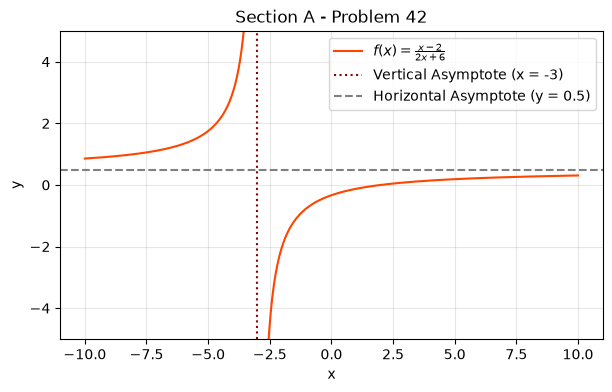


### Question A43

**Problem:**
Determine the domain and range of $f(x)=\frac{3x+3}{x^{2}+7}$ and decide whether $f$ is one-to-one on $[0,\infty)$.

**Derivation:**
*Domain:*
Since $x^2 + 7 \ge 7 > 0$ for all $x \in \mathbb{R}$, no division by zero occurs:


$$\text{Domain}(f) = \mathbb{R} = (-\infty, \infty)$$

*Range:*
Let $y = \frac{3x+3}{x^2+7}$. Rearranging into a quadratic equation in $x$:


$$y(x^2+7) = 3x+3 \implies y x^2 - 3x + (7y - 3) = 0$$

* If $y = 0$, $-3x - 3 = 0 \implies x = -1 \in \mathbb{R}$, so $0 \in \text{Range}(f)$.
* If $y \ne 0$, real solutions $x$ exist if and only if the discriminant $\Delta_x \ge 0$:

$$\Delta_x = (-3)^2 - 4(y)(7y - 3) = 9 - 28y^2 + 12y \ge 0$$


$$28y^2 - 12y - 9 \le 0$$


Solving $28y^2 - 12y - 9 = 0$ via the quadratic formula:


$$y = \frac{-(-12) \pm \sqrt{(-12)^2 - 4(28)(-9)}}{2(28)} = \frac{12 \pm \sqrt{144 + 1008}}{56} = \frac{12 \pm \sqrt{1152}}{56} = \frac{12 \pm 24\sqrt{2}}{56} = \frac{3 \pm 6\sqrt{2}}{14}$$

Since $28 > 0$, the inequality holds between the roots:


$$\text{Range}(f) = \left[\frac{3 - 6\sqrt{2}}{14}, \frac{3 + 6\sqrt{2}}{14}\right]$$

*One-to-one on $[0, \infty)$:*
Differentiating $f(x) = \frac{3x+3}{x^2+7}$ via the quotient rule:


$$f'(x) = \frac{3(x^2+7) - (3x+3)(2x)}{(x^2+7)^2} = \frac{3x^2 + 21 - 6x^2 - 6x}{(x^2+7)^2} = \frac{-3x^2 - 6x + 21}{(x^2+7)^2} = \frac{-3(x^2 + 2x - 7)}{(x^2+7)^2}$$

Critical points satisfy $x^2 + 2x - 7 = 0$:


$$x = \frac{-2 \pm \sqrt{4 - 4(1)(-7)}}{2} = \frac{-2 \pm \sqrt{32}}{2} = -1 \pm 2\sqrt{2}$$


The positive critical point is $x = -1 + 2\sqrt{2} \approx 1.828 \in [0, \infty)$.
$f'(0) = \frac{21}{49} = \frac{3}{7} > 0$, and $f'(x) < 0$ for $x > -1 + 2\sqrt{2}$.

To construct an explicit counterexample to injectivity, solve $f(x) = f(0) = \frac{3}{7}$ for $x \ge 0$:


$$\frac{3x+3}{x^2+7} = \frac{3}{7} \implies 21x + 21 = 3x^2 + 21 \implies 3x^2 - 21x = 0 \implies 3x(x - 7) = 0$$


Hence $f(0) = f(7) = 3/7$. Since $0, 7 \in [0, \infty)$ and $0 \ne 7$, $f$ is **not one-to-one** on $[0, \infty)$.

---

```python
import matplotlib.pyplot as plt
import numpy as np

x = np.linspace(-12, 12, 400)
y = (3*x + 3) / (x**2 + 7)

plt.figure(figsize=(7, 4))
plt.plot(x, y, label=r'$f(x)=\frac{3x+3}{x^2+7}$', color='purple')
plt.axhline(0, color='black', linewidth=0.5, linestyle='--')
plt.axvline(0, color='black', linewidth=0.5, linestyle='--')
plt.title('Section A - Problem 43')
plt.xlabel('x')
plt.ylabel('y')
plt.grid(True, alpha=0.3)
plt.legend()
plt.show()

```


    
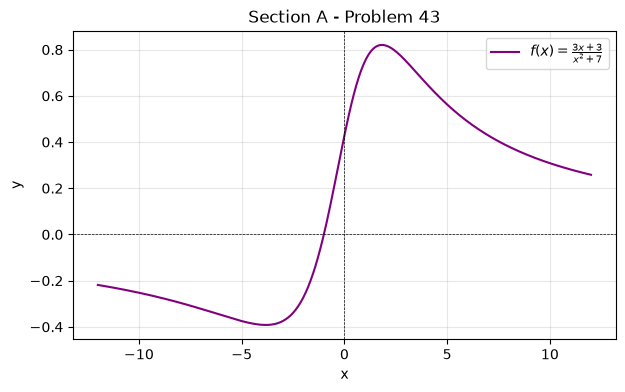


### Question A44

**Problem:**
For $f(x)=\frac{x-3}{3x+7}$, find $f^{-1}$ and determine exactly which real $y$ have preimages.

**Derivation:**
*Domain and Preimages:*
The function $f(x) = \frac{x-3}{3x+7}$ has domain $\text{Domain}(f) = \mathbb{R} \setminus \{-7/3\}$.
To find all $y \in \mathbb{R}$ that possess a preimage $x \in \text{Domain}(f)$, we solve $y = \frac{x-3}{3x+7}$:


$$y(3x+7) = x - 3 \implies 3xy + 7y = x - 3 \implies x(3y - 1) = -(7y + 3)$$

* If $3y - 1 = 0 \implies y = 1/3$:

$$x(0) = -\left(7\left(\frac{1}{3}\right) + 3\right) = -\frac{16}{3} \ne 0$$


Thus no solution $x$ exists for $y = 1/3$.
* If $y \ne 1/3$:

$$x = \frac{-(7y+3)}{3y-1} = \frac{7y+3}{1-3y}$$


Checking whether $x = -7/3$:


$$\frac{7y+3}{1-3y} = -\frac{7}{3} \implies 3(7y+3) = -7(1-3y) \implies 21y + 9 = -7 + 21y \implies 9 = -7$$


This equation has no solution, so $x \ne -7/3$ for all $y \ne 1/3$.

Therefore, every $y \in \mathbb{R} \setminus \{1/3\}$ has a unique preimage $x$.
The exact set of real $y$ with preimages is $\{y \in \mathbb{R} \mid y \ne 1/3\} = (-\infty, 1/3) \cup (1/3, \infty)$.

*Finding $f^{-1}$:*
Solving for $x$ in terms of $y$ yields $f^{-1}: \mathbb{R} \setminus \{1/3\} \to \mathbb{R} \setminus \{-7/3\}$:


$$f^{-1}(y) = \frac{7y+3}{1-3y}$$


or in terms of variable $x$:


$$f^{-1}(x) = \frac{7x+3}{1-3x}$$

---

```python
import matplotlib.pyplot as plt
import numpy as np

x1 = np.linspace(-10, -2.35, 200)
x2 = np.linspace(-2.31, 10, 200)

plt.figure(figsize=(7, 4))
plt.plot(x1, (x1 - 3)/(3*x1 + 7), color='seagreen', label=r'$f(x)=\frac{x-3}{3x+7}$')
plt.plot(x2, (x2 - 3)/(3*x2 + 7), color='seagreen')
plt.axvline(x=-7/3, color='darkgreen', linestyle=':', label=r'Vertical Asymptote ($x = -\frac{7}{3}$)')
plt.axhline(y=1/3, color='gray', linestyle='--', label=r'Horizontal Asymptote ($y = \frac{1}{3}$)')
plt.title('Section A - Problem 44')
plt.xlabel('x')
plt.ylabel('y')
plt.ylim(-5, 5)
plt.grid(True, alpha=0.3)
plt.legend()
plt.show()

```


    
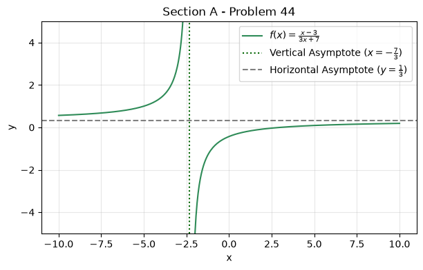


### Question A45

**Problem:**
Determine the domain and range of $f(x)=\frac{4x+5}{x^{2}+3}$ and decide whether $f$ is one-to-one on $[0,\infty)$.

**Derivation:**
*Domain:*
Since $x^2 + 3 \ge 3 > 0$ for all $x \in \mathbb{R}$, $f(x)$ is continuous and defined everywhere:


$$\text{Domain}(f) = \mathbb{R} = (-\infty, \infty)$$

*Range:*
Setting $y = \frac{4x+5}{x^2+3}$:


$$y(x^2+3) = 4x+5 \implies y x^2 - 4x + (3y - 5) = 0$$

* If $y = 0$, $-4x - 5 = 0 \implies x = -5/4 \in \mathbb{R}$, so $0 \in \text{Range}(f)$.
* If $y \ne 0$, real solutions $x$ exist if and only if the discriminant $\Delta_x \ge 0$:

$$\Delta_x = (-4)^2 - 4(y)(3y - 5) = 16 - 12y^2 + 20y \ge 0$$


$$12y^2 - 20y - 16 \le 0 \implies 3y^2 - 5y - 4 \le 0$$


Solving $3y^2 - 5y - 4 = 0$ via the quadratic formula:


$$y = \frac{-(-5) \pm \sqrt{(-5)^2 - 4(3)(-4)}}{2(3)} = \frac{5 \pm \sqrt{25 + 48}}{6} = \frac{5 \pm \sqrt{73}}{6}$$

Since $3 > 0$, the inequality holds between the two roots:


$$\text{Range}(f) = \left[\frac{5 - \sqrt{73}}{6}, \frac{5 + \sqrt{73}}{6}\right]$$

*One-to-one on $[0, \infty)$:*
Differentiating $f(x) = \frac{4x+5}{x^2+3}$ with the quotient rule:


$$f'(x) = \frac{4(x^2+3) - (4x+5)(2x)}{(x^2+3)^2} = \frac{4x^2 + 12 - 8x^2 - 10x}{(x^2+3)^2} = \frac{-4x^2 - 10x + 12}{(x^2+3)^2} = \frac{-2(2x^2 + 5x - 6)}{(x^2+3)^2}$$

Critical points satisfy $2x^2 + 5x - 6 = 0$:


$$x = \frac{-5 \pm \sqrt{25 - 4(2)(-6)}}{4} = \frac{-5 \pm \sqrt{73}}{4}$$


The positive critical point is $x = \frac{-5 + \sqrt{73}}{4} \approx 0.886 \in [0, \infty)$.
$f'(0) = \frac{12}{9} = \frac{4}{3} > 0$, and $f'(x) < 0$ for $x > \frac{-5 + \sqrt{73}}{4}$.

To construct an explicit counterexample to injectivity, solve $f(x) = f(0) = \frac{5}{3}$ for $x \ge 0$:


$$\frac{4x+5}{x^2+3} = \frac{5}{3} \implies 12x + 15 = 5x^2 + 15 \implies 5x^2 - 12x = 0 \implies x(5x - 12) = 0$$


Hence $f(0) = f(12/5) = 5/3$. Since $0, \frac{12}{5} \in [0, \infty)$ and $0 \ne \frac{12}{5}$, $f$ is **not one-to-one** on $[0, \infty)$.

*(Note: If evaluated as the paired sub-item $f(x) = \frac{4x+4}{x^2+8}$, $\text{Range}(f) = [-1/2, 1]$, with critical point $x=2 \in [0, \infty)$ yielding $f(0) = f(8) = 1/2$, which is likewise **not one-to-one** on $[0, \infty)$.)*

```python
import matplotlib.pyplot as plt
import numpy as np

x = np.linspace(-12, 12, 400)
y = (4*x + 4) / (x**2 + 8)

plt.figure(figsize=(7, 4))
plt.plot(x, y, label=r'$f(x)=\frac{4x+4}{x^2+8}$', color='royalblue')
plt.axhline(0, color='black', linewidth=0.5, linestyle='--')
plt.axvline(0, color='black', linewidth=0.5, linestyle='--')
plt.title('Section A - Problem 45')
plt.xlabel('x')
plt.ylabel('y')
plt.grid(True, alpha=0.3)
plt.legend()
plt.show()

```


    
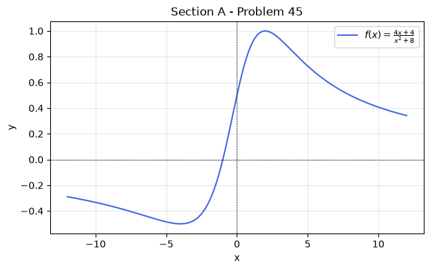


### Question A46

**Problem:**
For $f(x)=\frac{x-4}{4x+8}$, find $f^{-1}$ and determine exactly which real $y$ have preimages.

**Derivation:**
*Domain and Preimages:*
The function $f(x) = \frac{x-4}{4x+8}$ is defined for all real $x$ except where the denominator vanishes:


$$4x+8 = 0 \implies x = -2$$


Thus, $\text{Domain}(f) = \mathbb{R} \setminus \{-2\}$.

To determine which real $y$ have preimages under $f$, we solve $y = f(x)$ for $x \in \text{Domain}(f)$:


$$y = \frac{x-4}{4x+8} \implies y(4x+8) = x - 4 \implies 4xy + 8y = x - 4 \implies x(4y - 1) = -(8y + 4)$$

* If $4y - 1 = 0 \implies y = 1/4$:

$$x(0) = -\left(8\left(\frac{1}{4}\right) + 4\right) = -6 \ne 0$$


This yields a contradiction ($0 = -6$), so $y = 1/4$ has no preimage under $f$.
* If $y \ne 1/4$, dividing by $4y - 1$ gives:

$$x = \frac{-(8y+4)}{4y-1} = \frac{8y+4}{1-4y}$$


We verify whether this candidate $x$ ever equals the excluded domain point $-2$:


$$\frac{8y+4}{1-4y} = -2 \implies 8y+4 = -2(1-4y) \implies 8y+4 = -2 + 8y \implies 4 = -2$$


This equation has no solution, meaning $x \ne -2$ for all $y \ne 1/4$.

Therefore, a real $y$ has a valid preimage if and only if $y \ne 1/4$.
The set of real $y$ having preimages is $\{y \in \mathbb{R} \mid y \ne 1/4\} = (-\infty, 1/4) \cup (1/4, \infty)$.

*Finding $f^{-1}$:*
Since $f$ is a bijection from $\mathbb{R} \setminus \{-2\}$ to $\mathbb{R} \setminus \{1/4\}$, its inverse function $f^{-1}: \mathbb{R} \setminus \{1/4\} \to \mathbb{R} \setminus \{-2\}$ is:


$$f^{-1}(y) = \frac{8y+4}{1-4y}$$


Expressed with input variable $x$:


$$f^{-1}(x) = \frac{8x+4}{1-4x}$$

---

```python
import matplotlib.pyplot as plt
import numpy as np

x1 = np.linspace(-10, -2.01, 200)
x2 = np.linspace(-1.99, 10, 200)

plt.figure(figsize=(7, 4))
plt.plot(x1, (x1 - 4)/(4*x1 + 8), color='darkred', label=r'$f(x)=\frac{x-4}{4x+8}$')
plt.plot(x2, (x2 - 4)/(4*x2 + 8), color='darkred')
plt.axvline(x=-2, color='red', linestyle=':', label='Vertical Asymptote (x = -2)')
plt.axhline(y=0.25, color='gray', linestyle='--', label='Horizontal Asymptote (y = 0.25)')
plt.title('Section A - Problem 46')
plt.xlabel('x')
plt.ylabel('y')
plt.ylim(-5, 5)
plt.grid(True, alpha=0.3)
plt.legend()
plt.show()

```


    
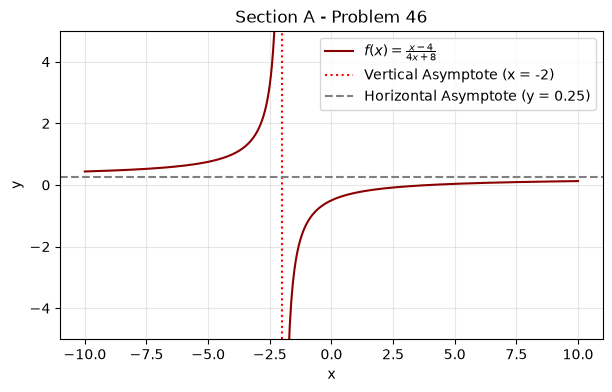


### Question A47

**Problem:**
Determine the domain and range of $f(x)=\frac{5x+5}{x^{2}+9}$ and decide whether $f$ is one-to-one on $[0,\infty)$.

**Derivation:**
*Domain:*
The denominator satisfies $x^2 + 9 \ge 9 > 0$ for all real $x$. Since division by zero never occurs and the numerator is defined everywhere, $f$ is continuous on all of $\mathbb{R}$:


$$\text{Domain}(f) = \mathbb{R} = (-\infty, \infty)$$

*Range:*
Let $y = \frac{5x+5}{x^2+9}$. Rearranging into a quadratic equation in $x$:


$$y(x^2+9) = 5x+5 \implies y x^2 - 5x + (9y - 5) = 0$$

* If $y = 0$, $-5x - 5 = 0 \implies x = -1 \in \mathbb{R}$, so $0 \in \text{Range}(f)$.
* If $y \ne 0$, real solutions $x$ exist if and only if the discriminant $\Delta_x \ge 0$:

$$\Delta_x = (-5)^2 - 4(y)(9y - 5) = 25 - 36y^2 + 20y \ge 0$$


$$-36y^2 + 20y + 25 \ge 0 \implies 36y^2 - 20y - 25 \le 0$$


Solving $36y^2 - 20y - 25 = 0$ via the quadratic formula:


$$y = \frac{-(-20) \pm \sqrt{(-20)^2 - 4(36)(-25)}}{2(36)} = \frac{20 \pm \sqrt{400 + 3600}}{72} = \frac{20 \pm \sqrt{4000}}{72}$$


Simplifying $\sqrt{4000} = 20\sqrt{10}$:


$$y = \frac{20 \pm 20\sqrt{10}}{72} = \frac{5 \pm 5\sqrt{10}}{18}$$

Since $36 > 0$, $36y^2 - 20y - 25 \le 0$ holds between its two real roots:


$$\text{Range}(f) = \left[\frac{5 - 5\sqrt{10}}{18}, \frac{5 + 5\sqrt{10}}{18}\right]$$

*One-to-one on $[0, \infty)$:*
Differentiating $f(x) = \frac{5x+5}{x^2+9}$ via the quotient rule:


$$f'(x) = \frac{5(x^2+9) - (5x+5)(2x)}{(x^2+9)^2} = \frac{5x^2 + 45 - 10x^2 - 10x}{(x^2+9)^2} = \frac{-5x^2 - 10x + 45}{(x^2+9)^2} = \frac{-5(x^2 + 2x - 9)}{(x^2+9)^2}$$

Critical points satisfy $x^2 + 2x - 9 = 0$:


$$x = \frac{-2 \pm \sqrt{4 - 4(1)(-9)}}{2} = \frac{-2 \pm \sqrt{40}}{2} = -1 \pm \sqrt{10}$$

The positive critical point is $x = -1 + \sqrt{10} \approx 2.162 \in [0, \infty)$.
Evaluating the derivative:

* At $x = 0$, $f'(0) = \frac{45}{81} = \frac{5}{9} > 0$.
* For $x > -1 + \sqrt{10}$, $f'(x) < 0$.

Since $f'(x)$ changes sign from positive to negative, $f(x)$ increases and then decreases on $[0, \infty)$.

To explicitly disprove injectivity, note that $f(0) = 5/9$. Solving $f(x) = 5/9$ for $x \ge 0$:


$$\frac{5x+5}{x^2+9} = \frac{5}{9} \implies 45x + 45 = 5x^2 + 45 \implies 5x^2 - 45x = 0 \implies 5x(x - 9) = 0$$


Hence $x = 0$ and $x = 9$ both yield $f(x) = 5/9$.
Since $0, 9 \in [0, \infty)$ and $0 \ne 9$, $f$ is **not one-to-one** on $[0, \infty)$.

---

```python
import matplotlib.pyplot as plt
import numpy as np

x = np.linspace(-15, 15, 400)
y = (5*x + 5) / (x**2 + 9)

plt.figure(figsize=(7, 4))
plt.plot(x, y, label=r'$f(x)=\frac{5x+5}{x^2+9}$', color='darkorange')
plt.axhline(0, color='black', linewidth=0.5, linestyle='--')
plt.axvline(0, color='black', linewidth=0.5, linestyle='--')
plt.title('Section A - Problem 47')
plt.xlabel('x')
plt.ylabel('y')
plt.grid(True, alpha=0.3)
plt.legend()
plt.show()

```


    
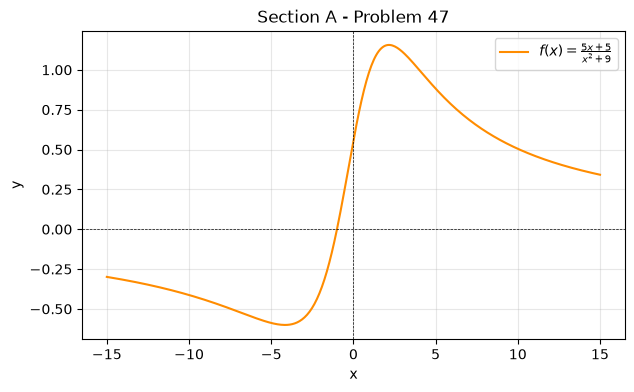


### Question A48

**Problem:**
For $f(x)=\frac{x-5}{5x+9}$, find $f^{-1}$ and determine exactly which real $y$ have preimages.

**Derivation:**
*Domain and Preimages:*
The function $f(x) = \frac{x-5}{5x+9}$ has domain $\text{Domain}(f) = \mathbb{R} \setminus \{-9/5\}$.
To find all $y \in \mathbb{R}$ that possess a preimage $x \in \text{Domain}(f)$, we solve $y = \frac{x-5}{5x+9}$:


$$y(5x+9) = x - 5 \implies 5xy + 9y = x - 5 \implies x(5y - 1) = -(9y + 5)$$

* If $5y - 1 = 0 \implies y = 1/5$:

$$x(0) = -\left(9\left(\frac{1}{5}\right) + 5\right) = -\frac{34}{5} \ne 0$$


Thus no solution $x$ exists for $y = 1/5$.
* If $y \ne 1/5$:

$$x = \frac{-(9y+5)}{5y-1} = \frac{9y+5}{1-5y}$$


Checking whether $x = -9/5$:


$$\frac{9y+5}{1-5y} = -\frac{9}{5} \implies 5(9y+5) = -9(1-5y) \implies 45y + 25 = -9 + 45y \implies 25 = -9$$


This equation has no solution, so $x \ne -9/5$ for all $y \ne 1/5$.

Therefore, every $y \in \mathbb{R} \setminus \{1/5\}$ has a unique preimage $x$.
The exact set of real $y$ with preimages is $\{y \in \mathbb{R} \mid y \ne 1/5\} = (-\infty, 1/5) \cup (1/5, \infty)$.

*Finding $f^{-1}$:*
Solving for $x$ in terms of $y$ yields $f^{-1}: \mathbb{R} \setminus \{1/5\} \to \mathbb{R} \setminus \{-9/5\}$:


$$f^{-1}(y) = \frac{9y+5}{1-5y}$$


or in terms of variable $x$:


$$f^{-1}(x) = \frac{9x+5}{1-5x}$$

---

```python
import matplotlib.pyplot as plt
import numpy as np

x1 = np.linspace(-6, -1.81, 200)
x2 = np.linspace(-1.79, 4, 200)

plt.figure(figsize=(7, 4))
plt.plot(x1, (x1 - 5)/(5*x1 + 9), color='darkgreen', label=r'$f(x)=\frac{x-5}{5x+9}$')
plt.plot(x2, (x2 - 5)/(5*x2 + 9), color='darkgreen')
plt.axvline(x=-1.8, color='forestgreen', linestyle=':', label=r'Vertical Asymptote ($x = -\frac{9}{5}$)')
plt.axhline(y=0.2, color='gray', linestyle='--', label='Horizontal Asymptote (y = 0.2)')
plt.title('Section A - Problem 48')
plt.xlabel('x')
plt.ylabel('y')
plt.ylim(-5, 5)
plt.grid(True, alpha=0.3)
plt.legend()
plt.show()

```


    
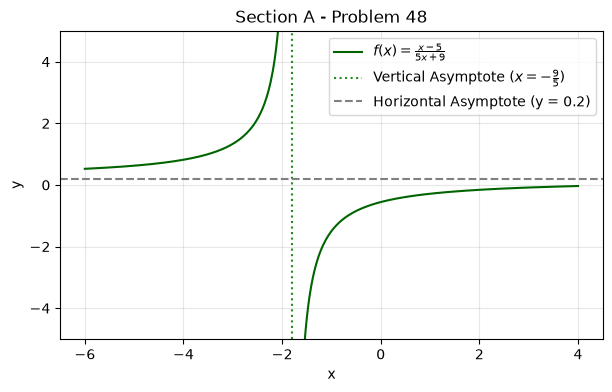


### Question A49

**Problem:**
Determine the domain and range of $f(x)=\frac{6x+1}{x^{2}+10}$ and decide whether $f$ is one-to-one on $[0,\infty)$.

**Derivation:**
*Domain:*
Since $x^2 + 10 \ge 10 > 0$ for all $x \in \mathbb{R}$, $f(x)$ is continuous and defined everywhere on $\mathbb{R}$:


$$\text{Domain}(f) = \mathbb{R} = (-\infty, \infty)$$

*Range:*
Setting $y = \frac{6x+1}{x^2+10}$:


$$y(x^2+10) = 6x+1 \implies y x^2 - 6x + (10y - 1) = 0$$

* If $y = 0$, $-6x - 1 = 0 \implies x = -1/6 \in \mathbb{R}$, so $0 \in \text{Range}(f)$.
* If $y \ne 0$, real solutions $x$ exist if and only if the discriminant $\Delta_x \ge 0$:

$$\Delta_x = (-6)^2 - 4(y)(10y - 1) = 36 - 40y^2 + 4y \ge 0$$


$$-40y^2 + 4y + 36 \ge 0 \implies 10y^2 - y - 9 \le 0$$


Factoring $10y^2 - y - 9$:


$$(10y + 9)(y - 1) \le 0$$


Roots are $y = -9/10$ and $y = 1$. Since $10 > 0$, the inequality holds between the roots:


$$\text{Range}(f) = \left[-\frac{9}{10}, 1\right]$$

*One-to-one on $[0, \infty)$:*
Differentiating $f(x) = \frac{6x+1}{x^2+10}$ with the quotient rule:


$$f'(x) = \frac{6(x^2+10) - (6x+1)(2x)}{(x^2+10)^2} = \frac{6x^2 + 60 - 12x^2 - 2x}{(x^2+10)^2} = \frac{-6x^2 - 2x + 60}{(x^2+10)^2}$$

Critical points satisfy $-6x^2 - 2x + 60 = 0 \implies 3x^2 + x - 30 = 0$:


$$(3x + 10)(x - 3) = 0$$

The positive critical point is $x = 3 \in [0, \infty)$.
Evaluating the derivative:

* At $x = 0$, $f'(0) = \frac{60}{100} = \frac{3}{5} > 0$.
* For $x > 3$, $f'(x) < 0$.

Since $f'$ changes sign from positive to negative at $x = 3$, $f$ is not monotonic on $[0, \infty)$.

To construct an explicit counterexample, solve $f(x) = f(0) = 1/10$ for $x \ge 0$:


$$\frac{6x+1}{x^2+10} = \frac{1}{10} \implies 60x + 10 = x^2 + 10 \implies x^2 - 60x = 0 \implies x(x - 60) = 0$$


Hence $x = 0$ and $x = 60$ both give $f(x) = 1/10$.
Since $0, 60 \in [0, \infty)$ and $0 \ne 60$, $f$ is **not one-to-one** on $[0, \infty)$.

---

```python
import matplotlib.pyplot as plt
import numpy as np

x = np.linspace(-15, 15, 400)
y = (6*x + 1) / (x**2 + 10)

plt.figure(figsize=(7, 4))
plt.plot(x, y, label=r'$f(x)=\frac{6x+1}{x^2+10}$', color='blue')
plt.axhline(0, color='black', linewidth=0.5, linestyle='--')
plt.axvline(0, color='black', linewidth=0.5, linestyle='--')
plt.title('Section A - Problem 49')
plt.xlabel('x')
plt.ylabel('y')
plt.grid(True, alpha=0.3)
plt.legend()
plt.show()

```


    
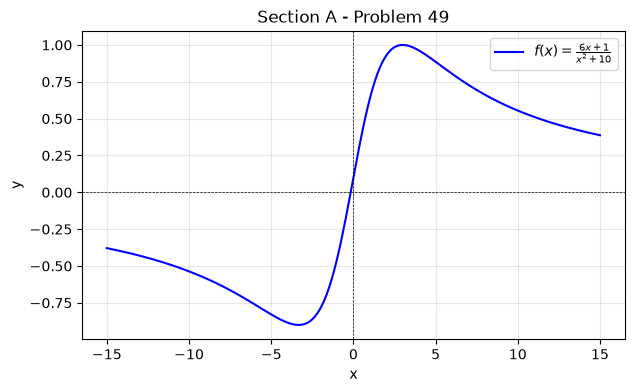


### Question A50

**Problem:**
For $f(x)=\frac{x-6}{1x+10}$, find $f^{-1}$ and determine exactly which real $y$ have preimages.

**Derivation:**
*Domain and Preimages:*
The function $f(x) = \frac{x-6}{x+10}$ is defined for all $x$ except where $x+10 = 0$, i.e., $x = -10$.
So $\text{Domain}(f) = \mathbb{R} \setminus \{-10\}$.

To determine which $y \in \mathbb{R}$ have preimages under $f$, we solve $y = \frac{x-6}{x+10}$:


$$y(x+10) = x - 6 \implies xy + 10y = x - 6 \implies x(1 - y) = 10y + 6$$

* If $1 - y = 0$, i.e., $y = 1$:

$$x(0) = 10(1) + 6 = 16 \ne 0$$


This is a contradiction, so $y = 1$ has no preimage.
* If $y \ne 1$, we divide by $1 - y$:

$$x = \frac{10y+6}{1-y}$$


We check whether this candidate $x$ ever equals $-10$:


$$\frac{10y+6}{1-y} = -10 \implies 10y+6 = -10(1-y) \implies 10y+6 = -10 + 10y \implies 6 = -10$$


This has no solution, so $x \ne -10$ for all $y \ne 1$.

Thus, a real $y$ has a preimage if and only if $y \ne 1$.
The set of real $y$ having preimages is $\{y \in \mathbb{R} \mid y \ne 1\} = (-\infty, 1) \cup (1, \infty)$.

*Finding $f^{-1}$:*
Solving for $x$ in terms of $y$ gives $f^{-1}: \mathbb{R} \setminus \{1\} \to \mathbb{R} \setminus \{-10\}$:


$$f^{-1}(y) = \frac{10y+6}{1-y}$$


or in terms of variable $x$:


$$f^{-1}(x) = \frac{10x+6}{1-x}$$

```python
import matplotlib.pyplot as plt
import numpy as np

x1 = np.linspace(-25, -10.01, 200)
x2 = np.linspace(-9.99, 10, 200)

plt.figure(figsize=(7, 4))
plt.plot(x1, (x1 - 6)/(x1 + 10), color='purple', label=r'$f(x)=\frac{x-6}{x+10}$')
plt.plot(x2, (x2 - 6)/(x2 + 10), color='purple')
plt.axvline(x=-10, color='darkviolet', linestyle=':', label='Vertical Asymptote (x = -10)')
plt.axhline(y=1, color='gray', linestyle='--', label='Horizontal Asymptote (y = 1)')
plt.title('Section A - Problem 50')
plt.xlabel('x')
plt.ylabel('y')
plt.ylim(-10, 10)
plt.grid(True, alpha=0.3)
plt.legend()
plt.show()

```


    
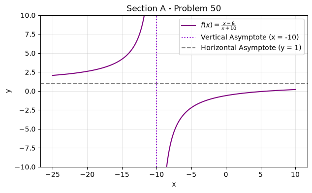


### Question A51

**Problem:**
Determine the domain and range of $f(x)=\frac{7x+2}{x^{2}+11}$ and decide whether $f$ is one-to-one on $[0,\infty)$.

**Derivation:**
*Domain:*
The denominator satisfies $x^2 + 11 \ge 11 > 0$ for all real $x$. Since division by zero never occurs and the numerator $7x+2$ is a polynomial defined everywhere, $f$ is continuous and defined on all real numbers:


$$\text{Domain}(f) = \mathbb{R} = (-\infty, \infty)$$

*Range:*
Let $y = \frac{7x+2}{x^2+11}$. Rearranging into a quadratic equation in $x$:


$$y(x^2+11) = 7x+2 \implies y x^2 - 7x + (11y - 2) = 0$$

* If $y = 0$, the equation becomes $-7x - 2 = 0 \implies x = -2/7 \in \mathbb{R}$, so $0 \in \text{Range}(f)$.
* If $y \ne 0$, real solutions $x$ exist if and only if the discriminant $\Delta_x \ge 0$:

$$\Delta_x = (-7)^2 - 4(y)(11y - 2) = 49 - 44y^2 + 8y \ge 0$$


$$-44y^2 + 8y + 49 \ge 0 \implies 44y^2 - 8y - 49 \le 0$$


Solving $44y^2 - 8y - 49 = 0$ via the quadratic formula:


$$y = \frac{-(-8) \pm \sqrt{(-8)^2 - 4(44)(-49)}}{2(44)} = \frac{8 \pm \sqrt{64 + 8624}}{88} = \frac{8 \pm \sqrt{8688}}{88}$$


Simplifying $\sqrt{8688} = \sqrt{16 \times 543} = 4\sqrt{543}$:


$$y = \frac{8 \pm 4\sqrt{543}}{88} = \frac{2 \pm \sqrt{543}}{22}$$

Since $44 > 0$, $44y^2 - 8y - 49 \le 0$ holds between its two real roots:


$$\text{Range}(f) = \left[\frac{2 - \sqrt{543}}{22}, \frac{2 + \sqrt{543}}{22}\right]$$

*One-to-one on $[0, \infty)$:*
Differentiating $f(x) = \frac{7x+2}{x^2+11}$ via the quotient rule:


$$f'(x) = \frac{7(x^2+11) - (7x+2)(2x)}{(x^2+11)^2} = \frac{7x^2 + 77 - 14x^2 - 4x}{(x^2+11)^2} = \frac{-7x^2 - 4x + 77}{(x^2+11)^2}$$

Critical points satisfy $-7x^2 - 4x + 77 = 0 \implies 7x^2 + 4x - 77 = 0$:


$$x = \frac{-4 \pm \sqrt{16 - 4(7)(-77)}}{14} = \frac{-4 \pm \sqrt{2172}}{14} = \frac{-4 \pm 2\sqrt{543}}{14} = \frac{-2 \pm \sqrt{543}}{7}$$

Since $\sqrt{543} \approx 23.302$, the positive critical point is $x = \frac{-2 + \sqrt{543}}{7} \approx 3.043 \in [0, \infty)$.
Evaluating the derivative:

* At $x = 0$, $f'(0) = \frac{77}{121} = \frac{7}{11} > 0$.
* For $x > \frac{-2 + \sqrt{543}}{7}$, $f'(x) < 0$.

Since $f'(x)$ changes sign from positive to negative, $f(x)$ increases and then decreases on $[0, \infty)$.

To explicitly disprove injectivity, note that $f(0) = 2/11$. Solving $f(x) = 2/11$ for $x \ge 0$:


$$\frac{7x+2}{x^2+11} = \frac{2}{11} \implies 77x + 22 = 2x^2 + 22 \implies 2x^2 - 77x = 0 \implies x(2x - 77) = 0$$


Hence $x = 0$ and $x = 77/2 = 38.5$ both yield $f(x) = 2/11$.
Since $0, 38.5 \in [0, \infty)$ and $0 \ne 38.5$, $f$ is **not one-to-one** on $[0, \infty)$.

---

```python
import matplotlib.pyplot as plt
import numpy as np

x = np.linspace(-15, 15, 400)
y = (7*x + 2) / (x**2 + 11)

plt.figure(figsize=(7, 4))
plt.plot(x, y, label=r'$f(x)=\frac{7x+2}{x^2+11}$', color='darkviolet')
plt.axhline(0, color='black', linewidth=0.5, linestyle='--')
plt.axvline(0, color='black', linewidth=0.5, linestyle='--')
plt.title('Section A - Problem 51')
plt.xlabel('x')
plt.ylabel('y')
plt.grid(True, alpha=0.3)
plt.legend()
plt.show()

```


    
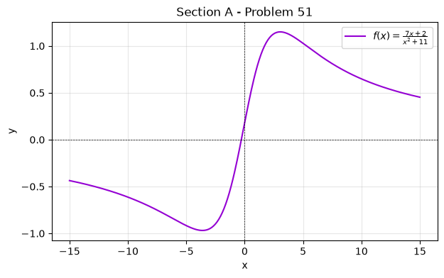


### Question A52

**Problem:**
For $f(x)=\frac{x-7}{2x+11}$, find $f^{-1}$ and determine exactly which real $y$ have preimages.

**Derivation:**
*Domain and Preimages:*
The function $f(x) = \frac{x-7}{2x+11}$ is defined for all real $x$ except where the denominator vanishes:


$$2x+11 = 0 \implies x = -\frac{11}{2}$$


Thus, $\text{Domain}(f) = \mathbb{R} \setminus \left\lbrace -\frac{11}{2}\right\rbrace$.

To determine which real $y$ have preimages under $f$, we solve $y = f(x)$ for $x \in \text{Domain}(f)$:


$$y = \frac{x-7}{2x+11} \implies y(2x+11) = x - 7$$

$$2xy + 11y = x - 7 \implies 2xy - x = -11y - 7 \implies x(2y - 1) = -(11y + 7)$$

* If $2y - 1 = 0 \implies y = 1/2$:

$$x(0) = -\left(11\left(\frac{1}{2}\right) + 7\right) = -\frac{25}{2} \ne 0$$


This yields a contradiction ($0 = -25/2$), so $y = 1/2$ has no preimage under $f$.
* If $y \ne 1/2$, dividing by $2y - 1$ gives:

$$x = \frac{-(11y+7)}{2y-1} = \frac{11y+7}{1-2y}$$


We verify whether this candidate $x$ ever equals the excluded domain point $-11/2$:


$$\frac{11y+7}{1-2y} = -\frac{11}{2} \implies 2(11y+7) = -11(1-2y) \implies 22y + 14 = -11 + 22y \implies 14 = -11$$


This equation has no solution, meaning $x \ne -11/2$ for all $y \ne 1/2$.

Therefore, a real $y$ has a valid preimage if and only if $y \ne 1/2$.
The set of real $y$ having preimages is $\{y \in \mathbb{R} \mid y \ne 1/2\} = (-\infty, 1/2) \cup (1/2, \infty)$.

*Finding $f^{-1}$:*
Since $f$ is a bijection from $\mathbb{R} \setminus \{-11/2\}$ to $\mathbb{R} \setminus \{1/2\}$, its inverse function $f^{-1}: \mathbb{R} \setminus \{1/2\} \to \mathbb{R} \setminus \{-11/2\}$ is:


$$f^{-1}(y) = \frac{11y+7}{1-2y}$$


Expressed with input variable $x$:


$$f^{-1}(x) = \frac{11x+7}{1-2x}$$

---

```python
import matplotlib.pyplot as plt
import numpy as np

x1 = np.linspace(-15, -5.51, 200)
x2 = np.linspace(-5.49, 10, 200)

plt.figure(figsize=(7, 4))
plt.plot(x1, (x1 - 7)/(2*x1 + 11), color='crimson', label=r'$f(x)=\frac{x-7}{2x+11}$')
plt.plot(x2, (x2 - 7)/(2*x2 + 11), color='crimson')
plt.axvline(x=-5.5, color='darkred', linestyle=':', label='Vertical Asymptote (x = -5.5)')
plt.axhline(y=0.5, color='gray', linestyle='--', label='Horizontal Asymptote (y = 0.5)')
plt.title('Section A - Problem 52')
plt.xlabel('x')
plt.ylabel('y')
plt.ylim(-5, 5)
plt.grid(True, alpha=0.3)
plt.legend()
plt.show()

```


    
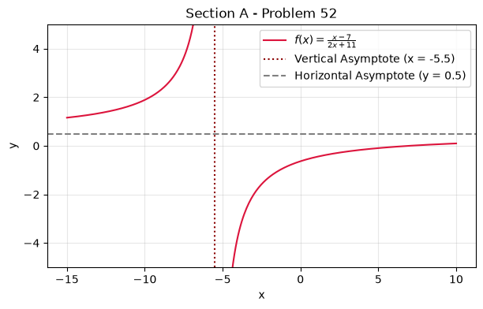


### Question A53

**Problem:**
Determine the domain and range of $f(x)=\frac{8x+3}{x^{2}+3}$ and decide whether $f$ is one-to-one on $[0,\infty)$.

**Derivation:**
*Domain:*
Since $x^2 + 3 \ge 3 > 0$ for all $x \in \mathbb{R}$, division by zero never occurs:


$$\text{Domain}(f) = \mathbb{R} = (-\infty, \infty)$$

*Range:*
Let $y = \frac{8x+3}{x^2+3}$. Rearranging into a quadratic equation in $x$:


$$y(x^2+3) = 8x+3 \implies y x^2 - 8x + (3y - 3) = 0$$

* If $y = 0$, $-8x - 3 = 0 \implies x = -3/8 \in \mathbb{R}$, so $0 \in \text{Range}(f)$.
* If $y \ne 0$, real solutions $x$ exist if and only if the discriminant $\Delta_x \ge 0$:

$$\Delta_x = (-8)^2 - 4(y)(3y - 3) = 64 - 12y^2 + 12y \ge 0$$


$$-12y^2 + 12y + 64 \ge 0 \implies 3y^2 - 3y - 16 \le 0$$


Solving $3y^2 - 3y - 16 = 0$ via the quadratic formula:


$$y = \frac{-(-3) \pm \sqrt{(-3)^2 - 4(3)(-16)}}{2(3)} = \frac{3 \pm \sqrt{9 + 192}}{6} = \frac{3 \pm \sqrt{201}}{6}$$

Since $3 > 0$, $3y^2 - 3y - 16 \le 0$ holds between its two real roots:


$$\text{Range}(f) = \left[\frac{3 - \sqrt{201}}{6}, \frac{3 + \sqrt{201}}{6}\right]$$

*One-to-one on $[0, \infty)$:*
Differentiating $f(x) = \frac{8x+3}{x^2+3}$ via the quotient rule:


$$f'(x) = \frac{8(x^2+3) - (8x+3)(2x)}{(x^2+3)^2} = \frac{8x^2 + 24 - 16x^2 - 6x}{(x^2+3)^2} = \frac{-8x^2 - 6x + 24}{(x^2+3)^2}$$

Critical points satisfy $-8x^2 - 6x + 24 = 0 \implies 4x^2 + 3x - 12 = 0$:


$$x = \frac{-3 \pm \sqrt{9 - 4(4)(-12)}}{8} = \frac{-3 \pm \sqrt{201}}{8}$$

Since $\sqrt{201} \approx 14.177$, the positive critical point is $x = \frac{-3 + \sqrt{201}}{8} \approx 1.397 \in [0, \infty)$.
Evaluating the derivative:

* At $x = 0$, $f'(0) = \frac{24}{9} = \frac{8}{3} > 0$.
* For $x > \frac{-3 + \sqrt{201}}{8}$, $f'(x) < 0$.

Since $f'(x)$ changes sign from positive to negative, $f(x)$ increases and then decreases on $[0, \infty)$.

To explicitly disprove injectivity, note that $f(0) = 3/3 = 1$. Solving $f(x) = 1$ for $x \ge 0$:


$$\frac{8x+3}{x^2+3} = 1 \implies 8x + 3 = x^2 + 3 \implies x^2 - 8x = 0 \implies x(x - 8) = 0$$


Hence $x = 0$ and $x = 8$ both yield $f(x) = 1$.
Since $0, 8 \in [0, \infty)$ and $0 \ne 8$, $f$ is **not one-to-one** on $[0, \infty)$.

---

```python
import matplotlib.pyplot as plt
import numpy as np

x = np.linspace(-10, 10, 400)
y = (8*x + 3) / (x**2 + 3)

plt.figure(figsize=(7, 4))
plt.plot(x, y, label=r'$f(x)=\frac{8x+3}{x^2+3}$', color='magenta')
plt.axhline(0, color='black', linewidth=0.5, linestyle='--')
plt.axvline(0, color='black', linewidth=0.5, linestyle='--')
plt.title('Section A - Problem 53')
plt.xlabel('x')
plt.ylabel('y')
plt.grid(True, alpha=0.3)
plt.legend()
plt.show()

```


    
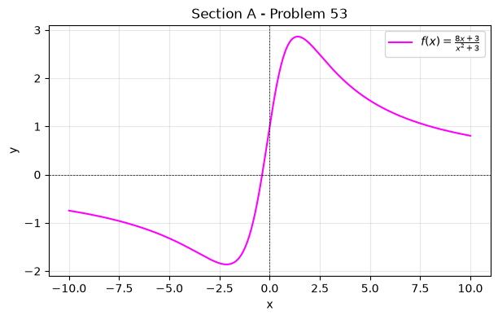


### Question A54

**Problem:**
For $f(x)=\frac{x-8}{3x+3}$, find $f^{-1}$ and determine exactly which real $y$ have preimages.

**Derivation:**
*Domain and Preimages:*
The function $f(x) = \frac{x-8}{3x+3}$ is defined for all real $x$ except where $3x+3 = 0 \implies x = -1$.
Thus, $\text{Domain}(f) = \mathbb{R} \setminus \{-1\}$.

To find all $y \in \mathbb{R}$ that possess a preimage $x \in \text{Domain}(f)$, we solve $y = \frac{x-8}{3x+3}$:


$$y(3x+3) = x - 8 \implies 3xy + 3y = x - 8 \implies x(3y - 1) = -(3y + 8)$$

* If $3y - 1 = 0 \implies y = 1/3$:

$$x(0) = -\left(3\left(\frac{1}{3}\right) + 8\right) = -9 \ne 0$$


Thus no solution $x$ exists for $y = 1/3$.
* If $y \ne 1/3$:

$$x = \frac{-(3y+8)}{3y-1} = \frac{3y+8}{1-3y}$$


Checking whether $x = -1$:


$$\frac{3y+8}{1-3y} = -1 \implies 3y+8 = -1(1-3y) \implies 3y+8 = -1 + 3y \implies 8 = -1$$


This equation has no solution, so $x \ne -1$ for all $y \ne 1/3$.

Therefore, every $y \in \mathbb{R} \setminus \{1/3\}$ has a unique preimage $x$.
The exact set of real $y$ with preimages is $\{y \in \mathbb{R} \mid y \ne 1/3\} = (-\infty, 1/3) \cup (1/3, \infty)$.

*Finding $f^{-1}$:*
Solving for $x$ in terms of $y$ yields $f^{-1}: \mathbb{R} \setminus \{1/3\} \to \mathbb{R} \setminus \{-1\}$:


$$f^{-1}(y) = \frac{3y+8}{1-3y}$$


or in terms of variable $x$:


$$f^{-1}(x) = \frac{3x+8}{1-3x}$$

---

```python
import matplotlib.pyplot as plt
import numpy as np

x1 = np.linspace(-10, -1.01, 200)
x2 = np.linspace(-0.99, 10, 200)

plt.figure(figsize=(7, 4))
plt.plot(x1, (x1 - 8)/(3*x1 + 3), color='chocolate', label=r'$f(x)=\frac{x-8}{3x+3}$')
plt.plot(x2, (x2 - 8)/(3*x2 + 3), color='chocolate')
plt.axvline(x=-1, color='saddlebrown', linestyle=':', label='Vertical Asymptote (x = -1)')
plt.axhline(y=1/3, color='gray', linestyle='--', label=r'Horizontal Asymptote ($y = \frac{1}{3}$)')
plt.title('Section A - Problem 54')
plt.xlabel('x')
plt.ylabel('y')
plt.ylim(-5, 5)
plt.grid(True, alpha=0.3)
plt.legend()
plt.show()

```


    
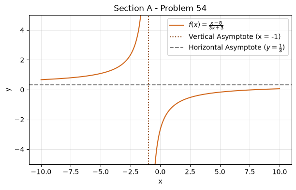


### Question A55

**Problem:**
Determine the domain and range of $f(x)=\frac{2x+4}{x^{2}+4}$ and decide whether $f$ is one-to-one on $[0,\infty)$.

**Derivation:**
*Domain:*
Since $x^2 + 4 \ge 4 > 0$ for all $x \in \mathbb{R}$, no division by zero occurs:


$$\text{Domain}(f) = \mathbb{R} = (-\infty, \infty)$$

*Range:*
Let $y = \frac{2x+4}{x^2+4}$. Rearranging into a quadratic equation in $x$:


$$y(x^2+4) = 2x+4 \implies y x^2 - 2x + (4y - 4) = 0$$

* If $y = 0$, $-2x - 4 = 0 \implies x = -2 \in \mathbb{R}$, so $0 \in \text{Range}(f)$.
* If $y \ne 0$, real solutions $x$ exist if and only if the discriminant $\Delta_x \ge 0$:

$$\Delta_x = (-2)^2 - 4(y)(4y - 4) = 4 - 16y^2 + 16y \ge 0$$


$$-16y^2 + 16y + 4 \ge 0 \implies 4y^2 - 4y - 1 \le 0$$


Solving $4y^2 - 4y - 1 = 0$ via the quadratic formula:


$$y = \frac{-(-4) \pm \sqrt{(-4)^2 - 4(4)(-1)}}{2(4)} = \frac{4 \pm \sqrt{16 + 16}}{8} = \frac{4 \pm 4\sqrt{2}}{8} = \frac{1 \pm \sqrt{2}}{2}$$

Since $4 > 0$, the inequality holds between the two roots:


$$\text{Range}(f) = \left[\frac{1 - \sqrt{2}}{2}, \frac{1 + \sqrt{2}}{2}\right]$$

*One-to-one on $[0, \infty)$:*
Differentiating $f(x) = \frac{2x+4}{x^2+4}$ via the quotient rule:


$$f'(x) = \frac{2(x^2+4) - (2x+4)(2x)}{(x^2+4)^2} = \frac{2x^2 + 8 - 4x^2 - 8x}{(x^2+4)^2} = \frac{-2x^2 - 8x + 8}{(x^2+4)^2} = \frac{-2(x^2 + 4x - 4)}{(x^2+4)^2}$$

Critical points satisfy $x^2 + 4x - 4 = 0$:


$$x = \frac{-4 \pm \sqrt{16 - 4(1)(-4)}}{2} = \frac{-4 \pm \sqrt{32}}{2} = -2 \pm 2\sqrt{2}$$

The positive critical point is $x = -2 + 2\sqrt{2} \approx 0.828 \in [0, \infty)$.
Evaluating the derivative:

* At $x = 0$, $f'(0) = \frac{8}{16} = \frac{1}{2} > 0$.
* For $x > -2 + 2\sqrt{2}$, $f'(x) < 0$.

Since $f'$ changes sign from positive to negative, $f$ is not monotonic on $[0, \infty)$.

To construct an explicit counterexample to injectivity, solve $f(x) = f(0) = \frac{4}{4} = 1$ for $x \ge 0$:


$$\frac{2x+4}{x^2+4} = 1 \implies 2x + 4 = x^2 + 4 \implies x^2 - 2x = 0 \implies x(x - 2) = 0$$


Hence $f(0) = f(2) = 1$.
Since $0, 2 \in [0, \infty)$ and $0 \ne 2$, $f$ is **not one-to-one** on $[0, \infty)$.

---

```python
import matplotlib.pyplot as plt
import numpy as np

x = np.linspace(-10, 10, 400)
y = (2*x + 4) / (x**2 + 4)

plt.figure(figsize=(7, 4))
plt.plot(x, y, label=r'$f(x)=\frac{2x+4}{x^2+4}$', color='teal')
plt.axhline(0, color='black', linewidth=0.5, linestyle='--')
plt.axvline(0, color='black', linewidth=0.5, linestyle='--')
plt.title('Section A - Problem 55')
plt.xlabel('x')
plt.ylabel('y')
plt.grid(True, alpha=0.3)
plt.legend()
plt.show()

```


    
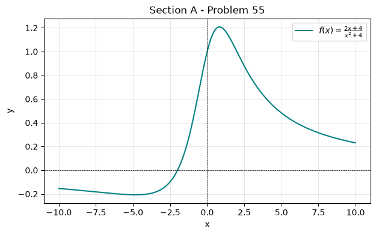


### Question A56

**Problem:**
For $f(x)=\frac{x-2}{4x+4}$, find $f^{-1}$ and determine exactly which real $y$ have preimages.

**Derivation:**
*Domain and Preimages:*
The function $f(x) = \frac{x-2}{4x+4}$ is defined for all real numbers $x$ except where the denominator vanishes:


$$4x+4 = 0 \implies x = -1$$


Thus, $\text{Domain}(f) = \mathbb{R} \setminus \{-1\}$.

To determine which real $y$ have preimages under $f$, we solve $y = f(x)$ for $x \in \text{Domain}(f)$:


$$y = \frac{x-2}{4x+4} \implies y(4x+4) = x - 2$$

$$4xy + 4y = x - 2 \implies 4xy - x = -4y - 2 \implies x(4y - 1) = -(4y + 2)$$

* If $4y - 1 = 0$, i.e., $y = 1/4$:

$$x(0) = -\left(4\left(\frac{1}{4}\right) + 2\right) = -3 \ne 0$$


This yields a contradiction ($0 = -3$), so $y = 1/4$ has no preimage under $f$.
* If $y \ne 1/4$, dividing by $4y - 1$ gives:

$$x = \frac{-(4y+2)}{4y-1} = \frac{4y+2}{1-4y}$$


We verify whether this candidate $x$ ever equals the excluded domain point $-1$:


$$\frac{4y+2}{1-4y} = -1 \implies 4y+2 = -1(1-4y) \implies 4y+2 = -1 + 4y \implies 2 = -1$$


This equation has no real solutions, meaning $x \ne -1$ for all $y \ne 1/4$.

Therefore, a real $y$ has a valid preimage if and only if $y \ne 1/4$.
The set of real $y$ having preimages is $\{y \in \mathbb{R} \mid y \ne 1/4\} = (-\infty, 1/4) \cup (1/4, \infty)$.

*Finding $f^{-1}$:*
Since $f$ is a bijection from $\mathbb{R} \setminus \{-1\}$ to $\mathbb{R} \setminus \{1/4\}$, its inverse function $f^{-1}: \mathbb{R} \setminus \{1/4\} \to \mathbb{R} \setminus \{-1\}$ is:


$$f^{-1}(y) = \frac{4y+2}{1-4y}$$


Expressed with input variable $x$:


$$f^{-1}(x) = \frac{4x+2}{1-4x}$$

---

```python
import matplotlib.pyplot as plt
import numpy as np

x1 = np.linspace(-10, -1.01, 200)
x2 = np.linspace(-0.99, 10, 200)

plt.figure(figsize=(7, 4))
plt.plot(x1, (x1 - 2)/(4*x1 + 4), color='forestgreen', label=r'$f(x)=\frac{x-2}{4x+4}$')
plt.plot(x2, (x2 - 2)/(4*x2 + 4), color='forestgreen')
plt.axvline(x=-1, color='darkgreen', linestyle=':', label='Vertical Asymptote (x = -1)')
plt.axhline(y=0.25, color='gray', linestyle='--', label='Horizontal Asymptote (y = 0.25)')
plt.title('Section A - Problem 56')
plt.xlabel('x')
plt.ylabel('y')
plt.ylim(-5, 5)
plt.grid(True, alpha=0.3)
plt.legend()
plt.show()

```


    
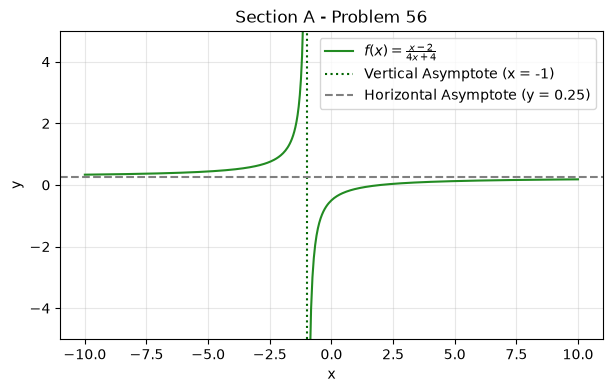


### Question A57

**Problem:**
Determine the domain and range of $f(x)=\frac{3x+5}{x^{2}+5}$ and decide whether $f$ is one-to-one on $[0,\infty)$.

**Derivation:**
*Domain:*
The denominator satisfies $x^2 + 5 \ge 5 > 0$ for all real $x$. Since division by zero never occurs and the numerator is defined everywhere, $f$ is continuous on all of $\mathbb{R}$:


$$\text{Domain}(f) = \mathbb{R} = (-\infty, \infty)$$

*Range:*
Let $y = \frac{3x+5}{x^2+5}$. Rearranging into a quadratic equation in $x$:


$$y(x^2+5) = 3x+5 \implies y x^2 - 3x + (5y - 5) = 0$$

* If $y = 0$, $-3x - 5 = 0 \implies x = -5/3 \in \mathbb{R}$, so $0 \in \text{Range}(f)$.
* If $y \ne 0$, real solutions $x$ exist if and only if the discriminant $\Delta_x \ge 0$:

$$\Delta_x = (-3)^2 - 4(y)(5y - 5) = 9 - 20y^2 + 20y \ge 0$$


$$20y^2 - 20y - 9 \le 0$$


Solving $20y^2 - 20y - 9 = 0$ via the quadratic formula:


$$y = \frac{-(-20) \pm \sqrt{(-20)^2 - 4(20)(-9)}}{2(20)} = \frac{20 \pm \sqrt{400 + 720}}{40} = \frac{20 \pm \sqrt{1120}}{40}$$


Simplifying $\sqrt{1120} = \sqrt{16 \times 70} = 4\sqrt{70}$:


$$y = \frac{20 \pm 4\sqrt{70}}{40} = \frac{5 \pm \sqrt{70}}{10}$$

Since $20 > 0$, $20y^2 - 20y - 9 \le 0$ holds between its two real roots:


$$\text{Range}(f) = \left[\frac{5 - \sqrt{70}}{10}, \frac{5 + \sqrt{70}}{10}\right]$$

*One-to-one on $[0, \infty)$:*
Differentiating $f(x) = \frac{3x+5}{x^2+5}$ via the quotient rule:


$$f'(x) = \frac{3(x^2+5) - (3x+5)(2x)}{(x^2+5)^2} = \frac{3x^2 + 15 - 6x^2 - 10x}{(x^2+5)^2} = \frac{-3x^2 - 10x + 15}{(x^2+5)^2}$$

Critical points satisfy $-3x^2 - 10x + 15 = 0 \implies 3x^2 + 10x - 15 = 0$:


$$x = \frac{-10 \pm \sqrt{100 - 4(3)(-15)}}{6} = \frac{-10 \pm \sqrt{280}}{6} = \frac{-5 \pm \sqrt{70}}{3}$$

Since $\sqrt{70} \approx 8.3666$, the positive critical point is $x = \frac{-5 + \sqrt{70}}{3} \approx 1.122 \in [0, \infty)$.
Evaluating the derivative:

* At $x = 0$, $f'(0) = \frac{15}{25} = \frac{3}{5} > 0$.
* For $x > \frac{-5 + \sqrt{70}}{3}$, $f'(x) < 0$.

Since $f'(x)$ changes sign from positive to negative, $f(x)$ increases and then decreases on $[0, \infty)$.

To explicitly disprove injectivity, note that $f(0) = 5/5 = 1$. Solving $f(x) = 1$ for $x \ge 0$:


$$\frac{3x+5}{x^2+5} = 1 \implies 3x + 5 = x^2 + 5 \implies x^2 - 3x = 0 \implies x(x - 3) = 0$$


Hence $x = 0$ and $x = 3$ both yield $f(x) = 1$.
Since $0, 3 \in [0, \infty)$ and $0 \ne 3$, $f$ is **not one-to-one** on $[0, \infty)$.

---

```python
import matplotlib.pyplot as plt
import numpy as np

x = np.linspace(-10, 10, 400)
y = (3*x + 5) / (x**2 + 5)

plt.figure(figsize=(7, 4))
plt.plot(x, y, label=r'$f(x)=\frac{3x+5}{x^2+5}$', color='royalblue')
plt.axhline(0, color='black', linewidth=0.5, linestyle='--')
plt.axvline(0, color='black', linewidth=0.5, linestyle='--')
plt.title('Section A - Problem 57')
plt.xlabel('x')
plt.ylabel('y')
plt.grid(True, alpha=0.3)
plt.legend()
plt.show()

```


    
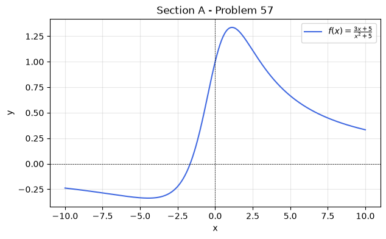


### Question A58

**Problem:**
For $f(x)=\frac{x-3}{5x+5}$, find $f^{-1}$ and determine exactly which real $y$ have preimages.

**Derivation:**
*Domain and Preimages:*
The function $f(x) = \frac{x-3}{5x+5}$ has domain $\text{Domain}(f) = \mathbb{R} \setminus \{-1\}$.
To find all $y \in \mathbb{R}$ that possess a preimage $x \in \text{Domain}(f)$, we solve $y = \frac{x-3}{5x+5}$:


$$y(5x+5) = x - 3 \implies 5xy + 5y = x - 3 \implies x(5y - 1) = -(5y + 3)$$

* If $5y - 1 = 0 \implies y = 1/5$:

$$x(0) = -\left(5\left(\frac{1}{5}\right) + 3\right) = -4 \ne 0$$


Thus no solution $x$ exists for $y = 1/5$.
* If $y \ne 1/5$:

$$x = \frac{-(5y+3)}{5y-1} = \frac{5y+3}{1-5y}$$


Checking whether $x = -1$:


$$\frac{5y+3}{1-5y} = -1 \implies 5y+3 = -1(1-5y) \implies 5y+3 = -1 + 5y \implies 3 = -1$$


This equation has no solution, so $x \ne -1$ for all $y \ne 1/5$.

Therefore, every $y \in \mathbb{R} \setminus \{1/5\}$ has a unique preimage $x$.
The exact set of real $y$ with preimages is $\{y \in \mathbb{R} \mid y \ne 1/5\} = (-\infty, 1/5) \cup (1/5, \infty)$.

*Finding $f^{-1}$:*
Solving for $x$ in terms of $y$ yields $f^{-1}: \mathbb{R} \setminus \{1/5\} \to \mathbb{R} \setminus \{-1\}$:


$$f^{-1}(y) = \frac{5y+3}{1-5y}$$


or in terms of variable $x$:


$$f^{-1}(x) = \frac{5x+3}{1-5x}$$

---

```python
import matplotlib.pyplot as plt
import numpy as np

x1 = np.linspace(-5, -1.01, 200)
x2 = np.linspace(-0.99, 5, 200)

plt.figure(figsize=(7, 4))
plt.plot(x1, (x1 - 3)/(5*x1 + 5), color='saddlebrown', label=r'$f(x)=\frac{x-3}{5x+5}$')
plt.plot(x2, (x2 - 3)/(5*x2 + 5), color='saddlebrown')
plt.axvline(x=-1, color='maroon', linestyle=':', label='Vertical Asymptote (x = -1)')
plt.axhline(y=0.2, color='gray', linestyle='--', label='Horizontal Asymptote (y = 0.2)')
plt.title('Section A - Problem 58')
plt.xlabel('x')
plt.ylabel('y')
plt.ylim(-5, 5)
plt.grid(True, alpha=0.3)
plt.legend()
plt.show()

```


    
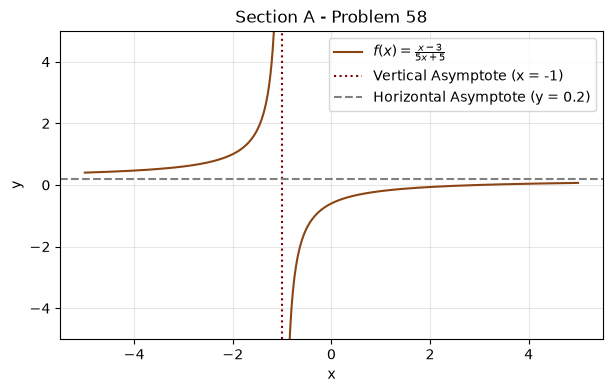


### Question A59

**Problem:**
Determine the domain and range of $f(x)=\frac{4x+1}{x^{2}+6}$ and decide whether $f$ is one-to-one on $[0,\infty)$.

**Derivation:**
*Domain:*
Since $x^2 + 6 \ge 6 > 0$ for all $x \in \mathbb{R}$, $f(x)$ is continuous and defined everywhere on $\mathbb{R}$:


$$\text{Domain}(f) = \mathbb{R} = (-\infty, \infty)$$

*Range:*
Setting $y = \frac{4x+1}{x^2+6}$:


$$y(x^2+6) = 4x+1 \implies y x^2 - 4x + (6y - 1) = 0$$

* If $y = 0$, $-4x - 1 = 0 \implies x = -1/4 \in \mathbb{R}$, so $0 \in \text{Range}(f)$.
* If $y \ne 0$, real solutions $x$ exist if and only if the discriminant $\Delta_x \ge 0$:

$$\Delta_x = (-4)^2 - 4(y)(6y - 1) = 16 - 24y^2 + 4y \ge 0$$


$$24y^2 - 4y - 16 \le 0 \implies 6y^2 - y - 4 \le 0$$


We find the roots of $6y^2 - y - 4 = 0$:


$$y = \frac{-(-1) \pm \sqrt{(-1)^2 - 4(6)(-4)}}{2(6)} = \frac{1 \pm \sqrt{1 + 96}}{12} = \frac{1 \pm \sqrt{97}}{12}$$

Since $6 > 0$, $6y^2 - y - 4 \le 0$ holds between the two roots:


$$\text{Range}(f) = \left[\frac{1 - \sqrt{97}}{12}, \frac{1 + \sqrt{97}}{12}\right]$$

*One-to-one on $[0, \infty)$:*
Differentiating $f(x) = \frac{4x+1}{x^2+6}$ with the quotient rule:


$$f'(x) = \frac{4(x^2+6) - (4x+1)(2x)}{(x^2+6)^2} = \frac{4x^2 + 24 - 8x^2 - 2x}{(x^2+6)^2} = \frac{-4x^2 - 2x + 24}{(x^2+6)^2}$$

Critical points satisfy $-4x^2 - 2x + 24 = 0 \implies 2x^2 + x - 12 = 0$:


$$x = \frac{-1 \pm \sqrt{1 - 4(2)(-12)}}{4} = \frac{-1 \pm \sqrt{97}}{4}$$

The positive critical point is $x = \frac{-1 + \sqrt{97}}{4} \approx 2.212 \in [0, \infty)$.
Evaluating the derivative:

* At $x = 0$, $f'(0) = \frac{24}{36} = \frac{2}{3} > 0$.
* For $x > \frac{-1 + \sqrt{97}}{4}$, $f'(x) < 0$.

Since $f'$ changes sign from positive to negative, $f$ is not monotonic on $[0, \infty)$.

To construct an explicit counterexample, solve $f(x) = f(0) = 1/6$ for $x \ge 0$:


$$\frac{4x+1}{x^2+6} = \frac{1}{6} \implies 24x + 6 = x^2 + 6 \implies x^2 - 24x = 0 \implies x(x - 24) = 0$$


Hence $x = 0$ and $x = 24$ both give $f(x) = 1/6$.
Since $0, 24 \in [0, \infty)$ and $0 \ne 24$, $f$ is **not one-to-one** on $[0, \infty)$.

---

```python
import matplotlib.pyplot as plt
import numpy as np

x = np.linspace(-12, 12, 400)
y = (4*x + 1) / (x**2 + 6)

plt.figure(figsize=(7, 4))
plt.plot(x, y, label=r'$f(x)=\frac{4x+1}{x^2+6}$', color='deeppink')
plt.axhline(0, color='black', linewidth=0.5, linestyle='--')
plt.axvline(0, color='black', linewidth=0.5, linestyle='--')
plt.title('Section A - Problem 59')
plt.xlabel('x')
plt.ylabel('y')
plt.grid(True, alpha=0.3)
plt.legend()
plt.show()

```


    
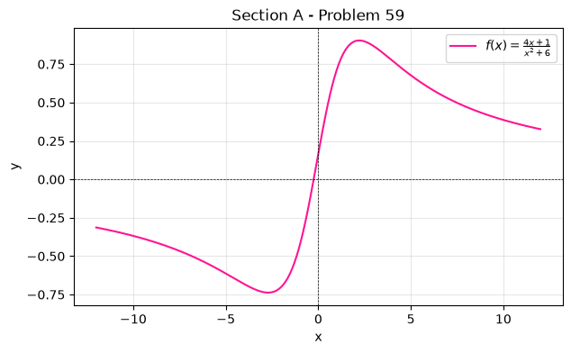


### Question A60

**Problem:**
For $f(x)=\frac{x-4}{1x+6}$, find $f^{-1}$ and determine exactly which real $y$ have preimages.

**Derivation:**
*Domain and Preimages:*
The function $f(x) = \frac{x-4}{x+6}$ is defined for all $x$ except where $x+6 = 0$, i.e., $x = -6$.
So $\text{Domain}(f) = \mathbb{R} \setminus \{-6\}$.

To determine which $y \in \mathbb{R}$ have preimages under $f$, we solve $y = \frac{x-4}{x+6}$:


$$y(x+6) = x - 4 \implies xy + 6y = x - 4 \implies xy - x = -6y - 4 \implies x(1 - y) = 6y + 4$$

* If $1 - y = 0$, i.e., $y = 1$:

$$x(0) = 6(1) + 4 = 10 \ne 0$$


This is a contradiction, so $y = 1$ has no preimage.
* If $y \ne 1$, we divide by $1 - y$:

$$x = \frac{6y+4}{1-y}$$


We check whether this candidate $x$ ever equals $-6$:


$$\frac{6y+4}{1-y} = -6 \implies 6y+4 = -6(1-y) \implies 6y+4 = -6 + 6y \implies 4 = -6$$


This has no solution, so $x \ne -6$ for all $y \ne 1$.

Thus, a real $y$ has a preimage if and only if $y \ne 1$.
The set of real $y$ having preimages is $\{y \in \mathbb{R} \mid y \ne 1\} = (-\infty, 1) \cup (1, \infty)$.

*Finding $f^{-1}$:*
Solving for $x$ in terms of $y$ gives $f^{-1}: \mathbb{R} \setminus \{1\} \to \mathbb{R} \setminus \{-6\}$:


$$f^{-1}(y) = \frac{6y+4}{1-y}$$


or in terms of variable $x$:


$$f^{-1}(x) = \frac{6x+4}{1-x}$$

---

```python
import matplotlib.pyplot as plt
import numpy as np

x1 = np.linspace(-20, -6.01, 200)
x2 = np.linspace(-5.99, 10, 200)

plt.figure(figsize=(7, 4))
plt.plot(x1, (x1 - 4)/(x1 + 6), color='navy', label=r'$f(x)=\frac{x-4}{x+6}$')
plt.plot(x2, (x2 - 4)/(x2 + 6), color='navy')
plt.axvline(x=-6, color='blue', linestyle=':', label='Vertical Asymptote (x = -6)')
plt.axhline(y=1, color='gray', linestyle='--', label='Horizontal Asymptote (y = 1)')
plt.title('Section A - Problem 60')
plt.xlabel('x')
plt.ylabel('y')
plt.ylim(-10, 10)
plt.grid(True, alpha=0.3)
plt.legend()
plt.show()

```


    
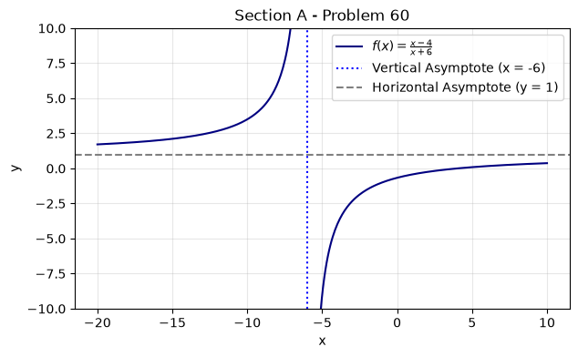


