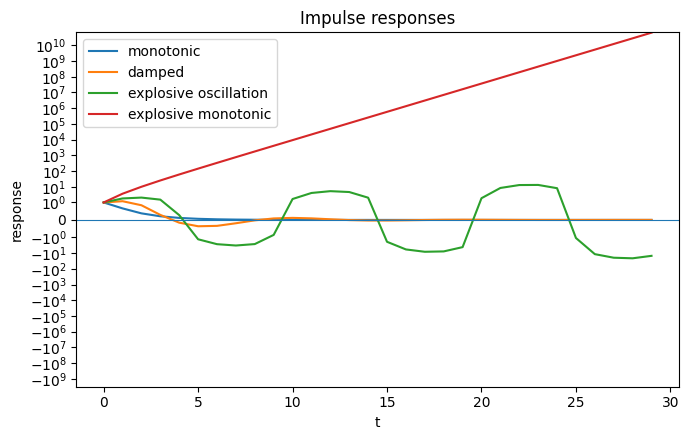
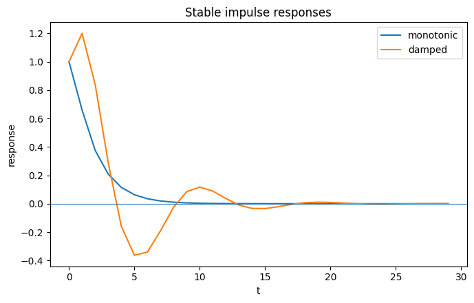
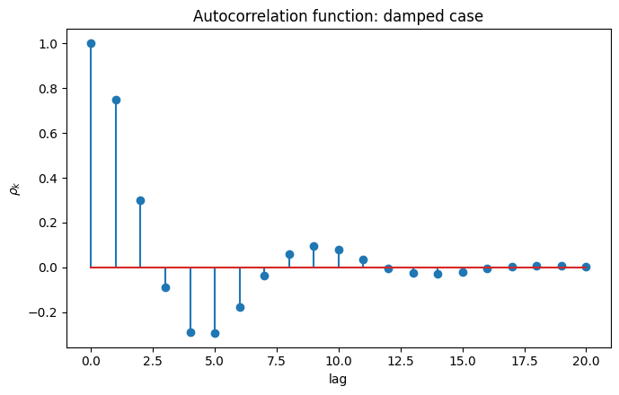

## Problem

Consider the Samuelson Multiplier-Accelerator model with stochastic shocks. Let $Y_t$ be national income, $C_t$ consumption, $I_t$ investment, and $G_t$ government spending.

The behavioral equations are:

1. $Y_t = C_t + I_t + G_t$.
2. $C_t = cY_{t-1}$ (where $0 < c < 1$ is the marginal propensity to consume).
3. $I_t = b(C_t - C_{t-1}) + \bar{I}$ (where $b > 0$ is the accelerator coefficient).
4. $G_t = \bar{G} + u_t$, where $u_t \sim WN(0, \sigma_u^2)$.

**(a)** Combine these equations to derive a single second-order stochastic difference equation for $Y_t$ in terms of its own lags and the shock $u_t$.

**(b)** Find the characteristic equation of the homogeneous part. Derive the exact parameter conditions (in terms of $c$ and $b$) under which the system exhibits: (i) explosive oscillations, (ii) damped oscillations, and (iii) monotonic convergence.

**(c)** Assuming the system is stationary (damped), derive the autocovariance generating function

$$
g(z) = \sum_{k=-\infty}^{\infty} \gamma_k z^k
$$

for the equilibrium process $y_t = Y_t - \mathbb{E}[Y_t]$.

---

## Solution

### (a) Second-order stochastic difference equation

From

$$
C_t = cY_{t-1}, \qquad C_{t-1} = cY_{t-2},
$$

we have

$$
I_t = b(C_t - C_{t-1}) + \bar{I} = bc(Y_{t-1} - Y_{t-2}) + \bar{I}.
$$

Substituting $C_t$, $I_t$, and $G_t = \bar{G} + u_t$ into $Y_t = C_t + I_t + G_t$ gives

$$
\begin{aligned}
Y_t &= cY_{t-1} + bc(Y_{t-1} - Y_{t-2}) + \bar{I} + \bar{G} + u_t \\
&= c(1 + b)Y_{t-1} - bcY_{t-2} + \bar{I} + \bar{G} + u_t.
\end{aligned}
$$

Let

$$
A \equiv \bar{I} + \bar{G}.
$$

Then

$$
Y_t = c(1 + b)Y_{t-1} - bcY_{t-2} + A + u_t.
$$

For the equilibrium mean $\mu = \mathbb{E}[Y_t]$,

$$
\mu = c(1 + b)\mu - bc\mu + A = c\mu + A, \quad \text{so} \quad \mu = \frac{\bar{I} + \bar{G}}{1 - c}.
$$

Hence, defining

$$
y_t \equiv Y_t - \mu,
$$

the constant disappears:

$$
\boxed{\, y_t = c(1 + b)\,y_{t-1} - bc\,y_{t-2} + u_t \,}
$$

### (b) Characteristic roots and dynamics

The homogeneous equation is

$$
y_t = c(1 + b)\,y_{t-1} - bc\,y_{t-2}.
$$

Putting $y_t = r^t$,

$$
r^2 - c(1 + b)\,r + bc = 0.
$$

Thus

$$
r_{1,2} = \frac{c(1 + b) \pm \sqrt{c^2(1 + b)^2 - 4bc}}{2}.
$$

Define the discriminant

$$
\Delta = c^2(1 + b)^2 - 4bc = c\left[ c(1 + b)^2 - 4b \right].
$$

Complex roots occur when

$$
c(1 + b)^2 < 4b.
$$

The two boundary values of $b$ are

$$
b_{\pm} = \frac{2 - c \pm 2\sqrt{1 - c}}{c} = \frac{\left(1 \pm \sqrt{1 - c}\right)^2}{c}.
$$

Hence complex roots occur for

$$
b_- < b < b_+.
$$

For complex conjugate roots,

$$
r_1 r_2 = bc \implies |r_1| = |r_2| = \sqrt{bc}.
$$

Therefore

$$
\begin{aligned}
\text{Explosive oscillations} &\iff \frac{1}{c} < b < b_+, \\[4pt]
\text{Damped oscillations} &\iff b_- < b < \frac{1}{c}, \\[4pt]
\text{Monotonic convergence} &\iff 0 < b \leq b_-.
\end{aligned}
$$

The boundary

$$
b = \frac{1}{c}
$$

gives $|r_1| = |r_2| = 1$, hence undamped oscillations. At $b = b_+$ the roots coincide at a real value above unity, giving explosive monotonic behaviour.

For real roots,

$$
r_1 + r_2 = c(1 + b) > 0, \qquad r_1 r_2 = bc > 0,
$$

so both roots are positive; there is therefore no oscillation.

The stationarity condition is

$$
\boxed{\, bc < 1 \,}
$$

### (c) Autocovariance generating function

Write

$$
y_t = \phi_1 y_{t-1} + \phi_2 y_{t-2} + u_t,
$$

where

$$
\phi_1 = c(1 + b), \qquad \phi_2 = -bc.
$$

The AR polynomial is

$$
\Phi(z) = 1 - \phi_1 z - \phi_2 z^2 = 1 - c(1 + b)z + bcz^2.
$$

Thus

$$
y_t = \frac{1}{\Phi(L)}\, u_t.
$$

For white noise,

$$
\mathbb{E}[u_t u_{t-k}] =
\begin{cases}
\sigma_u^2, & k = 0, \\
0, & k \neq 0,
\end{cases}
$$

and therefore

$$
g(z) = \sigma_u^2 \, \frac{1}{\Phi(z)\,\Phi(z^{-1})}.
$$

Hence

$$
\boxed{\, g(z) = \frac{\sigma_u^2}{\left[ 1 - c(1 + b)z + bcz^2 \right]\left[ 1 - c(1 + b)z^{-1} + bcz^{-2} \right]} \,}
$$

Equivalently, for $k \geq 2$,

$$
\gamma_k = c(1 + b)\,\gamma_{k-1} - bc\,\gamma_{k-2},
$$

with

$$
\gamma_1 = \frac{c(1 + b)}{1 + bc}\,\gamma_0.
$$

---

## Computational check

The analytical results can be checked numerically by choosing $c = 0.6$ and examining representative values of the accelerator coefficient $b$.

```python
import numpy as np
import sympy as sp
import matplotlib.pyplot as plt

c, b = sp.symbols('c b', positive=True)
A = sp.symbols('A')
r = sp.symbols('r')

Yt = sp.Symbol('Y_t')
Y1 = sp.Symbol('Y_{t-1}')
Y2 = sp.Symbol('Y_{t-2}')
u = sp.Symbol('u_t')

model = sp.Eq(
    Yt,
    c * Y1 + b * c * (Y1 - Y2) + A + u
)

print("Reduced model:")
sp.pprint(model)

characteristic = r**2 - c * (1 + b) * r + b * c

print("\nCharacteristic equation:")
sp.pprint(sp.Eq(characteristic, 0))

b_minus = (1 - sp.sqrt(1 - c))**2 / c
b_plus = (1 + sp.sqrt(1 - c))**2 / c

print("\nBoundaries:")
print("b_- =", sp.simplify(b_minus))
print("b_+ =", sp.simplify(b_plus))
print("Stationarity requires bc < 1.")

c_value = 0.6

b_values = {
    "monotonic": 0.1,
    "damped": 1.0,
    "explosive oscillation": 2.0,
    "explosive monotonic": 5.0
}


def roots(c, b):
    return np.roots([
        1,
        -c * (1 + b),
        b * c
    ])


def impulse_response(c, b, periods=30):
    response = np.zeros(periods)
    response[0] = 1

    for t in range(1, periods):
        response[t] = c * (1 + b) * response[t - 1]
        if t >= 2:
            response[t] -= b * c * response[t - 2]

    return response


def acf(c, b, periods=20):
    phi1 = c * (1 + b)
    phi2 = -b * c

    rho = np.zeros(periods + 1)
    rho[0] = 1
    rho[1] = phi1 / (1 - phi2)

    for k in range(2, periods + 1):
        rho[k] = phi1 * rho[k - 1] + phi2 * rho[k - 2]

    return rho


b1 = float(b_minus.subs(c, c_value))
b2 = float(b_plus.subs(c, c_value))

print("\nFor c =", c_value)
print("b_- =", b1)
print("b_+ =", b2)
print("1/c =", 1 / c_value)

print("\nRepresentative roots:")
for name, b_value in b_values.items():
    roots_here = roots(c_value, b_value)
    print(
        f"{name:24s}"
        f" b = {b_value:<4}"
        f" roots = {np.round(roots_here, 4)}"
        f" |r| = {np.round(np.abs(roots_here), 4)}"
    )

# All four regimes
plt.figure(figsize=(7, 4.5))

for name, b_value in b_values.items():
    response = impulse_response(c_value, b_value)
    plt.plot(response, label=name)

plt.axhline(0, linewidth=0.8)
plt.yscale("symlog", linthresh=1)
plt.xlabel("t")
plt.ylabel("response")
plt.title("Impulse responses")
plt.legend()
plt.tight_layout()
plt.savefig(
    "impulse_response.png",
    dpi=300,
    bbox_inches="tight"
)
plt.show()

# Stable regimes only
stable_cases = {
    "monotonic": 0.1,
    "damped": 1.0
}

plt.figure(figsize=(7, 4.5))

for name, b_value in stable_cases.items():
    response = impulse_response(c_value, b_value)
    plt.plot(response, label=name)

plt.axhline(0, linewidth=0.8)
plt.xlabel("t")
plt.ylabel("response")
plt.title("Stable impulse responses")
plt.legend()
plt.tight_layout()
plt.savefig(
    "stable_impulse_response.png",
    dpi=300,
    bbox_inches="tight"
)
plt.show()

# Autocorrelation function for the damped case
rho = acf(c_value, 1.0)

plt.figure(figsize=(7, 4.5))
plt.stem(range(len(rho)), rho)
plt.xlabel("lag")
plt.ylabel(r"$\rho_k$")
plt.title("Autocorrelation function: damped case")
plt.tight_layout()
plt.savefig(
    "autocorrelation.png",
    dpi=300,
    bbox_inches="tight"
)
plt.show()
```

### Numerical output

For

$$
c = 0.6,
$$

the relevant boundaries are

$$
b_- \approx 0.22515, \qquad \frac{1}{c} \approx 1.66667, \qquad b_+ \approx 4.44152.
$$

Thus

$$
\begin{aligned}
0 < b < 0.22515 &\Rightarrow \text{monotonic convergence}, \\
0.22515 < b < 1.66667 &\Rightarrow \text{damped oscillations}, \\
1.66667 < b < 4.44152 &\Rightarrow \text{explosive oscillations}, \\
b > 4.44152 &\Rightarrow \text{explosive monotonic behaviour}.
\end{aligned}
$$

Representative characteristic roots are

| Regime | $b$ | Roots |
|---|---|---|
| Monotonic | 0.1 | 0.5511, 0.1089 |
| Damped | 1.0 | $0.6000 \pm 0.4899i$ |
| Explosive oscillation | 2.0 | $0.9000 \pm 0.6245i$ |
| Explosive monotonic | 5.0 | 2.2899, 1.3101 |

Their moduli are

| $b$ | $\lvert r \rvert$ |
|---|---|
| 0.1 | 0.5511, 0.1089 |
| 1.0 | 0.7746 |
| 2.0 | 1.0954 |
| 5.0 | 2.2899, 1.3101 |

which verifies the analytical classification.

### All four dynamic regimes

The impulse response makes the role of the characteristic-root modulus visible. The symmetric logarithmic scale allows stable and explosive responses to appear together.



### Stable regimes in detail

The stable cases are plotted separately on a linear scale so that monotonic convergence and damped oscillation are directly visible.



### Autocorrelation in the damped case

For $c = 0.6$ and $b = 1$,

$$
\phi_1 = 1.2, \qquad \phi_2 = -0.6,
$$

so

$$
\rho_1 = \frac{1.2}{1.6} = 0.75, \qquad \rho_k = 1.2\,\rho_{k-1} - 0.6\,\rho_{k-2}.
$$

The alternating signs and declining amplitude of $\rho_k$ are the stochastic counterpart of the damped oscillatory roots.


